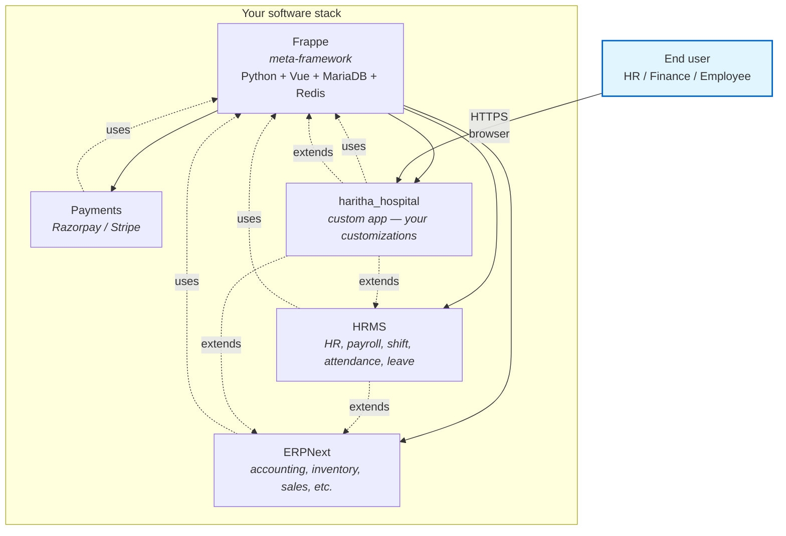

# 00.1 — What is ERP / Frappe / HRMS / Custom App?

> **Audience:** New team members, prospective clients, anyone onboarding to Haritha Hospitals.
> **Goal:** Plain-English overview of the software stack so non-developers can follow the rest of the Phase 6 docs.
> **Last updated:** 2026-08-29

---

## What is ERP?

**ERP = Enterprise Resource Planning.**

At its simplest, ERP is **one software system that runs a company's shared back-office** — instead of one spreadsheet for sales, another for payroll, a third for inventory, and an inbox for HR, ERP consolidates them into a single database with shared definitions.

Before ERP, a typical mid-size company ran:
- **Accounting** in Tally / QuickBooks / Excel
- **HR** in spreadsheets + paper leave forms
- **Inventory** in another spreadsheet (or a separate POS)
- **Sales** in a CRM (Salesforce, Zoho, ...)
- **Operations** in project tools or paper job cards

These didn't talk to each other. The HR team tracked leave in Excel; payroll re-typed the totals into Tally; the warehouse counted stock by hand and emailed sales "we're out of X". Mistakes, double-entry, and end-of-month panic were normal.

**An ERP fixes that by making one database the single source of truth:**

| Function | Before ERP | After ERP |
|---|---|---|
| Sales invoice | Tally entry + emailed PDF | ERP auto-creates invoice, updates accounts receivable, decrements inventory, prints PDF |
| Payroll | Excel leaves + Tally entry | ERP aggregates attendance + leave + salary structure, posts journal entry to accounts, prints payslip |
| Inventory | Spreadsheet + manual reorder | ERP tracks stock per warehouse, auto-creates Purchase Request when below reorder level |
| HR onboarding | Paper forms + 3 systems | ERP creates Employee record + User login + asset assignment in one workflow |

### Why companies use ERP

1. **Single source of truth** — no copy-paste between systems.
2. **Audit trail** — every change has an author, timestamp, before/after.
3. **Permissions / segregation of duties** — the warehouse user can't see the chart of accounts; the accountant can't change leave policy without approval.
4. **Reporting** — same data feeds financial statements, MIS dashboards, statutory filings.
5. **Process discipline** — the system enforces the workflow (you can't ship goods without a sales order; you can't pay an invoice without a GRN).
6. **Compliance** — Indian GST, TDS, payroll PF/ESI, e-invoicing are built into the major Indian ERPs as statutory modules.

### Examples of ERP products

| ERP | Target | Notes |
|---|---|---|
| **ERPNext** | SMB / mid-market, India-strong | Open source, Python+JS, web-based, used by Haritha |
| Tally | Indian SMB, accounting-strong | Desktop-first, GST + TDS specialist |
| SAP S/4HANA | Enterprise | Industry-specific modules, very expensive |
| Oracle NetSuite | Mid-market + enterprise | Cloud, financial-heavy |
| Microsoft Dynamics 365 | Enterprise + SMB | Tied to MS ecosystem |
| Odoo | SMB | Open source, broad module coverage |
| Zoho Books / Inventory | SMB | Cloud, lighter weight |

For Haritha Hospitals we picked **ERPNext** because it is open-source, India-aware (GST, payroll, PF/ESI), covers HR + accounting + inventory in one stack, and is backed by a community that includes a strong HR module (HRMS).

---

## What is Frappe?

**Frappe is a low-code web framework — the "operating system" on which ERPNext, HRMS, and many other business apps are built.**

Most business software today is built two ways:
1. **Hand-coded from scratch** in Python / Node / Java — slow, expensive, every company reinvents the same plumbing.
2. **On top of a generic web framework** (Django, Rails, Next.js, ...) — faster but you still write forms, lists, reports, permissions, audit trails, email queues, file uploads, PDF generators, API endpoints, etc. from scratch.

Frappe is a third path: a **batteries-included meta-framework** purpose-built for database-driven business apps. It gives you for free:

- **DocType** — define a table + form + list + permissions in one JSON file
- **REST API** — every DocType gets `GET/POST/PUT/DELETE /api/resource/<DocType>` automatically
- **Permissions** — role-based, document-level, field-level, all declarative
- **Workflows** — finite-state machines on top of any DocType
- **Reports** — Query Reports (SQL) + Script Reports (Python) + custom dashboards
- **Print / Email** — Jinja-based templates for any DocType
- **Background jobs** — scheduled + on-demand queues (Redis + worker pools)
- **Files & attachments** — with private/public split
- **Realtime** — Socket.IO push for desk notifications
- **i18n** — translations + multi-currency
- **Migration system** — versioned schema changes per app

You write Python (server-side) and JavaScript/Vue (client-side) only for the business logic that's actually unique to your company. Everything else comes free.

### Frappe is "meta" because it ships zero business apps

Frappe itself contains no accounting, no HR, no inventory. It's a toolbox. The first-party apps that sit on top of Frappe are:

| App | What it adds |
|---|---|
| **ERPNext** | Accounting, inventory, sales, buying, manufacturing, projects, CRM, support, assets |
| **HRMS** | Employees, attendance, leave, payroll, shift, recruitment, training, appraisals |
| **CRM** (Frappe CRM) | Lead/deal pipeline, contacts, campaigns |
| **Education** | Students, courses, attendance, fees |
| **Healthcare** | Patients, practitioners, appointments, clinical procedures |
| **Payments** | Payment gateway integrations (Razorpay, Stripe, ...) |
| **Wiki** | Internal docs |
| **Gameplan** | OKRs + team meetings |
| **Builder** | Drag-and-drop page builder |
| **Print Designer** | Visual print format editor |
| **Insights** | BI / dashboards on top of Frappe DB |

You can mix and match — Haritha runs **Frappe + ERPNext + HRMS + payments + haritha_hospital (custom)**.

### Tech stack (in case anyone asks)

| Layer | Tech |
|---|---|
| Backend | Python 3.11 |
| Frontend | Vue 3 (desks) + vanilla JS (forms) |
| Database | MariaDB / PostgreSQL |
| Cache + queue | Redis |
| Realtime | Socket.IO (Node) |
| Web server | gunicorn (Python) + nginx (TLS termination) |
| Background workers | bench worker (long + short queues) + bench schedule |
| Container | Docker (compose-based; one project per env) |

---

## What is ERPNext?

**ERPNext is the main business app built on Frappe** — accounting + inventory + sales + buying + manufacturing + projects + CRM + support + assets + a lot more.

It's the most-used Frappe app and effectively the "default" — when someone says "we're running Frappe" they usually mean ERPNext.

### Modules ERPNext covers

| Module | Examples |
|---|---|
| **Accounting** | Chart of Accounts, Journal Entry, Sales/Purchase Invoice, Payment Entry, Bank Reconciliation, Fiscal Year, Cost Center, Tax (GST/TDS), Financial Statements |
| **Inventory** | Item, Warehouse, Stock Entry, Stock Reconciliation, Batch + Serial, Landed Cost, Item Variants |
| **Selling** | Quotation → Sales Order → Delivery Note → Sales Invoice → Payment |
| **Buying** | Supplier → Purchase Order → Purchase Receipt → Purchase Invoice → Payment |
| **Manufacturing** | BOM, Work Order, Job Card, Subcontracting |
| **CRM** | Lead, Opportunity, Customer, Quotation, Contract |
| **Support** | Issue, Service Level Agreement, Maintenance Schedule |
| **Projects** | Project, Task, Timesheet, Activity Cost |
| **Assets** | Asset, Asset Depreciation Schedule, Asset Repair, Capitalization |
| **Quality** | Quality Inspection, Quality Goal |
| **Telephony** | Call Log, Twilio integration |

For Haritha, the relevant subset is **HRMS + basic Accounting + Item/Item Group/UoM** (we don't run full inventory, selling, or buying yet — Haritha adds those later as the hospital's finance + procurement mature).

---

## What is HRMS?

**HRMS is the Human Resource Management System app** for Frappe — everything HR + payroll.

HRMS is a separate Frappe app (it installs on top of ERPNext, not instead of it). It covers:

| Sub-module | What it does |
|---|---|
| **Employee** | Master record: name, department, designation, grade, branch, employment type, joining date, bank, ID proofs, approvers |
| **Attendance** | Daily check-in/out, status (Present / Absent / On Leave / Half Day / Work From Home / Holiday / Weekly Off), late entry, early exit |
| **Shift Management** | Shift Type, Shift Assignment, Shift Schedule, Shift Schedule Assignment, Shift Request, Auto Attendance from check-ins |
| **Leave** | Leave Type, Leave Policy, Leave Allocation, Leave Application, Leave Block List, Holiday List |
| **Employee Checkin** | Raw check-in log (used by auto-attendance to derive Attendance) |
| **Payroll** | Salary Structure, Salary Slip, Payroll Entry, tax calculations (TDS), PF/ESI, payroll integration to Accounting via Journal Entry |
| **Recruitment** | Job Opening, Job Applicant, Interview, Offer, Onboarding |
| **Training** | Training Program, Training Event, Training Result, Training Feedback |
| **Appraisal** | Appraisal Template, Appraisal Cycle, Appraisal |
| **Performance** | Goals, KRAs, feedback |
| **Tax** | Employee Tax Exemption Declaration, Proof Submission, Income Tax Slab |
| **Exit** | Exit Interview, Exit Checklist, separation workflow |
| **Loans** | Loan Type, Loan Application, Loan |
| **Expense Claim** | Submit receipts, get reimbursed to salary or bank |

For Haritha, HRMS is the **primary app in scope** — Phase 1–4 of this project focused on Shift Management + Attendance + Leave + Employee master. The rest of HRMS is available as Haritha's HR team grows.

### HRMS version pinning

**Important:** HRMS has a known install bug (LEARNINGS #44) in versions v16.5.1+ — the `repost_allowed_types` phantom field. Always pin to **v16.5.0** until upstream merges a fix. Haritha's compose files pin this explicitly.

---

## What is a Custom App?

A **Custom App is a Frappe app that YOU write** to hold anything that isn't covered by Frappe / ERPNext / HRMS out of the box — your custom DocTypes, custom scripts, custom fixtures, your own business logic.

### Why use one?

You CAN just add Custom Fields + Property Setters + Client Scripts via the Frappe UI and they'll work. But you'll burn yourself the moment you:

1. Want to **replicate the env** (staging → prod, or env → env) — UI-made customizations live only in the DB. Without fixtures, you have to manually recreate them every time.
2. Want to **version-control** the customization (so you can review, revert, branch) — UI changes don't go to git.
3. Want to **ship business logic** (a server-side Python hook that auto-calculates something on save, or a custom REST endpoint).

A custom app solves all three: code + fixtures live in a git repo, deploy via `bench install-app`, replicate via `bench migrate`.

### What's in a custom app?

```
haritha_hospital/                     ← repo root
├── pyproject.toml                    ← Python package metadata
├── apps/
│   └── haritha_hospital/             ← Python module (matches app name)
│       ├── __init__.py               ← version + app constants
│       ├── hooks.py                  ← fixtures list, scheduler events, doc events
│       ├── modules.txt               ← module declarations
│       ├── fixtures/                 ← DB data exported from prod as JSON
│       │   ├── custom_field.json
│       │   ├── property_setter.json
│       │   ├── print_format.json
│       │   ├── notification.json
│       │   └── letter_head.json
│       ├── haritha_hospital/         ← Python source
│       │   └── __init__.py
│       └── public/                   ← frontend assets (CSS/JS)
└── README.md
```

### Custom App: haritha_hospital

For this project we built a custom app named `haritha_hospital`. It captures **274 customizations** as fixtures — 78 Custom Fields + 189 Property Setters + 5 Print Formats + 3 Notifications + 2 Letter Heads — so any fresh env can be reproduced with:

```bash
bench get-app haritha_hospital git@github.com:venkat-narasimha/haritha_hospital.git
bench --site pberpprod install-app haritha_hospital
bench --site pberpprod migrate
```

Result: same customizations on prod, dev, QA, future staging — without re-clicking through the UI.

### Fixtures pattern (the magic)

```python
# apps/haritha_hospital/haritha_hospital/hooks.py
fixtures = [
    {"doctype": "Custom Field", "filters": {"module": "haritha_hospital"}},
    {"doctype": "Property Setter", "filters": {"module": "haritha_hospital"}},
    {"doctype": "Print Format", "filters": {"module": "haritha_hospital"}},
    {"doctype": "Notification", "filters": {"module": "haritha_hospital"}},
    "Letter Head",  # no module col — exports all rows
]
```

Then in any env:
```bash
bench --site <site> install-app haritha_hospital
bench --site <site> migrate    # applies fixtures
```

The migrate command looks up `fixtures = [...]` in `hooks.py`, exports matching rows from `tab*` tables, and inserts them. **Idempotent** — re-running doesn't duplicate.

(Detail: Frappe v16 uses `module` column not `app`; LEARNINGS #152.)

---

## How they relate



**Read it like this:** every box is a Frappe app. Each app depends on Frappe. Apps can also depend on each other (HRMS depends on ERPNext for chart-of-accounts integration). Custom apps can extend any of the others. End users only see the top of the stack (Haritha Hospitals), but every interaction is powered by the layers underneath.

---

## Glossary

| Term | Meaning |
|---|---|
| **App** | A Python package that adds DocTypes + business logic to Frappe (e.g., ERPNext, HRMS, haritha_hospital). |
| **Bench** | The directory + CLI tool that wraps a Frappe installation (`/home/frappe/frappe-bench`). `bench --site X` runs commands against site X. |
| **Site** | One Frappe deployment inside a bench — has its own DB, site_config.json, files. One bench can host many sites. |
| **DocType** | The fundamental object: a table + form + list view + permissions. Defined by a JSON file in `apps/<app>/<app>/doctype/<doctype>/<doctype>.json`. |
| **DocField** | A field on a DocType. Has a `fieldtype` (Data, Int, Select, Link, Date, ...) and properties like `reqd`, `read_only`, `hidden`, `options`. |
| **Custom Field** | A DocField added to a standard DocType via the UI or as a fixture. Lives in `tabCustom Field`. |
| **Property Setter** | Override any property on a standard DocField (default value, options list, hidden, reqd, read_only, print_hide, etc.). Lives in `tabProperty Setter`. |
| **Single DocType** | A DocType that has exactly ONE record (e.g., System Settings, Print Settings, HR Settings). Stored in `tabSingles` key/value table. |
| **Child Table** | A nested DocType that appears as a repeating row inside a parent DocType (e.g., `items` table inside Sales Invoice). |
| **Link Field** | A DocField whose `fieldtype=Link` and `options=<Other DocType>` — creates a foreign key. |
| **Naming Series** | A pattern like `HR-EMP-.YYYY.-` that generates unique names for a DocType when a new record is created. |
| **autoname** | The mechanism that picks a name for a new record: `field:` (use a field value), `naming_series:` (use a series), `hash` (random), etc. |
| **docstatus** | The lifecycle state of a record: 0=Draft, 1=Submitted, 2=Cancelled. Only submittable DocTypes use this. |
| **Fixtures** | JSON files in an app's `fixtures/` directory, listing rows to be installed/updated on `bench migrate`. |
| **Workspace** | The home screen layout — shortcuts to DocTypes + charts + reports + dashboards. Stored as JSON in `tabWorkspace`. |
| **Hooks** | Python entry points an app registers (doc_events, scheduler_events, fixtures, app_include_js, ...). Lives in `apps/<app>/<app>/hooks.py`. |
| **Print Format** | A template (Jinja HTML or custom Python) that renders a DocType as a printable PDF or HTML. |
| **Letter Head** | The header/footer that appears on every printed document. |
| **Notification** | An auto-email/SMS that fires when a DocType event happens (New, Save, Submit, Days Before, Value Change). |
| **Client Script** | JavaScript that runs in the browser for a specific DocType (custom buttons, field validation, computed fields). Lives in `tabClient Script`. |
| **Server Script** | Python that runs on the server for a specific DocType event. Lives in `tabServer Script`. |
| **Custom DocType** | A brand-new DocType you create from scratch (vs Custom Field which extends an existing one). |
| **Permission (DocPerm)** | A row in `tabDocPerm` granting a Role read/write/create/submit/cancel/etc. on a DocType. |
| **Role** | A named bundle of permissions (e.g., HR Manager, Employee, Accounts User). Stored in `tabRole`. |
| **User** | A login account with one or more Roles. |
| **Module** | A folder inside an app grouping related DocTypes (e.g., `hrms/hr/doctype/attendance/`). The `module` field on Custom Field/Property Setter/Print Format tags which app owns it. |
| **Background Job** | A unit of work queued to Redis and picked up by `bench worker`. Used for emails, reports, slow operations. |
| **Scheduler** | A `bench schedule` process that fires cron-like events defined in `hooks.py` `scheduler_events`. |
| **Queue (short / long)** | Two Redis queues — short for quick jobs (emails), long for slow jobs (reports, imports). |
| **Socket.IO** | WebSocket layer that pushes real-time desk notifications to the browser. |
| **gunicorn** | The Python WSGI server that serves HTTP requests inside the backend container. |
| **nginx** | TLS-terminating reverse proxy in front of gunicorn + the frontend container. |
| **DuckDNS** | Free dynamic-DNS service that maps a hostname to your VPS's changing IP. Used for `*.duckdns.org`. |
| **Let's Encrypt** | Free TLS certificate authority. Certbot auto-renews every 90 days. |
| **MariaDB / MySQL** | The relational database storing all DocTypes. |
| **Redis** | In-memory data store used for cache + queue broker. |
| **Docker Compose** | Tool for defining multi-container apps in `compose.yaml`. Frappe ships a reference compose layout. |
| **Container / Volume** | A Docker container runs one process (e.g., backend, scheduler). A named volume persists data across container restarts. |
| **Site Config (`site_config.json`)** | JSON file with site-specific secrets + DB credentials + installed apps list. |
| **Common Site Config (`common_site_config.json`)** | JSON file shared across all sites in a bench — Redis hosts, WebSocket port, etc. |
| **Apps.txt** | One-app-per-line file in `sites/apps.txt` listing which apps are enabled. Must match `site_config.json`'s `installed_apps`. |
| **Migration** | A versioned Python file that runs on `bench migrate` to apply schema changes per app. |
| **Patch** | A one-time Python script in `apps/<app>/<app>/patches.txt` that runs once during `bench migrate`. |
| **Bootstrap / Setup Wizard** | First-run flow that creates Company, Fiscal Year, User, etc. for a fresh site. |
| **Desk** | The web UI — `/desk` shows the Workspace, then DocType list, form views, reports. |
| **Form View** | One DocType record open in edit mode (`/desk#Form/Employee/HR-EMP-00001`). |
| **List View** | The table view of multiple records (`/desk#List/Employee`). |
| **Report** | A view that runs a query or script and returns rows. Two kinds: Query Report (SQL) + Script Report (Python). |
| **Dashboard / Chart** | A visualization on a Workspace that wraps a Report with default filters. |
| **REST API** | `GET/POST/PUT/DELETE /api/resource/<DocType>` for any DocType; `POST /api/method/<app>.<module>.<func>` for arbitrary Python. |
| **Frappe Cloud** | The official hosted Frappe/ERPNext service. Haritha is self-hosted, not on Frappe Cloud. |
| **Custom Field "module"** | The `module` column tags which app "owns" a Custom Field. Used by `fixtures = [...]` filters. |
| **Idempotent** | An operation that can be run multiple times with the same result (e.g., `INSERT ... ON DUPLICATE KEY UPDATE`). |

---

## Where to learn more

| Topic | Link |
|---|---|
| Frappe framework | https://frappe.io/ |
| Frappe docs (developer) | https://frappeframework.com/docs |
| ERPNext docs (user + admin) | https://docs.erpnext.com/ |
| HRMS docs (user + admin) | https://docs.frappe.io/hr |
| Frappe GitHub | https://github.com/frappe/frappe |
| ERPNext GitHub | https://github.com/frappe/erpnext |
| HRMS GitHub | https://github.com/frappe/hrms |
| Mermaid syntax (diagrams) | https://mermaid.js.org/ |
| DuckDNS | https://www.duckdns.org/ |

For Haritha-specific context (customizations, migration, ops), see:

- `docs/HARITHA_HOSPITALS_GUIDE.md` — comprehensive project guide
- `docs/phase6/00.2-architecture-overview.md` — infrastructure deep-dive
- `docs/phase6/01.1-schema-reference.md` — all 274 customizations in detail

---

*End of 00.1. Next: 00.2 — Architecture Overview.*
