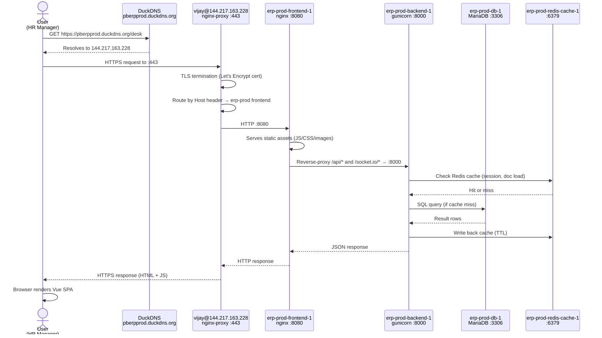
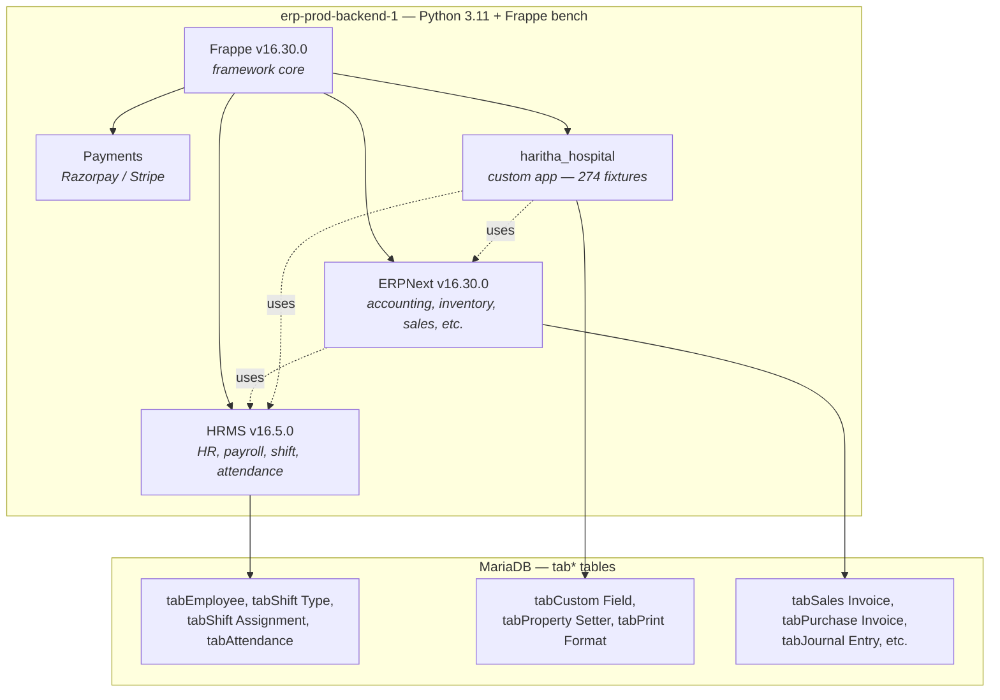
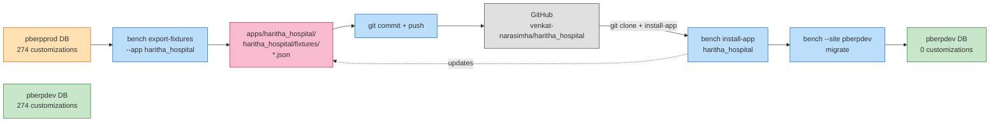
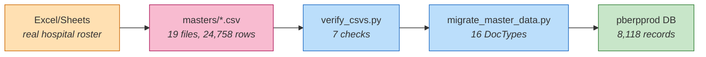
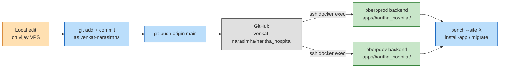

# 00.2 — Architecture Overview

> **Audience:** Devs, operators, and technically-inclined stakeholders who need to know what's running, where, and why.
> **Goal:** End-to-end picture of the Haritha Hospitals infrastructure — containers, network, data flow, backups, git flow.
> **Last updated:** 2026-08-29

---

## 1. System overview

Haritha Hospitals runs on a **3-environment topology** with two VPS hosts. The QA env is intentionally skipped for Haritha (per Venkat 2026-08-28 — direct dev ↔ prod promotion with custom-app fixtures as the safety net).

| Env | URL | Host | Compose Project | Purpose |
|---|---|---|---|---|
| **prod** | `https://pberpprod.duckdns.org/` | main VPS (vijay@144.217.163.228) | `erp-prod` | Real hospital use — 210 employees, 25 shifts, 8,118 shift assignments |
| **dev** | `https://pberpdev.duckdns.org/` | main VPS (vijay@144.217.163.228) | `erp-dev` | Dev mirror of prod (customizations + master data) for testing + change rehearsal |
| **dev-erp** | `https://dev-erp.duckdns.org/` | Venkat VPS (venkat@135.125.196.35) | `erpdev` | Venkat's private prototyping stack (Frappe v15, separate from Haritha) |

**Venkat VPS** (135.125.196.35) is reserved for **offsite backup destination** (the 3-2-1 rule's "1") — every backup from main VPS pushes a copy to Venkat VPS, never the other way around.

**dev-erp** is Venkat's own experimentation stack — different apps (Frappe v15, separate containers), separate concerns. Not part of the Haritha critical path but hosts the **3rd backup tier** for Haritha (dev-erp's `deverp_backup.sh` covers its own stack, not Haritha's).

---

## 2. Container topology

Each env (prod / dev) runs the same 9-container layout defined in `compose.yaml`:

```
erp-<env>-backend-1         ← gunicorn (Python) — serves HTTP on :8000
erp-<env>-frontend-1       ← nginx (frontend container) — serves assets on :8080
erp-<env>-scheduler-1      ← bench schedule — fires cron events from hooks.py
erp-<env>-queue-short-1    ← bench worker --queue short — quick jobs (emails)
erp-<env>-queue-long-1     ← bench worker --queue long — slow jobs (reports)
erp-<env>-websocket-1      ← bench socketio — real-time desk push
erp-<env>-redis-cache-1    ← Redis (db 1) — app cache
erp-<env>-redis-queue-1    ← Redis (db 0) — queue broker
erp-<env>-db-1             ← MariaDB 10.x — persistent data
```

### Container responsibilities

| Container | Process | Port | Volume mounts (named) | Failure mode |
|---|---|---|---|---|
| backend | gunicorn | 8000 (internal) | `erp-<env>_sites` | New apps need `docker restart` (gunicorn `--preload` freezes sys.path) — LEARNINGS #153 |
| frontend | nginx | 8080 (internal) | `erp-<env>_sites` | After backend restart, frontend caches stale backend IP — needs frontend restart too — LEARNINGS (DNS_RESOLVER) |
| scheduler | bench schedule | n/a | `erp-<env>_sites` | Restart on app install + env migration |
| queue-short | bench worker --queue short | n/a | `erp-<env>_sites` | Restart on app install + after `install-app` |
| queue-long | bench worker --queue long | n/a | `erp-<env>_sites` | Same |
| websocket | bench socketio | 9000 (internal) | `erp-<env>_sites` | Proxied via nginx-proxy with `Upgrade: websocket` header |
| redis-cache | redis-server | 6379 | `erp-<env>_redis-cache-data` | In-memory data loss on restart is OK (cache rebuilds) |
| redis-queue | redis-server | 6379 | `erp-<env>_redis-queue-data` | Queue jobs lost on restart (jobs are re-enqueued by retry logic) |
| db | mariadbd | 3306 | `erp-<env>_db-data` | **Critical** — never `docker-compose down -v` on this |

### Named volumes (data that survives `docker restart`)

```
erp-<env>_sites             /home/frappe/frappe-bench/sites/    ← site_config.json, apps.txt, assets, private files
erp-<env>_db-data           /var/lib/mysql/                     ← MariaDB data dir
erp-<env>_redis-cache-data  /data                               ← cache snapshots
erp-<env>_redis-queue-data  /data                               ← queue snapshots
```

**Anything outside named volumes is ephemeral** — logs in `/home/frappe/frappe-bench/logs/`, tmp files in `/tmp`, runtime writes in the writable container layer. `docker restart` is safe. **`docker-compose down -v` is data loss.** (LEARNINGS #154)

### Restart safety pattern

```bash
# ✅ Safe — data preserved
docker restart erp-prod-backend-1

# ❌ Destructive — wipes all named volumes
docker-compose down -v
docker volume rm erp-prod_sites erp-prod_db-data
```

---

## 3. Network flow

End-to-end request flow for a browser loading a Haritha page:



**Key hops:**
1. **DuckDNS** — free dynamic DNS, points `*.duckdns.org` to current VPS IP.
2. **nginx-proxy** — single reverse proxy on the VPS host, routes by `Host:` header to the right frontend container. TLS terminates here.
3. **frontend nginx** — serves built assets (Vue bundles, CSS) on `:8080`, reverse-proxies `/api/*` + `/socket.io/*` to backend gunicorn.
4. **backend gunicorn** — Python WSGI server, serves the Frappe REST API + the desk SPA HTML.
5. **MariaDB** — actual data store. Backend runs queries here.
6. **Redis cache** — short-circuits repeated queries + holds user sessions.

---

## 4. App layers

The Python code that runs inside the backend container:



**Order of install** (relevant for migrations):
1. `frappe` — foundation
2. `erpnext` — depends on frappe
3. `hrms` — depends on frappe + erpnext
4. `payments` — depends on frappe
5. `haritha_hospital` — depends on frappe + hrms (for shift fields) + erpnext (for accounting fields)

**HRMS pin:** v16.5.0 exactly. v16.5.1+ breaks on `repost_allowed_types` phantom field (LEARNINGS #44).

---

## 5. Data flow

Three flows matter day-to-day:

### 5.1 Fixture flow (customizations → all envs)



**Key:** once `fixtures = [...]` is in `hooks.py` (LEARNINGS #151), `bench export-fixtures` actually writes JSON. Without it, the export exits 0 silently doing nothing.

### 5.2 Master data flow (CSV → DB)



**Key:** CSV in git is the canonical source. Verify before ingest. Migrate is idempotent (re-runnable, no duplicates).

### 5.3 Backup flow (DB → local → offsite)

```mermaid
flowchart LR
    D[pberpprod DB]:::src
    B[bench backup --with-files<br/><i>timeout 900 wrapper</i>]:::step
    T[tar.gz<br/>pberpprod_backup_<ts>.tar.gz<br/>1.0–1.5 MB]:::repo
    LOCAL[/home/vijay/backups/prod/<br/><i>7-day retention</i>]:::local
    OFFSITE[/home/venkat/pberpprod_backups/<br/><i>forever retention</i>]:::remote
    CRON[cron: 0 */6 * * *<br/>00:00, 06:00, 12:00, 18:00 IST]:::step

    CRON --> B
    D --> B --> T
    T --> LOCAL
    T --> OFFSITE

    classDef src fill:#ffe0b2,stroke:#cc6600;
    classDef local fill:#c8e6c9,stroke:#2e7d32;
    classDef remote fill:#fff9c4,stroke:#f9a825;
    classDef step fill:#bbdefb,stroke:#1565c0;
    classDef repo fill:#f8bbd0,stroke:#ad1457;
```

---

## 6. Volume mounts — where data persists

| What | Where | Volume / filesystem | Survives `docker restart`? | Survives `docker-compose down -v`? |
|---|---|---|---|---|
| **Site config** (site_config.json, apps.txt) | `/home/frappe/frappe-bench/sites/` | named `erp-<env>_sites` | ✅ | ❌ |
| **DB data** (tab* tables) | `/var/lib/mysql/` | named `erp-<env>_db-data` | ✅ | ❌ |
| **App code** | `/home/frappe/frappe-bench/apps/` | named `erp-<env>_sites` (within sites volume) | ✅ | ❌ |
| **Frontend assets** (JS, CSS bundles) | `/home/frappe/frappe-bench/sites/assets/` | named `erp-<env>_sites` | ✅ | ❌ |
| **Private files** (uploaded attachments) | `/home/frappe/frappe-bench/sites/<site>/private/files/` | named `erp-<env>_sites` | ✅ | ❌ |
| **Public files** | `/home/frappe/frappe-bench/sites/<site>/public/files/` | named `erp-<env>_sites` | ✅ | ❌ |
| **Redis cache** | `/data` | named `erp-<env>_redis-cache-data` | ✅ | ❌ |
| **Redis queue** | `/data` | named `erp-<env>_redis-queue-data` | ✅ | � |
| **Container logs** | `/home/frappe/frappe-bench/logs/` (writable layer) | anonymous / tmpfs | ❌ on container recreate | ❌ |
| **Backup files (local)** | `/home/vijay/backups/prod/` | VPS host filesystem | ✅ (independent of containers) | ✅ |
| **Backup files (offsite)** | `/home/venkat/pberpprod_backups/` | Venkat VPS host filesystem | ✅ | ✅ |

**Rule:** if the data matters, it lives in a **named Docker volume** OR on the host filesystem (outside Docker). Anything in the writable container layer is ephemeral.

**Why restart is safe:** `docker restart` only stops and starts the existing container — the underlying named volumes and their data persist across the restart. (LEARNINGS #154)

---

## 7. GitHub integration

### Repos

| Repo | Path | Purpose |
|---|---|---|
| **venkat-narasimha/haritha_hospital** | `/apps/haritha_hospital/haritha_hospital/` (inside any bench that has it installed) | Custom app — code + fixtures. Lives inside a Frappe bench. |
| **venkat-narasimha/haritha_hospitals** | `/home/vijay/frappeclaw/frappeclaw-data/workspace/projects/haritha-hospitals/` | This repo — workspace, docs, scripts, masters CSVs, TRACKER. |

### Branch strategy

Both repos use `main` as the single trunk. No long-lived branches. No tags (yet).

```
main ──●────●────●────●────●────►
       A    B    C    D    E
       │    │    │    │    │
       ▼    ▼    ▼    ▼    ▼
      phase 2  3   3.7  4  custom-app
```

### Deploy flow (app repo → env)



**Push from VPS, NOT container** (the erpclaw SSH key on the container is not authorized for `venkat-narasimha/haritha_hospital`). Pattern:

```bash
ssh -i /root/.openclaw/ssh_key -o StrictHostKeyChecking=no vijay@144.217.163.228 \
  "cd /home/vijay/frappeclaw/frappeclaw-data/workspace/projects/haritha-hospitals && \
   git config user.name venkat-narasimha && \
   git config user.email srivenkatnarasimha@gmail.com && \
   git add <files> && git commit -m '...' && git push origin main"
```

### Identity

All commits **must** be authored as `venkat-narasimha <srivenkatnarasimha@gmail.com>`. (Standing rule #11 — never `erpclaw`, never `claude`.) Set on container + VPS:

```bash
git config --global user.name venkat-narasimha
git config --global user.email srivenkatnarasimha@gmail.com
```

---

## 8. Backup infrastructure (3-2-1 rule)

The 3-2-1 rule for Haritha:

- **3** copies of every backup
- **2** different storage types (local disk + remote VPS)
- **1** offsite (Venkat VPS, geographically separate from main VPS)

### Cron schedule (main VPS)

```cron
# /var/spool/cron/vijay (vijay VPS)
0 */6 * * * /home/vijay/scripts/dev_backup.sh   >> /home/vijay/backups/logs/dev_backup.log   2>&1
0 */6 * * * /home/vijay/scripts/qa_backup.sh    >> /home/vijay/backups/logs/qa_backup.log    2>&1
0 */6 * * * /home/vijay/scripts/prod_backup.sh  >> /home/vijay/backups/logs/prod_backup.log  2>&1
0 3 * * *    /home/vijay/scripts/erpclaw-git-daily-backup.sh >> /home/vijay/backups/logs/erpclaw_backup.log 2>&1
```

### Backup target matrix

| Script | Schedule (IST) | Local path (7d retention) | Offsite path (forever) |
|---|---|---|---|
| `prod_backup.sh` | 00:00, 06:00, 12:00, 18:00 | `/home/vijay/backups/prod/` | `venkat@135.125.196.35:/home/venkat/pberpprod_backups/` |
| `dev_backup.sh` | 00:00, 06:00, 12:00, 18:00 | `/home/vijay/backups/dev/` | `venkat@135.125.196.35:/home/venkat/pberpdev_backups/` |
| `qa_backup.sh` | 00:00, 06:00, 12:00, 18:00 | `/home/vijay/backups/qa/` | `venkat@135.125.196.35:/home/venkat/pberpqa_backups/` |
| `erpclaw-git-daily-backup.sh` | 03:00 | GitHub `backup-YYYY-MM-DD` branch (7d auto-delete) | n/a |

**Per-slot:** 4 backup files (DB dump + site_config + public + private) → packaged as `*.tar.gz` (~1.0–1.5 MB compressed) → rsync'd to offsite. Total: ~6 MB/day local + 6 MB/day offsite = 12 MB/day.

### Hardening (prod_backup.sh pattern)

```bash
#!/bin/bash
set -euo pipefail
trap 'echo "ERROR: line $LINENO exit=$?" | tee -a /home/vijay/backups/logs/prod_backup.log' ERR

TIMEOUT=900  # 15 min hard cap on bench backup

# 1. Backup (timeout-bounded, exit code captured)
timeout $TIMEOUT docker exec erp-prod-backend-1 bash -c \
  "cd /home/frappe/frappe-bench && bench --site pberpprod.duckdns.org backup --with-files" \
  || { echo "ERROR: bench backup exit=$?"; exit 1; }

# 2. Stage + tar
TS=$(date +%Y%m%d_%H%M%S)
WORK=/home/vijay/backups/prod/${TS}
mkdir -p "$WORK"
docker cp erp-prod-backend-1:/home/frappe/frappe-bench/sites/pberpprod.duckdns.org/private/backups/. "$WORK/"

cd "$WORK/.." && tar czf "${TS}.tar.gz" "$TS"

# 3. SHA256 + integrity test
sha256sum "${TS}.tar.gz" > "${TS}.tar.gz.sha256"
gunzip -t "${TS}.tar.gz" || { echo "ERROR: gzip integrity fail"; exit 1; }

# 4. Local retention: 7 days
find /home/vijay/backups/prod -name '*.tar.gz' -mtime +7 -delete

# 5. Offsite push
rsync -e "ssh -i /home/vijay/pberpprod_backup_key" -az \
  "${TS}.tar.gz" "${TS}.tar.gz.sha256" \
  venkat@135.125.196.35:/home/venkat/pberpprod_backups/

# 6. Loud success
echo "OK $(date +%Y-%m-%d_%H:%M:%S) ${TS}.tar.gz"
```

**Key invariants:**
- `set -euo pipefail` + `${PIPESTATUS[0]}` capture — every error loud
- `timeout 900` — no silent hangs (LEARNINGS #79)
- Local retention = 7d; offsite = forever
- SHA256 checksum + gzip integrity test before offsite push

### Restore (disaster recovery)

```bash
# 1. Pick the backup timestamp
TS=20260827_143236

# 2. Stop traffic (maintenance mode + nginx pause)
docker exec erp-prod-backend-1 bench --site pberpprod.duckdns.org \
  set-maintenance-mode on

# 3. Pull backup off offsite
scp -i /home/vijay/pberpprod_backup_key \
  venkat@135.125.196.35:/home/venkat/pberpprod_backups/${TS}.tar.gz \
  /tmp/restore/

# 4. Extract + restore DB
tar xzf /tmp/restore/${TS}.tar.gz -C /tmp/restore/
docker cp /tmp/restore/${TS}/*.sql.gz erp-prod-db-1:/tmp/
docker exec erp-prod-db-1 bash -c \
  "gunzip < /tmp/*.sql.gz | mysql -u root -p\$(printenv MYSQL_ROOT_PASSWORD)"

# 5. Restore files (private + public)
docker cp /tmp/restore/${TS}/private/files/. \
  erp-prod-backend-1:/home/frappe/frappe-bench/sites/pberpprod.duckdns.org/private/files/
# (repeat for public/files)

# 6. bench migrate (re-applies any pending fixtures)
docker exec erp-prod-backend-1 bench --site pberpprod.duckdns.org migrate

# 7. Restart workers
docker restart erp-prod-frontend-1 erp-prod-scheduler-1 \
  erp-prod-queue-short-1 erp-prod-queue-long-1

# 8. Smoke test
curl -I https://pberpprod.duckdns.org/
```

**DR test status:** not yet tested end-to-end on prod. Phase 5 (deferred).

---

## 9. Architecture diagram (full system)

```mermaid
flowchart TB
    subgraph UserSide["User side"]
        U[Hospital staff<br/>browser]:::user
    end

    subgraph DNSPublic["Public DNS"]
        DDNS[DuckDNS<br/>pberpprod.duckdns.org]:::ext
    end

    subgraph MainVPS["Main VPS — vijay@144.217.163.228"]
        NGINX_PROXY[nginx-proxy :443<br/>TLS termination<br/>Host-based routing]:::infra

        subgraph ProdEnv["erp-prod — 9 containers"]
            PFE[frontend :8080]:::container
            PBE[backend :8000<br/>gunicorn]:::container
            PSC[scheduler<br/>bench schedule]:::container
            PQS[queue-short]:::container
            PQL[queue-long]:::container
            PWS[websocket :9000]:::container
            PRC[redis-cache :6379]:::container
            PRQ[redis-queue :6379]:::container
            PDB[(MariaDB :3306<br/>DB: _b80f05e76a0dcaad)]:::db
        end

        subgraph DevEnv["erp-dev — 9 containers"]
            DBE[backend :8000]:::container
            DFE[frontend :8080]:::container
            DSC[scheduler]:::container
            DWS[websocket]:::container
            DDB[(MariaDB<br/>DB: _0c0679ad719b9491)]:::db
        end

        HAPPS[haritha_hospital app<br/>fixtures/<br/>274 customizations]:::app

        BACKUPS[/home/vijay/backups/<br/>prod/ dev/ qa/]:::backup
        SCRIPTS[/home/vijay/scripts/<br/>prod_backup.sh etc.]:::scripts
        CRONTAB[vijay crontab<br/>0 */6 * * *]:::scripts
    end

    subgraph VenkatVPS["Offsite — venkat@135.125.196.35"]
        VBACKUPS[/home/venkat/<br/>pberpprod_backups/<br/>pberpdev_backups/<br/>pberpqa_backups/]:::backup
    end

    subgraph Github["GitHub"]
        GHWS[venkat-narasimha/<br/>haritha_hospitals<br/>workspace + docs]:::ext
        GHAPP[venkat-narasimha/<br/>haritha_hospital<br/>custom app]:::ext
    end

    U -->|HTTPS| DDNS
    DDNS --> NGINX_PROXY
    NGINX_PROXY --> PFE
    NGINX_PROXY --> DFE
    PFE -->|proxy /api| PBE
    PFE -->|proxy /socket.io| PWS
    PBE -->|SQL| PDB
    PBE <-->|cache| PRC
    PBE <-->|jobs| PRQ
    PBE -->|app code| HAPPS
    HAPPS -->|read fixtures| PBE

    DBE -->|app code| HAPPS

    PSC --> PRQ
    PQS --> PRQ
    PQL --> PRQ

    CRONTAB --> SCRIPTS
    SCRIPTS -->|bench backup + rsync| PBE
    SCRIPTS --> BACKUPS
    SCRIPTS -->|offsite rsync| VBACKUPS

    GHWS -.workspace source.-> MainVPS
    GHAPP -.app source.-> HAPPS

    classDef user fill:#e1f5ff,stroke:#0066cc,stroke-width:2px;
    classDef infra fill:#fff9c4,stroke:#f9a825;
    classDef container fill:#bbdefb,stroke:#1565c0;
    classDef db fill:#c8e6c9,stroke:#2e7d32,stroke-width:2px;
    classDef app fill:#f8bbd0,stroke:#ad1457;
    classDef backup fill:#d1c4e9,stroke:#4527a0;
    classDef scripts fill:#bcaaa4,stroke:#3e2723;
    classDef ext fill:#e0e0e0,stroke:#424242;
```

---

## 10. What's NOT in this doc

This doc is the **infrastructure overview**. For deeper detail see:

| Topic | Doc |
|---|---|
| All 274 customizations | `docs/phase6/01.1-schema-reference.md` |
| Schema ERD | `docs/phase6/01.2-schema-diagram.md` |
| Shift management workflow | `docs/phase6/02-shift-workflow/*` (Batch 2) |
| Migration playbook (replicate Haritha from scratch) | `docs/HARITHA_HOSPITALS_GUIDE.md` §6 |
| Operational runbook (incident response) | `docs/HARITHA_HOSPITALS_GUIDE.md` §7 |
| Disaster recovery procedure | `docs/phase6/04-run-books/*` (Batch 3) |
| All LEARNINGS (gotchas encountered) | `/root/.openclaw/workspace/.learnings/LEARNINGS.md` |

---

*End of 00.2. Next: 01.1 — Schema Reference (catalog of all 274 customizations).*
