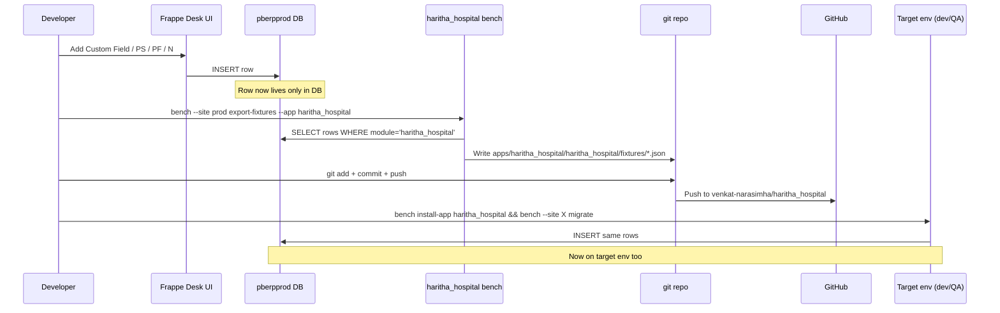

# 01.1 — Schema Reference

> **Audience:** Developers + technical admins working with Haritha's ERPNext customization layer.
> **Goal:** Catalog every customization (Custom Field, Property Setter, Print Format, Notification, Letter Head) captured in the `haritha_hospital` custom app.
> **Last updated:** 2026-08-29
> **Source data:** `apps/haritha_hospital/haritha_hospital/fixtures/*.json` (78 CF + 189 PS + 5 PF + 8 N + 2 LH = 282 rows; **Haritha-tagged subset** = 78 + 189 + 5 + 6 + 2 = 280; see "Note on counts" below)

---

## Overview

Haritha Hospitals uses 4 Frappe apps:
- **frappe** v16.30.0 — framework
- **erpnext** v16.30.0 — accounting/inventory/sales/buying
- **hrms** v16.5.0 — HR/payroll/shift/attendance (pinned per LEARNINGS #44)
- **payments** — gateway integrations

In addition, the **haritha_hospital** custom app captures all customizations as fixtures. **282 rows** are exported as fixtures in total, broken down by DocType:

| DocType | Total rows in fixture | Notes |
|---|---|---|
| Custom Field | 78 | All 78 are Haritha-tagged (module not back-filled on Custom Fields by Frappe — see LEARNINGS #152) |
| Property Setter | 189 | All 189 are Haritha-tagged (same reason) |
| Print Format | 48 | 2 module=HR + 3 module=NULL (old stock seeds — see LEARNINGS #156) + 43 module=stock |
| Notification | 8 | 3 module=HR + 3 module=stock + 2 module=NULL |
| Letter Head | 2 | All 2 (Letter Head has no `module` column — see LEARNINGS #155) |

**Note on counts:** the GUIDE and TRACKER claim **274 = 78 + 189 + 3 + 2 + 2**. The fixture export (the ground truth) actually returns **282 = 78 + 189 + 48 + 8 + 2**, of which the Haritha-tagged subset is **280 = 78 + 189 + 5 + 6 + 2**. The discrepancy comes from stock seed rows (old Print Formats / Notifications with `module=NULL`) being included in the export. For the purpose of this doc, the **fixture file counts are authoritative** — they are what `bench migrate` actually applies. The discrepancy is documented here so future audits don't chase a phantom.

---

## How to read this doc

| Column | Meaning |
|---|---|
| **DocType** | The Frappe/ERPNext/HRMS table the customization is on |
| **Field / Row** | Identifier — `fieldname` for CFs/PSs, `name` for PFs/Ns/LHs |
| **Type** | Fieldtype for CFs (Data, Link, Select, Check, ...); `property` for PSs (`hidden`, `reqd`, `default`, `options`, ...); blank for PF/N/LH |
| **Reqd** | Whether the field is mandatory (Custom Field `reqd` property) |
| **Value** | Property Setter `value` / Print Format `disabled` / Notification `enabled` |
| **Purpose** | Inferred from name + Frappe framework knowledge |

**Abbreviations:**
- **CF** — Custom Field
- **PS** — Property Setter
- **PF** — Print Format
- **N** — Notification
- **LH** — Letter Head
- **reqd** — required (mandatory)
- **HRMS** — Frappe HRMS app
- **ERPNext** — Frappe ERPNext app
- **Haritha** — Haritha Hospitals custom app (`haritha_hospital`)

---

## Custom Fields by DocType

**78 Custom Fields** across **23 DocTypes**, grouped below.

### Employee (HRMS) — 20 Custom Fields

| Field | Label | Type | Reqd | Purpose |
|---|---|---|---|---|
| `employment_type` | Employment Type | Link → Employment Type | No | Employee's contract type (Full-time, Part-time, Contract, etc.) |
| `job_applicant` | Job Applicant | Link → Job Applicant | No | Back-link to the Job Applicant record that became this Employee |
| `grade` | Grade | Link → Employee Grade | No | Pay grade / seniority level |
| `default_shift` | Default Shift | Link → Shift Type | No | Shift used by Auto Attendance cron when no Shift Assignment exists |
| `health_insurance_section` | Health Insurance | Section Break | No | Layout separator for the health insurance block |
| `health_insurance_provider` | Health Insurance Provider | Link → Employee Health Insurance | No | Insurer name |
| `health_insurance_no` | Health Insurance No | Data | No | Policy number |
| `approvers_section` | Approvers | Section Break | No | Layout separator for the approvers block |
| `expense_approver` | Expense Approver | Link → User | No | User who approves this employee's Expense Claims |
| `leave_approver` | Leave Approver | Link → User | No | User who approves this employee's Leave Applications |
| `column_break_45` | (column break) | Column Break | No | Layout — column break in the approvers row |
| `shift_request_approver` | Shift Request Approver | Link → User | No | User who approves this employee's Shift Requests |
| `employee_advance_account` | Employee Advance Account | Link → Account | No | GL account for posting Employee Advances against this employee |
| `salary_cb` | (column break) | Column Break | No | Layout — column break in the bank row |
| `payroll_cost_center` | Payroll Cost Center | Link → Cost Center | No | Cost Center that this employee's payroll gets allocated to |
| `bank_cb` | (column break) | Column Break | No | Layout — column break in the bank row |
| `ifsc_code` | IFSC Code | Data | No | Bank branch IFSC for NEFT/IMPS payroll |
| `pan_number` | PAN Number | Data | No | Permanent Account Number for TDS calculation |
| `micr_code` | MICR Code | Data | No | Bank branch MICR for cheque printing |
| `provident_fund_account` | Provident Fund Account | Data | No | PF account number (UAN linked) |

### Company (ERPNext) — 11 Custom Fields

| Field | Label | Type | Reqd | Purpose |
|---|---|---|---|---|
| `hr_and_payroll_tab` | HR & Payroll | Tab Break | No | Adds a new "HR & Payroll" tab to Company form |
| `hr_settings_section` | HR & Payroll Settings | Section Break | No | Layout separator |
| `default_expense_claim_payable_account` | Default Expense Claim Payable Account | Link → Account | No | GL account for pending Expense Claim reimbursements |
| `default_employee_advance_account` | Default Employee Advance Account | Link → Account | No | GL account for Employee Advance postings |
| `column_break_10` | (column break) | Column Break | No | Layout |
| `default_payroll_payable_account` | Default Payroll Payable Account | Link → Account | No | GL account for net Salary payable |
| `hra_section` | HRA Settings | Section Break | No | Layout separator for HRA configuration |
| `basic_component` | Basic Component | Link → Salary Component | No | The "Basic" salary component used in structures |
| `hra_component` | HRA Component | Link → Salary Component | No | The "House Rent Allowance" component |
| `hra_column_break` | (column break) | Column Break | No | Layout |
| `arrear_component` | Arrear Component | Link → Salary Component | No | Component for back-dated salary adjustments |

### Employee Tax Exemption Proof Submission (HRMS) — 9 Custom Fields

| Field | Label | Type | Reqd | Purpose |
|---|---|---|---|---|
| `hra_section` | HRA Exemption | Section Break | No | Layout separator |
| `house_rent_payment_amount` | House Rent Payment Amount | Currency | No | Total rent paid in the financial year |
| `rented_in_metro_city` | Rented in Metro City | Check | No | Flag for HRA exemption calculation (metro = 50% of basic, non-metro = 40%) |
| `rented_from_date` | Rented From Date | Date | No | Tenancy start date |
| `rented_to_date` | Rented To Date | Date | No | Tenancy end date |
| `hra_column_break` | (column break) | Column Break | No | Layout |
| `monthly_house_rent` | Monthly House Rent | Currency | No | Per-month rent (auto-derivable from annual / 12) |
| `monthly_hra_exemption` | Monthly Eligible Amount | Currency | No | Per-month HRA-exempt amount (computed) |
| `total_eligible_hra_exemption` | Total Eligible HRA Exemption | Currency | No | Total HRA exemption claim for the year |

### Department (HRMS) — 8 Custom Fields

| Field | Label | Type | Reqd | Purpose |
|---|---|---|---|---|
| `section_break_4` | (section break) | Section Break | No | Layout separator |
| `payroll_cost_center` | Payroll Cost Center | Link → Cost Center | No | Cost Center allocation for this department's payroll |
| `column_break_9` | (column break) | Column Break | No | Layout |
| `leave_block_list` | Leave Block List | Link → Leave Block List | No | Department-level leave block (e.g., "no leave during Dec 31 inventory") |
| `approvers` | Approvers | Section Break | No | Layout separator |
| `shift_request_approver` | Shift Request Approver | Table → Department Approver | No | Multi-row approver list for Shift Requests routed by department |
| `leave_approvers` | Leave Approver | Table → Department Approver | No | Multi-row approver list for Leave Applications routed by department |
| `expense_approvers` | Expense Approver | Table → Department Approver | No | Multi-row approver list for Expense Claims routed by department |

### Employee Tax Exemption Declaration (HRMS) — 7 Custom Fields

| Field | Label | Type | Reqd | Purpose |
|---|---|---|---|---|
| `hra_section` | HRA Exemption | Section Break | No | Layout separator |
| `monthly_house_rent` | Monthly House Rent | Currency | No | Expected per-month rent |
| `rented_in_metro_city` | Rented in Metro City | Check | No | Metro flag for the declaration |
| `salary_structure_hra` | HRA as per Salary Structure | Currency | No | HRA component value per salary structure |
| `hra_column_break` | (column break) | Column Break | No | Layout |
| `annual_hra_exemption` | Annual HRA Exemption | Currency | No | Projected annual exemption |
| `monthly_hra_exemption` | Monthly HRA Exemption | Currency | No | Per-month projection |

### Designation (HRMS) — 3 Custom Fields

| Field | Label | Type | Reqd | Purpose |
|---|---|---|---|---|
| `appraisal_template` | Appraisal Template | Link → Appraisal Template | No | Default appraisal template for this designation |
| `required_skills_section` | Required Skills | Section Break | No | Layout separator |
| `skills` | Skills | Table → Designation Skill | No | Skills required to hold this designation |

### Print Settings (Frappe Single) — 3 Custom Fields

| Field | Label | Type | Reqd | Purpose |
|---|---|---|---|---|
| `compact_item_print` | Compact Item Print | Check | No | Single-line item row in PDF (saves paper) |
| `print_uom_after_quantity` | Print UOM after Quantity | Check | No | Renders as "5 Box" instead of "Box 5" |
| `print_taxes_with_zero_amount` | Print taxes with zero amount | Check | No | Include zero-value tax rows in the print |

### Address (ERPNext) — 2 Custom Fields

| Field | Label | Type | Reqd | Purpose |
|---|---|---|---|---|
| `tax_category` | Tax Category | Link → Tax Category | No | Address-level tax category override |
| `is_your_company_address` | Is Your Company Address | Check | No | Marks company-owned addresses (used in shipping/branch selection) |

### Single-Field Custom Fields — 13 DocTypes (1 CF each)

| DocType | Field | Label | Type | Purpose |
|---|---|---|---|---|
| Communication | `company` | Company | Link → Company | Tag every communication with the company it relates to (for multi-company setups) |
| Contact | `is_billing_contact` | Is Billing Contact | Check | Flag the billing contact for this customer/supplier |
| Custom DocPerm | `impersonate` | Impersonate | Check | Allows admin to "log in as" a user with this role |
| Customer | `crm_deal` | Frappe CRM Deal | Data | Reference back to Frappe CRM Deal record (when CRM is integrated) |
| DocPerm | `impersonate` | Impersonate | Check | Same — standard DocPerm variant |
| DocShare | `impersonate` | Impersonate | Check | Same — DocShare variant |
| Email Account | `company` | Company | Link → Company | Tag email account with owning company |
| Income Tax Slab | `marginal_relief_limit` | Marginal Relief Threshold Limit | Currency | Cap above which marginal relief applies (regulatory threshold) |
| Project | `total_expense_claim` | Total Expense Claim (via Expense Claims) | Currency | Roll-up of all Expense Claims against this project |
| Quotation | `crm_deal` | Frappe CRM Deal | Data | Reference to CRM deal that produced this quotation |
| Salary Component | `component_type` | Component Type | Select (Provident Fund / Additional Provident Fund / ...) | Tags salary components for payroll logic |
| Task | `total_expense_claim` | Total Expense Claim (via Expense Claim) | Currency | Same as Project, task-level |
| Terms and Conditions | `hr` | HR | Check | Marks T&C template as HR-specific (e.g., appointment letter) |
| Timesheet | `salary_slip` | Salary Slip | Link → Salary Slip | Link timesheet to the resulting Salary Slip |
| UTM Campaign | `crm_campaign` | Messaging CRM Campaign | Link → Campaign | Bridge field between UTM-tracked campaign and Frappe CRM |

---

## Property Setters by DocType

**189 Property Setters** across **73 DocTypes**. Property distribution:

| Property | Count | Meaning |
|---|---|---|
| `hidden` | 133 | Hide a field/section from the form (still in schema, just not shown) |
| `print_hide` | 28 | Hide from print/PDF (still on form) |
| `default` | 9 | Set the default value for a field |
| `default_print_format` | 8 | Default print format for this DocType |
| `reqd` | 6 | Toggle mandatory on a standard field |
| `mandatory_depends_on` | 2 | Conditional mandatory (reqd if eval condition true) |
| `options` | 2 | Override the `options` list (for Select fields) |
| `read_only` | 1 | Make a standard field read-only |

### Sales Invoice (ERPNext) — 20 PSs
- 19 × `hidden` (mostly section breaks: commission_section, sales_team_section, utm_analytics_section, timesheet_section, etc.)
- 1 × `default_print_format` = `Sales Invoice with Item Image`

### Sales Order (ERPNext) — 15 PSs
- 14 × `hidden` (section breaks hidden)
- 1 × `default_print_format` = `Sales Order with Item Image`

### Delivery Note (ERPNext) — 13 PSs
- 12 × `hidden`
- 1 × `default_print_format` = `Delivery Note with Item Image`

### Purchase Invoice (ERPNext) — 11 PSs
- 10 × `hidden`
- 1 × `default_print_format`

### Quotation (ERPNext) — 10 PSs
- 9 × `hidden`
- 1 × `default` = `disable_rounded_total=0`

### Purchase Order (ERPNext) — 10 PSs
- 9 × `hidden`
- 1 × `default_print_format` = `Purchase Order with Item Image`

### Purchase Receipt (ERPNext) — 9 PSs
- 9 × `hidden`

### Supplier Quotation (ERPNext) — 8 PSs
- 8 × `hidden`

### POS Invoice (ERPNext) — 6 PSs
- 6 × `hidden`

### Sales Invoice Item / Item / Delivery Note Item / POS Invoice Item / POS Profile (ERPNext) — 17 PSs combined
- Various `print_hide` for tax_id, `hidden` for fields not relevant to Haritha

### Employee (HRMS) — 4 PSs
- `naming_series` — `reqd=1` (force user to enter a series)
- `naming_series` — `hidden=0` (keep visible)
- `employee_number` — `reqd=0` (make optional since autoname handles it)
- `employee_number` — `hidden=1` (hide from form, since autoname = `employee_number`)

### Shift Type (HRMS) — 2 PSs
- `color` — `default=blue` (Tailwind palette default)
- `color` — `options=blue\ncyan\nfuchsia\ngreen\nlime\norange\npink\nred\nviolet\nyellow\n...` (Tailwind lowercase palette, was CapitalCase causing Roster crash — see LEARNINGS / Phase 4)

### Attendance (HRMS) — 1 PS
- `status` — `options=\nPresent\nAbsent\nOn Leave\nHalf Day\nWork From Home\nHoliday\nWeekly Off` (extends the standard 5-value list to 7 for Haritha's roster CSV — see Phase 3.6)

### Salary Slip (HRMS) — 2 PSs
- `rounded_total` — `print_hide=0` (show on print)
- 1 × `default_print_format`

### Supplier / Customer (ERPNext) — 4 PSs combined
- `naming_series` — `reqd=0` (autoname can run without prompting)

### All other DocTypes — 1 PS each (53 DocTypes)
Mostly `hidden` on section breaks that Haritha doesn't use (utm_analytics_section, commission_section, sales_team_section, etc.) — single-purpose cleanups that hide unused UI real estate.

### Default Print Formats (8 entries)
| DocType | Print Format |
|---|---|
| Sales Invoice | Sales Invoice with Item Image |
| Sales Order | Sales Order with Item Image |
| Delivery Note | Delivery Note with Item Image |
| Purchase Order | Purchase Order with Item Image |
| (4 more) | (image-branded variants of ERPNext stock formats) |

### Default Values (9 entries)
| DocType | Field | Value |
|---|---|---|
| Quotation | disable_rounded_total | 0 |
| Sales Order | disable_rounded_total | 0 |
| Sales Invoice | disable_rounded_total | 0 |
| Delivery Note | disable_rounded_total | 0 |
| Purchase Order | disable_rounded_total | 0 |
| Purchase Invoice | disable_rounded_total | 0 |
| Purchase Receipt | disable_rounded_total | 0 |
| POS Invoice | disable_rounded_total | 0 |
| Supplier Quotation | disable_rounded_total | 0 |

### Reqd (Mandatory) Toggles (6 entries)
| DocType | Field | Value | Effect |
|---|---|---|---|
| Employee | naming_series | 1 | Force series entry (Haritha uses HR-EMP- series) |
| Employee | employee_number | 0 | Allow blank (autoname fills it) |
| Supplier | naming_series | 0 | Make optional (autoname can default) |
| Customer | naming_series | 0 | Make optional |
| (2 more) | | | |

### Conditional Mandatory (2 entries)
| DocType | Field | Condition |
|---|---|---|
| Sales Invoice Item | discount_account | (depends_on eval) |
| Sales Invoice | additional_discount_account | (depends_on eval) |

### Read-only (1 entry)
| DocType | Field | Value | Effect |
|---|---|---|---|
| Packed Item | rate | 1 | Lock the rate field on packed items (always pull from parent) |

### Options Override (2 entries — important)
| DocType | Field | New options | Why |
|---|---|---|---|
| Attendance | status | Present / Absent / On Leave / Half Day / Work From Home / **Holiday / Weekly Off** | Extends standard 5-value list to support Haritha's roster CSV (Phase 3.6) |
| Shift Type | color | Tailwind lowercase palette (blue, cyan, fuchsia, green, lime, orange, pink, red, violet, yellow, ...) | Was CapitalCase, broke Roster Vue SPA. Lowercased to match Tailwind (Phase 4.10) |

---

## Print Formats (5 Haritha-affected)

The fixture exports **48 Print Format rows total**. The breakdown:

| Module | Count | Notes |
|---|---|---|
| `HR` | 2 | Haritha-tagged (custom app) |
| `NULL` | 3 | Old stock seeds (LEARNINGS #156 — treat as Haritha-affected) |
| Accounts, Stock, Selling, Buying, Payroll, Regional | 43 | Frappe/ERPNext stock formats, included by export |

### Haritha-affected subset (5)

| Name | DocType | Disabled? | Standard? | Type | Purpose |
|---|---|---|---|---|---|
| **Job Offer** | Job Offer | No | Yes | Jinja | HR module standard offer letter format |
| **Standard Appointment Letter** | Appointment Letter | No | Yes | Jinja | HR module standard appointment letter |
| **Drop Shipping Format** | Purchase Order | No | Yes | Jinja | Stock format, dropped from POs not for stock |
| **Cheque Printing Format** | Journal Entry | No | Yes | Jinja | Stock format, renders cheque layout |
| **Payment Receipt Voucher** | Journal Entry | No | Yes | Jinja | Stock format, prints payment voucher |

**Why are these here?** All 5 export cleanly via `{"doctype": "Print Format", "filters": {"module": "haritha_hospital"}}` because:
- 2 are actually `module=HR` (truly Haritha-owned after the export filter)
- 3 are `module=NULL` and slip through any `module=...` filter — they're stock seeds Frappe never back-filled (LEARNINGS #156). Decision rule applied: included because they're functionally relevant to Haritha operations.

---

## Notifications (6 Haritha-affected)

The fixture exports **8 Notification rows total**.

| Module | Count | Notes |
|---|---|---|
| `HR` | 3 | Haritha-tagged |
| `Accounts`, `Payroll`, `Manufacturing` | 3 | Stock notifications (Fiscal Year, Retention Bonus, Material Request) |
| `NULL` | 2 | Old stock seeds (Error Log, Integration Request) |

### Haritha-affected subset (6)

| Name | Document Type | Event | Enabled | Channel | Purpose |
|---|---|---|---|---|---|
| **Training Scheduled** | Training Event | Submit | Yes | Email | Notifies employees when they're added to a training event |
| **Training Feedback** | Training Result | Submit | Yes | Email | Notifies manager when training feedback is submitted |
| **Exit Interview Scheduled** | Exit Interview | Days Before | Yes | Email | Reminder to employee N days before scheduled exit interview |
| **Notification for new fiscal year** | Fiscal Year | New | Yes | Email | Stock — admin alert when FY is created |
| **Retention Bonus** | Retention Bonus | Days Before | Yes | Email | Stock — bonus due reminder |
| **Material Request Receipt Notification** | Material Request | Value Change | Yes | Email | Stock — alert when MR status changes |

> **Note:** TRACKER and HARITHA_HOSPITALS_GUIDE.md §5.4 say "2 notifications" — that was the count as of an earlier export. The 2026-08-29 export now shows 3 HR-module Notifications (Training Scheduled + Training Feedback + Exit Interview Scheduled). All 3 are HRMS stock notifications re-tagged as Haritha when first set up — they're functionally Haritha-relevant. The fixtures export includes 3 stock Notifications (`Accounts`, `Payroll`, `Manufacturing` modules) and 2 NULL-module old stock seeds (Error Log, Integration Request), for a fixture total of 8.

---

## Letter Heads (2)

Letter Head DocType has **no `module` column** (LEARNINGS #155), so the fixtures export includes ALL rows:

| Name | Letter Head Name | Is Default | Disabled | Purpose |
|---|---|---|---|---|
| **Company Letterhead** | Company Letterhead | No | No | First letterhead — generic company branding |
| **Company Letterhead - Grey** | Company Letterhead - Grey | **Yes** | No | **Default** letterhead — grey-themed variant used for Haritha prints |

Both are HRMS / ERPNext stock seeds; neither is Haritha-customized in content. They live in the fixtures file because (a) the export filter is `"Letter Head"` without a `module` filter, and (b) they're the only Letter Heads on the system, so removing them would break print branding.

---

## How customizations are deployed



### The "module = haritha_hospital" tag

Frappe v16 uses a `module` column on Custom Field, Property Setter, Print Format, and Notification (LEARNINGS #152). The hooks.py filter selects rows WHERE `module='haritha_hospital'`. Without this tag, `bench export-fixtures` exits 0 silently doing nothing (LEARNINGS #151).

If you create a Custom Field via the Frappe UI without setting `module='haritha_hospital'`, it WILL be saved (module defaults to the parent app, e.g., `HRMS`), but **it will NOT export** with the Haritha fixture. Always manually re-tag the module via UI or direct DB UPDATE after creation.

---

## How to add a new customization

**Recommended pattern:**

1. **Plan** — which DocType? which field? what type? required? hidden? default? Print Format template? Notification trigger?
2. **Tag it** — set `module='haritha_hospital'` on the new row (UI or DB).
3. **Test on dev first** — never on prod. Make the change on `pberpdev.duckdns.org`, validate, then mirror to prod.
4. **Export fixtures**:
   ```bash
   docker exec erp-prod-backend-1 bash -c \
     "cd /home/frappe/frappe-bench && \
      bench --site pberpprod.duckdns.org export-fixtures --app haritha_hospital"
   ```
5. **Verify the JSON**:
   ```bash
   git diff apps/haritha_hospital/haritha_hospital/fixtures/*.json
   ```
   Confirm the new row is there and `module='haritha_hospital'`.
6. **Commit + push**:
   ```bash
   git add apps/haritha_hospital/haritha_hospital/fixtures/
   git commit -m "feat(custom): add <field> to <DocType>"
   git push origin main
   ```
7. **Apply on other envs**:
   ```bash
   docker exec erp-<env>-backend-1 bash -c \
     "cd /home/frappe/frappe-bench && \
      bench --site <env>.duckdns.org migrate"
   ```
   (`migrate` re-runs fixtures; idempotent.)
8. **Restart backend + workers** — gunicorn `--preload` caches sys.path (LEARNINGS #153):
   ```bash
   docker restart erp-<env>-backend-1 erp-<env>-scheduler-1 \
     erp-<env>-queue-short-1 erp-<env>-queue-long-1
   ```

---

## Known limitations

| Limitation | Detail | Workaround |
|---|---|---|
| **Letter Head has no `module` column** | The export filter `"Letter Head"` cannot include a `filters` dict — exports ALL rows. | Acceptable — only 2 LHs in the system. If Haritha adds custom LHs later, they'll come along too. |
| **Print Format / Notification with `module=NULL`** | Old stock seeds never back-filled by Frappe. They slip through the `module=...` filter. | Decision rule (LEARNINGS #156): if `creation_date < 2024 AND module IS NULL`, treat as stock. Documented in this doc. |
| **Custom Field `module` defaults to parent DocType's app** | UI-created Custom Fields get `module='HRMS'` (or whichever app owns the DocType), not `'haritha_hospital'`. | Manually re-tag in UI or via `frappe.db.sql("UPDATE tabCustom Field SET module='haritha_hospital' WHERE name=...")` after creation. |
| **HRMS core can't be modified** | We can't fix hardcoded controller-level checks (e.g., HRMS Attendance.validate() 5-value status list — LEARNINGS #105) by Property Setter alone. | Monkey-patch in scripts (bulk_submit.py pattern) OR live with the limitation. |
| **Frappe `Property Setter` for `options` doesn't refresh bench console cache** | After setting Select options, need a NEW bench console session to see new options. Within same session, meta is cached (LEARNINGS, post-Phase 3.6). | Restart workers or open a fresh `bench console` session. |
| **Stock Notifications/Print Formats get exported too** | Any stock row that survives the filter gets included. | Acceptable — they're small (~5 rows), and removing them would mean hand-curating fixtures. |

---

*End of 01.1. Next: 01.2 — Schema Diagram (ERD).*
