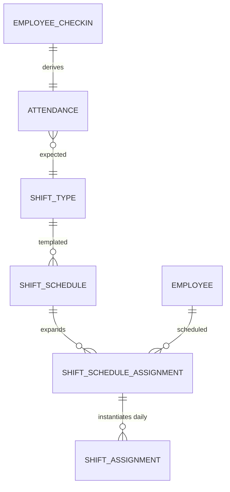
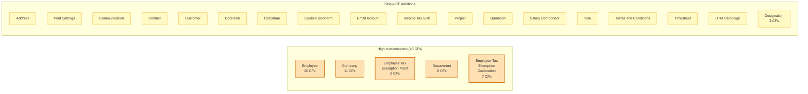

# 01.2 — Schema Diagram

> **Audience:** Anyone who needs a visual mental model of how Haritha's core DocTypes relate.
> **Goal:** ERD of the in-scope entities, with notes on which have custom fields and what they track.
> **Last updated:** 2026-08-29

---

## Overview

This doc shows the **entity-relationship diagram** for Haritha Hospitals' in-scope modules: HR, Shift Management, Attendance, Leave, plus the supporting master data (Company, Department, Designation, Item, Customer, Supplier).

For the full customization catalog (CFs, PSs, etc.), see [`01.1-schema-reference.md`](01.1-schema-reference.md). For doc-level architecture (containers, network), see [`../00-foundations/00.2-architecture-overview.md`](../00-foundations/00.2-architecture-overview.md).

---

## Main entities — ERD

```mermaid
erDiagram
    COMPANY ||--o{ DEPARTMENT : "owns"
    COMPANY ||--o{ EMPLOYEE : "employs"
    COMPANY ||--o{ SHIFT_TYPE : "defines"
    COMPANY ||--o{ COST_CENTER : "has"
    COMPANY ||--o{ ACCOUNT : "owns"
    COMPANY ||--o{ HOLIDAY_LIST : "uses"

    DEPARTMENT ||--o{ EMPLOYEE : "groups"
    DESIGNATION ||--o{ EMPLOYEE : "titles"
    EMPLOYEE_GRADE ||--o{ EMPLOYEE : "grades"

    EMPLOYEE ||--o{ SHIFT_ASSIGNMENT : "scheduled via"
    EMPLOYEE ||--o{ ATTENDANCE : "marks"
    EMPLOYEE ||--o{ EMPLOYEE_CHECKIN : "logs"
    EMPLOYEE ||--o{ LEAVE_APPLICATION : "files"
    EMPLOYEE ||--o{ LEAVE_ALLOCATION : "entitled"
    EMPLOYEE ||--o{ EMPLOYEE_TAX_EXEMPTION_DECLARATION : "declares"
    EMPLOYEE ||--o{ EMPLOYEE_TAX_EXEMPTION_PROOF_SUBMISSION : "submits"

    SHIFT_TYPE ||--o{ SHIFT_ASSIGNMENT : "assigned as"
    SHIFT_TYPE ||--o{ SHIFT_SCHEDULE_ASSIGNMENT : "templated in"
    SHIFT_TYPE ||--o{ ATTENDANCE : "expected for"

    SHIFT_SCHEDULE ||--o{ SHIFT_SCHEDULE_ASSIGNMENT : "groups"
    EMPLOYEE ||--o{ SHIFT_SCHEDULE_ASSIGNMENT : "scheduled"
    SHIFT_SCHEDULE_ASSIGNMENT ||--o{ SHIFT_ASSIGNMENT : "instantiates"

    EMPLOYEE ||--o{ SHIFT_REQUEST : "requests"

    HOLIDAY_LIST ||--o{ HOLIDAY : "contains"
    HOLIDAY_LIST ||--o{ SHIFT_TYPE : "references"
    HOLIDAY_LIST ||--o{ EMPLOYEE : "applies to"

    LEAVE_TYPE ||--o{ LEAVE_APPLICATION : "categorizes"
    LEAVE_TYPE ||--o{ LEAVE_ALLOCATION : "allocates"

    LEAVE_BLOCK_LIST ||--o{ LEAVE_APPLICATION : "may block"

    SALARY_COMPONENT ||--o{ SALARY_STRUCTURE : "composes"
    SALARY_STRUCTURE ||--o{ SALARY_SLIP : "instantiates"
    EMPLOYEE ||--o{ SALARY_SLIP : "paid via"

    ITEM_GROUP ||--o{ ITEM : "categorizes"
    UOM ||--o{ ITEM : "measures"

    CUSTOMER ||--o{ SALES_INVOICE : "billed to"
    SUPPLIER ||--o{ PURCHASE_INVOICE : "billed by"

    COMPANY {
        string name
        string country
        string default_currency
        string default_payroll_payable_account
        string default_employee_advance_account
        string default_expense_claim_payable_account
        string basic_component
        string hra_component
        string arrear_component
    }

    DEPARTMENT {
        string name
        string department_name
        string company
        string payroll_cost_center
        string leave_block_list
    }

    DESIGNATION {
        string name
        string designation_name
        string appraisal_template
    }

    EMPLOYEE {
        string name PK "HR-EMP-NNNNN autoname"
        string employee_name
        string employee_number
        string company
        string department
        string designation
        string grade
        string employment_type
        string branch
        string default_shift
        string holiday_list
        date date_of_joining
        date date_of_birth
        string gender
        string user_id
        string leave_approver
        string expense_approver
        string shift_request_approver
        string pan_number
        string ifsc_code
        string bank_name
        string bank_acct_no
        string micr_code
        string provident_fund_account
        string health_insurance_provider
        string health_insurance_no
        string attendance_device_id "EMP-NNNN"
    }

    EMPLOYEE_GRADE {
        string name
        string grade_name
    }

    SHIFT_TYPE {
        string name PK "10-char code"
        time start_time
        time end_time
        float duration
        bool is_past_end_time
        bool is_oncall
        bool is_emergency
        bool mark_auto_attendance
        bool enable_auto_attendance
        string company
        string holiday_list
        string determine_check_in_and_check_out
        string working_hours_calculation_based_on
        int begin_check_in_before_shift_start_time
        int allow_check_out_after_shift_end_time
        bool mark_auto_attendance_on_holidays
        float working_hours_threshold_for_half_day
        float working_hours_threshold_for_absent
        date process_attendance_after
        bool auto_update_last_sync_of_checkin
        bool enable_late_entry_marking
        int late_entry_grace_period
        bool enable_early_exit_marking
        int early_exit_grace_period
        datetime last_sync_of_checkin
        string color
    }

    SHIFT_ASSIGNMENT {
        string name PK "HR-SHA-YY-MM-NNNNN"
        string employee
        string shift_type
        date start_date
        date end_date
        string status "Active / Inactive"
        string shift_schedule_assignment
        int docstatus
    }

    SHIFT_SCHEDULE {
        string name
        string company
        date from_date
        date to_date
    }

    SHIFT_SCHEDULE_ASSIGNMENT {
        string name
        string employee
        string shift_type
        string company
        string status
        int docstatus
    }

    ATTENDANCE {
        string name PK "HR-ATT-YY-MM-NNNNN"
        string employee
        date attendance_date
        string status "Present / Absent / On Leave / Half Day / Work From Home / Holiday / Weekly Off"
        string shift
        time in_time
        time out_time
        float working_hours
        bool late_entry
        bool early_exit
        string leave_application
        string leave_type
        string company
        string department
        string employee_name
        string naming_series
    }

    EMPLOYEE_CHECKIN {
        string name
        string employee
        datetime time
        string log_type "IN / OUT"
        string shift
        datetime shift_start
        datetime shift_end
        datetime actual_start
        datetime actual_end
        string attendance
        bool offshift
        string device_id "attendance_device_id"
    }

    LEAVE_TYPE {
        string name
        string leave_type_name
        int max_days_allowed
        bool is_carry_forward
        bool is_lwp
        bool include_holiday
        bool is_encash
    }

    LEAVE_APPLICATION {
        string name
        string employee
        string leave_type
        date from_date
        date to_date
        float total_leave_days
        string status "Open / Approved / Rejected"
        string leave_approver
        string company
    }

    LEAVE_ALLOCATION {
        string name
        string employee
        string leave_type
        int from_date
        int to_date
        float new_leaves_allocated
        string company
    }

    HOLIDAY_LIST {
        string name
        string holiday_list_name
        date from_date
        date to_date
        string country
    }

    HOLIDAY {
        string name
        string parent "Holiday List"
        date holiday_date
        string description
    }

    SALARY_COMPONENT {
        string name
        string salary_component_name
        string type "Earning / Deduction"
        string component_type "Provident Fund / Additional Provident Fund / ..."
        string formula
    }

    SALARY_STRUCTURE {
        string name
        string employee
        string company
        string currency
        date from_date
    }

    SALARY_SLIP {
        string name
        string employee
        date start_date
        date end_date
        string salary_structure
        float gross_pay
        float net_pay
        float rounded_total
        string company
    }

    ITEM_GROUP {
        string name
        string item_group_name
        string parent_item_group
    }

    ITEM {
        string name
        string item_name
        string item_group
        string stock_uom
        string company
        bool is_stock_item
    }

    UOM {
        string name
        string uom_name
        string category
    }

    CUSTOMER {
        string name
        string customer_name
        string customer_group
        string territory
        string default_currency
        string crm_deal
    }

    SUPPLIER {
        string name
        string supplier_name
        string supplier_group
        string country
    }

    ACCOUNT {
        string name
        string account_name
        string account_type
        string account_number
        string company
        string parent_account
    }

    COST_CENTER {
        string name
        string cost_center_name
        string company
        string parent_cost_center
    }

    EMPLOYEE_TAX_EXEMPTION_DECLARATION {
        string name
        string employee
        string company
        string fiscal_year
        float monthly_house_rent
        bool rented_in_metro_city
        float salary_structure_hra
        float annual_hra_exemption
        float monthly_hra_exemption
    }

    EMPLOYEE_TAX_EXEMPTION_PROOF_SUBMISSION {
        string name
        string employee
        string company
        string fiscal_year
        float house_rent_payment_amount
        bool rented_in_metro_city
        date rented_from_date
        date rented_to_date
        float monthly_house_rent
        float monthly_hra_exemption
        float total_eligible_hra_exemption
    }

    LEAVE_BLOCK_LIST {
        string name
        string leave_block_list_name
    }

    SHIFT_REQUEST {
        string name
        string employee
        string shift_type
        date from_date
        date to_date
        string status
        string company
    }
```



---

## Key relations — narrative

### Foundation layer

- **Company** is the root — every master data DocType carries a `company` link. Haritha has 1 Company record: `Haritha Hospitals`.
- **Department** + **Designation** + **Employee Grade** are org-structure dimensions. An Employee belongs to exactly one of each.
- **Holiday List** is attached to Company + referenced by Shift Type + by Employee. Haritha has 1 Holiday List (`Haritha Hospitals Holiday List`) covering 14 Indian national holidays.

### Employee master

- **Employee** is the central employee record. PK is autoname `HR-EMP-NNNNN`. The CSV source uses `EMP-NNNN` which maps via `employee_number` to the autoname.
- **Custom fields** on Employee include bank details (IFSC, MICR, account), tax (PAN), approvers (leave, expense, shift request), and HRMS-specific (health insurance, PF account, default shift, grade, employment type). See [`01.1-schema-reference.md` §Employee](01.1-schema-reference.md#employee-hrms--20-custom-fields).
- **Attendance_device_id** (`EMP-NNNN`) is the FK join key from raw check-in logs to Employee.

### Shift + Attendance workflow



- **Shift Type** defines a recurring shift pattern (start, end, grace periods, auto-attendance rules). Haritha has 25 Shift Types.
- **Shift Schedule Assignment** is the recurring template binding (employee × shift type, no date — recurring forever until cancelled).
- **Shift Assignment** is the dated instance (employee × shift type × specific date range). One SSA expands into many SAs as dates roll forward.
- **Employee Checkin** is raw IN/OUT from the attendance device.
- **Attendance** is derived from checkins (auto-attendance cron) OR manually marked. Status options: Present / Absent / On Leave / Half Day / Work From Home / **Holiday** / **Weekly Off** (last 2 added via Property Setter — see [`01.1-schema-reference.md` §Options Override](01.1-schema-reference.md#options-override-2-entries--important)).
- **Shift Request** is when an employee asks to swap a shift — separate workflow, not in current scope (Phase 2+).

### Leave workflow

- **Leave Type** defines categories (Casual, Sick, Earned, etc.) with policies.
- **Leave Allocation** credits the employee with N days for a period.
- **Leave Application** is a request to consume allocation. Status: Open → Approved/Rejected.
- **Leave Block List** restricts when certain leave types can be applied (department-level).

### Tax exemption workflow

- **Employee Tax Exemption Declaration** is the employee's projection (annual expected HRA, etc.).
- **Employee Tax Exemption Proof Submission** is the supporting documents (rent receipts, etc.) with actual amounts.
- Both have custom fields added by Haritha's HRMS install (HRA section, metro city flag, etc.) — see [`01.1-schema-reference.md` §Employee Tax Exemption Proof Submission / Declaration](01.1-schema-reference.md#employee-tax-exemption-proof-submission-hrms--9-custom-fields).

### Payroll workflow

- **Salary Component** defines one line item (Basic, HRA, Provident Fund, ...). Custom field `component_type` tags it for payroll logic.
- **Salary Structure** assembles components into a formula (e.g., 40% Basic + 30% HRA + ...).
- **Salary Slip** is the per-period instance for one employee. Generated by Payroll Entry.

### Master / commercial

- **Item Group** + **Item** + **UOM** — inventory basics. Haritha has 6 Item Groups + UoMs loaded.
- **Customer** + **Supplier** — AR/AP parties. Customer has `crm_deal` custom field for Frappe CRM integration.
- **Account** + **Cost Center** — Chart of Accounts. Haritha has 89 Accounts + 2 Cost Centers.

---

## Custom field indicators

Below is a summary of **which entities have custom fields and what they track**. See [`01.1-schema-reference.md`](01.1-schema-reference.md) for the full field-by-field catalog.



**What the customization pattern reveals:**
- **HR-heavy customization** — 7 of 8 multi-CF DocTypes are HRMS-owned (Employee, Department, Designation, both Tax Exemption forms). Company is the only non-HRMS DocType with double-digit CFs.
- **Approval workflows are pervasive** — Department has 3 approver tables; Employee has 3 approver Link fields. Haritha routes approvals by role × department.
- **Tax/PF/HRA compliance** — the bulk of HR CFs relate to Indian statutory compliance (PAN, IFSC, PF account, HRA declaration/proof).
- **Stock commercial is mostly untouched** — Sales/Purchase/Inventory DocTypes appear only in the Property Setter list (mostly `hidden` cleanups), not in the Custom Field list.

---

## How to render this diagram

### On GitHub

GitHub renders Mermaid automatically when you put the `mermaid` block inside a Markdown file. Just open the doc on GitHub and the diagrams show up inline. No setup needed.

### Offline

Install Mermaid CLI:
```bash
npm install -g @mermaid-js/mermaid-cli
# or
brew install mermaid-cli
```

Render a single file:
```bash
mmdc -i 01.2-schema-diagram.md -o 01.2-schema-diagram.png -w 2400
```

The `-w 2400` flag gives a wide image to fit the ERD. PNG export needs the Mermaid CLI + a headless Chromium.

### Inside Frappe (alternative)

If you want the ERD rendered inside Frappe itself, paste the `mermaid` block into a Wiki page or a DocType description (Markdown is rendered in those). The Desk uses a Markdown renderer that includes Mermaid support.

### Excalidraw / draw.io alternative

If you need to edit the diagram (e.g., add a new DocType), the Mermaid syntax above can be pasted into:
- [Mermaid Live Editor](https://mermaid.live/) (free, instant render)
- VS Code with the "Markdown Preview Mermaid Support" extension
- Excalidraw (after conversion to Excalidraw syntax via `mermaid-to-excalidraw`)

We prefer Mermaid because it's **text-based → git diffable → reviewable in PRs**.

---

## What this doc doesn't cover

| Topic | Doc |
|---|---|
| All 274 customizations catalog (every field's purpose) | `01.1-schema-reference.md` |
| Shift Management workflow (Roster, Auto Attendance, Manual Attendance, Leave) | `docs/phase6/02-shift-workflow/*` (Batch 2) |
| Operational data — current values for each entity | `docs/HARITHA_HOSPITALS_GUIDE.md` Appendix A |
| Migration playbook — how to set up these tables from CSV | `docs/HARITHA_HOSPITALS_GUIDE.md` §6 |

---

*End of 01.2. Next: Tier 2 — Shift Workflow (Batch 2).*
