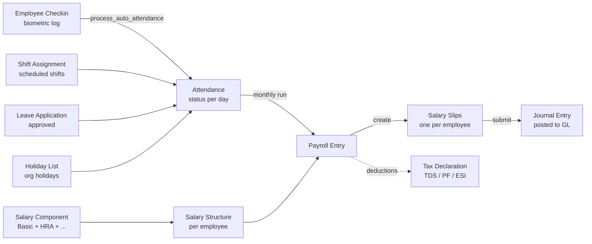

# 02.1 — Shift Management Workflow

> **Audience:** HR managers, shift supervisors, hospital admin, anyone running day-to-day shift ops.
> **Goal:** End-to-end explanation of how Haritha Hospitals manages shifts — from entity setup to daily operations to payroll.
> **Last updated:** 2026-08-29
> **Pre-req reading:** [00.1 What is ERP/Frappe/HRMS](../00-foundations/00.1-what-is-erp-frappe-hrms.md), [01.1 Schema Reference](../01-schema/01.1-schema-reference.md), [01.2 Schema Diagram](../01-schema/01.2-schema-diagram.md)

---

## Overview

**Shift Management at Haritha Hospitals is the system that defines when each of our 210+ employees works, records whether they actually showed up, and feeds that signal into payroll.**

Hospitals don't run 9-to-5. Emergency, ICU, and ward staff work in rotating shifts that change week to week. Without a structured system you end up with:
- Phone calls the night before to confirm "are you on duty?"
- A register book at the nurses' station that gets lost
- Payroll built from a manager's best guess
- No way to audit who was on shift when an incident happened

Haritha uses **HRMS Shift Management** (an app that ships with Frappe) to replace all of this with:
- **Shift Types** — defined shift timings (e.g., Morning 06:00–14:30, Night 20:00–08:00)
- **Shift Assignments** — which employee works which shift on which day
- **Employee Checkins** — biometric / manual log of actual arrival and departure
- **Attendance** — derived status (Present / Absent / On Leave / Half Day / Holiday)
- **Salary Slip** — calculated from attendance + leave + salary structure

The end result: the manager looks at a **monthly Roster** grid, the HR team reviews **Attendance** records, and payroll reads the same attendance data to compute the month's pay — all from one database.

---

## Entities recap

The schema is documented in detail in [01.1](../01-schema/01.1-schema-reference.md). Quick recap for this doc:

| Entity | DocType | Role |
|---|---|---|
| **Employee** | HRMS `Employee` | Master record — name, dept, designation, default shift, bank, IDs |
| **Department** | HRMS `Department` | Org unit — owns employees, links to Cost Center |
| **Designation** | HRMS `Designation` | Job title (Nurse, Doctor, Housekeeping, Security) |
| **Shift Type** | HRMS `Shift Type` | Shift timing template (start/end, color, grace periods) |
| **Shift Assignment** | HRMS `Shift Assignment` | One row = "Employee X works Shift Type Y from date A to date B" |
| **Attendance** | HRMS `Attendance` | One row per employee per day — Present / Absent / On Leave / Half Day |
| **Employee Checkin** | HRMS `Employee Checkin` | Raw IN/OUT log entries (from biometric or manual) |
| **Holiday List** | HRMS `Holiday List` | Calendar of org holidays (per Company) |
| **Leave Application** | HRMS `Leave Application` | Employee's request for paid/unpaid leave |
| **Leave Type** | HRMS `Leave Type` | Defines a kind of leave (Casual, Sick, Earned, etc.) |
| **Leave Allocation** | HRMS `Leave Allocation` | Per-employee annual quota per Leave Type |

The Haritha custom app adds fields to several of these — see [01.1 §Custom Fields](../01-schema/01.1-schema-reference.md) for the full list. The most shift-relevant are:

- `Employee.default_shift` (Link → Shift Type) — fallback for Auto Attendance cron
- `Employee.shift_request_approver` (Link → User)
- `Employee.leave_approver` (Link → User)
- `Employee.expense_approver` (Link → User)
- `Company.default_payroll_payable_account` (Link → Account)
- `Department.payroll_cost_center` (Link → Cost Center)

---

## Shift Type naming conventions

This is the single most important convention to internalize. Every Shift Type in Haritha follows a strict 10-character code: **`[GMAN]\d{4}[RS]\d{4}`** — four-part name where each part is meaningful.

Source of truth: `masters/shift_type.csv` (25 records currently).

### Format breakdown

```
G 0900 R 0830
│  │    │  │
│  │    │  └── end duration (HHMM, hours × 100 + minutes)
│  │    └─────── R = Regular / S = Special
│  └───────────── start time (HHMM, 24-hour)
└──────────────── G = General / M = Morning / A = Afternoon / N = Night
```

| Part | Position | Values | Meaning |
|---|---|---|---|
| **Prefix** | char 1 | `G` / `M` / `A` / `N` | Time-of-day category |
| **Start time** | chars 2–5 | `HHMM` (e.g., `0900` = 09:00) | When shift begins |
| **Mid suffix** | char 6 | `R` / `S` | Regular vs Special end |
| **End duration** | chars 7–10 | `HHMM` (e.g., `0830` = 8h 30m) | How long the shift lasts |

### Prefix meanings

| Prefix | Time-of-day | Typical use |
|---|---|---|
| **G** | General (daytime, mid-morning start) | Admin, billing, OPD desks |
| **M** | Morning (early start) | Doctors, nurses morning shift, ward staff |
| **A** | Afternoon (midday start) | Afternoon ward shift, pharmacy afternoon |
| **N** | Night (evening/night start, may end past midnight) | ICU night, security, emergency |

### Mid suffix meanings

| Suffix | Meaning |
|---|---|
| **R** | Regular shift — standard duration (6h / 8h / 8.5h / 9h) |
| **S** | Special shift — extended duration (12h / 16h / 12.5h) |

### Worked examples (from `masters/shift_type.csv`)

| Name | Prefix | Start | Mid | Duration | End | Use |
|---|---|---|---|---|---|---|
| `G0900R0830` | General | 09:00 | Regular | 8h 30m | 17:30 | Standard 9-to-5:30 office shift |
| `G0930R0800` | General | 09:30 | Regular | 8h 00m | 17:30 | Office shift with half-hour late start |
| `M0600R0830` | Morning | 06:00 | Regular | 8h 30m | 14:30 | Early ward / ICU morning |
| `M0800S1200` | Morning | 08:00 | Special | 12h 00m | 20:00 | Long-day shift (e.g., 12h duty) |
| `A1200R0830` | Afternoon | 12:00 | Regular | 8h 30m | 20:30 | Afternoon ward / pharmacy |
| `A1300S1230` | Afternoon | 13:00 | Special | 12h 30m | 25:30 (next day 01:30) | Long afternoon duty |
| `N2000R1200` | Night | 20:00 | Regular | 12h 00m | 08:00 next day | ICU night (sets `is_past_end_time=1`) |
| `N2200R0800` | Night | 22:00 | Regular | 8h 00m | 06:00 next day | Security late-night |
| `N1700S1600` | Night | 17:00 | Special | 16h 00m | 09:00 next day | Extended on-call |

**Why this matters:** when the Roster SPA renders the monthly grid, the **color of each cell** is determined by the prefix, and the **start time label** is parsed from the name. So a shift called `G0900R0830` shows up as a blue cell labeled "09:00–17:30" — without anyone hardcoding that mapping.

### Color coding (Roster SPA + Tailwind palette)

The HRMS Roster SPA uses **lowercase Tailwind color names** (per LEARNINGS #157 reversal from CapitalCase). The Shift Type's `color` field must match a Tailwind palette key:

| Prefix | Color (Tailwind) | Hex | Hex code |
|---|---|---|---|
| **G** (General) | `blue` | blue-500 | `#3b82f6` |
| **M** (Morning) | `green` | green-500 | `#22c55e` |
| **A** (Afternoon) | `orange` | orange-500 | `#f97316` |
| **N** (Night) | `violet` | violet-500 | `#8b5cf6` |

Two Property Setters in `haritha_hospital` fixtures ensure the color dropdown shows the right options:
- `Shift Type-color-options` — restricts the Select field to lowercase Tailwind palette names
- `Shift Type-color-default` — defaults new Shift Types to `blue`

If you add a new Shift Type via UI, **always pick from the lowercase dropdown**. Don't free-type "Blue" — the SPA will crash on `colors['Blue']` lookup because the Tailwind object uses `colors.blue` not `colors.Blue` (LEARNINGS — Roster crash root cause).

---

## Setup workflow (one-time, pre-go-live)

Follow this order. Each step depends on the previous one. Skipping order causes Link field validation errors.

### 1. Create Company

Already done for Haritha (record name: `Haritha Hospitals`). Skip if present.

```
DocType: Company
Name: Haritha Hospitals
Country: India
Default Currency: INR
Fiscal Year: April–March
```

Custom fields populated by fixtures:
- `default_payroll_payable_account` → links to "Salaries Payable" Account
- `default_employee_advance_account` → links to "Employee Advances" Account
- `default_expense_claim_payable_account` → links to "Expense Claims Payable" Account
- `basic_component` → Salary Component "Basic"
- `hra_component` → Salary Component "House Rent Allowance"
- `arrear_component` → Salary Component "Arrear"

### 2. Create Departments

```
Path: HR > Department > New
Required fields:
  - Department Name (e.g., "Nursing - ICU", "Housekeeping", "Pharmacy")
  - Company: Haritha Hospitals
  - Payroll Cost Center: <Cost Center created earlier>
```

Haritha has **36 departments** (per `TRACKER.md` and real hospital roster). Examples:
- Nursing - ICU
- Nursing - Ward A / Ward B
- Doctors - General Medicine
- Doctors - Emergency
- Pharmacy
- Laboratory
- Radiology
- Housekeeping
- Security
- Administration
- Billing
- HR
- Accounts

### 3. Create Designations

```
Path: HR > Designation > New
Required fields:
  - Designation Name (e.g., "Staff Nurse", "ICU Specialist", "Pharmacist")
```

Haritha has **51 designations**. Examples: Staff Nurse, Senior Nurse, ICU Specialist, Consultant, Resident Doctor, Medical Officer, Pharmacist, Lab Technician, Housekeeping Supervisor, Security Guard, Receptionist, HR Executive, Accounts Officer.

### 4. Create Shift Locations

```
Path: HR > Shift Location > New
Required fields:
  - Location Name (e.g., "Hyderabad Main Hospital")
  - Latitude: 17.3850
  - Longitude: 78.4867
  - Check-in Radius (meters): 200
```

Shift Location is used by the **HRMS mobile check-in** to verify the employee is physically at the hospital when they punch in. Latitude/longitude is the hospital's geo-coordinates; radius is how far from the pin they can be and still check in (200m allows for parking lot + adjacent wings).

Autoname is `field:location_name`, so the name == Location Name. Single record for Haritha.

### 5. Create Shift Types

```
Path: HR > Shift Type > New
Required fields (CRITICAL — see Lesson #42):
  - Name: <10-char code, e.g., G0900R0830>
  - Start Time: <HH:MM:SS, e.g., 09:00:00>
  - End Time: <HH:MM:SS, e.g., 17:30:00>
  - Color: <lowercase Tailwind, e.g., blue>
  - Company: Haritha Hospitals
  - Holiday List: Haritha Hospitals Holiday List
  - last_sync_of_checkin: <FUTURE date, e.g., 2027-01-01 00:00:00> ← REQUIRED (Lesson #42)
  - determine_check_in_and_check_out: "Alternating entries as IN and OUT"
  - working_hours_calculation_based_on: "First Check-in and Last Check-out"
  - begin_check_in_before_shift_start_time: 60  (60 min early grace)
  - allow_check_out_after_shift_end_time: 60   (60 min late grace)
  - working_hours_threshold_for_half_day: 5.0  (worked <5h = half day)
  - mark_auto_attendance: 1                    (enabled)
```

Create all 25 from `masters/shift_type.csv` via the migration script (see Bulk operations below).

**Why `last_sync_of_checkin` matters:** `process_auto_attendance()` (HRMS background job) silently skips shifts where this is NULL. Symptom is "scheduler runs every minute but marks ZERO attendance". Always populate it on creation (Lesson #42).

### 6. Create Holiday List

```
Path: HR > Holiday List > New
Name: Haritha Hospitals Holiday List
Company: Haritha Hospitals
From Date: 2026-01-01
To Date: 2026-12-31
Holidays (child table):
  - 2026-01-26   Republic Day
  - 2026-03-25   Holi
  - 2026-04-14   Dr. Ambedkar Jayanti
  - 2026-08-15   Independence Day
  - 2026-10-02   Gandhi Jayanti
  - 2026-11-08   Diwali
  - Plus weekly offs as configured in HR Settings
```

This list is then linked to each Shift Type and each Employee — when an employee is scheduled on a date that's a Holiday, Attendance is marked "Holiday" instead of "Absent".

### 7. Onboard Employees

```
Path: HR > Employee > New
Required:
  - First Name, Last Name, Gender, Date of Birth
  - Date of Joining
  - Department, Designation, Employment Type
  - Company: Haritha Hospitals
  - Holiday List: Haritha Hospitals Holiday List
  - Default Shift: <one of the 25 Shift Types>
  - Attendance Device ID: <EMP-NNNN format, used by biometric>
  - Leave Approver: <User>
  - Shift Request Approver: <User>
```

Create all 210 from `masters/employee.csv` via the migration script. Each Employee links to:
- One Department
- One Designation
- One Default Shift (used by Auto Attendance cron when no Shift Assignment exists)
- One Holiday List
- Up to three approver Users (leave / expense / shift)

---

## Daily operations (recurring, every day)

### 1. Auto Attendance (background)

HRMS scheduler fires `process_auto_attendance_for_all_shifts` **every minute** (configured in `hooks.py` scheduler_events). The job:

1. Reads `Shift Type.last_sync_of_checkin` — picks up from where it left off
2. For each Employee with a Shift Assignment, scans `Employee Checkin` rows between that timestamp and now
3. Pairs IN/OUT entries (alternating) → computes working hours
4. Creates / updates `Attendance` row:
   - First check-in ≥ start_time → Present
   - Worked hours < `working_hours_threshold_for_half_day` (5.0) → Half Day
   - No check-ins → Absent (if past `process_attendance_after` date)
   - Date is on Holiday List → Holiday
   - Date is in approved Leave Application → On Leave
5. Updates `last_sync_of_checkin` to now

No manual action needed unless an Employee missed check-in (next step).

### 2. Manual Attendance (corrections)

When the biometric fails, the employee forgets, or the network drops, the manager marks attendance manually:

```
Path: HR > Attendance > New
Fields:
  - Employee: HR-EMP-00123
  - Attendance Date: 2026-08-29
  - Status: Present
  - Shift: M0600R0830 (their assigned shift)
  - Leave Type: <blank unless on leave>
  - Company: Haritha Hospitals
```

Or **bulk mark** for a whole department via the Attendance tool (HR > Attendance > Mark Attendance).

### 3. Leave applications (employee-side)

```
Path: HR > Leave Application > New
Employee submits:
  - Leave Type: Casual / Sick / Earned
  - From Date, To Date
  - Reason (optional)
  - Attachment (medical certificate for Sick Leave > 2 days)

Approver gets email + desk notification → clicks Approve / Reject
Approved leave automatically reflects in Attendance (status = "On Leave")
```

The Leave Approver is the User set in `Employee.leave_approver` (custom field). Default fallback is the Reporting Manager.

### 4. Roster view

```
Path: /app/hr/roster (HRMS Desk page) OR https://pberpprod.duckdns.org/hr/roster
```

The Roster page is a Vue SPA (`apps/hrms/roster/`) that renders a month grid:

```
        Aug 2026
        Sun  Mon  Tue  Wed  Thu  Fri  Sat
Nurse A [M]   [M]   [A]   [A]   [N]   [N]   [—]
Nurse B [G]   [G]   [G]   [—]   [G]   [G]   [G]
Nurse C [—]   [M]   [M]   [M]   [M]   [M]   [M]
...
```

Each cell is colored by the Shift Type's color field:
- `[M]` Morning shift → green cell
- `[A]` Afternoon shift → orange cell
- `[N]` Night shift → violet cell
- `[G]` General → blue cell
- `[—]` No shift assigned (grey)

Filter by **Department** (top dropdown) to see only one unit. Filter by **Employee** (search box) to focus on one person.

**Critical lesson (Lesson #69):** the Roster shows ONLY rows from `tabShift Assignment`. If `Employee.default_shift` is set but no Shift Assignment exists for that date, the Roster shows BLANK — it does NOT fall back to default_shift. Default_shift is only used by the Auto Attendance cron as a fallback for the Attendance computation, NOT the Roster display.

### 5. Shift swaps (Shift Request)

When two nurses want to swap shifts:

```
Employee A creates Shift Request:
  - Shift Type: M0600R0830
  - From Date: 2026-09-05
  - To Date: 2026-09-05
  - Reason: Personal
  
Approver (Employee.shift_request_approver) approves
HR runs Shift Assignment Tool to reassign A's M0600 to B for that date
```

Approval flow is a Custom Field link: `Employee.shift_request_approver` → User.

---

## Payroll flow

Attendance feeds payroll. Here's the chain:



Step-by-step:

1. **End of month** — HR reviews Attendance + Leave. Fix any anomalies (manually mark attendance for missed check-ins).
2. **Create Payroll Entry** — `HR > Payroll Entry > New`. Select Company, Branch, Department, Payable Account (from `Company.default_payroll_payable_account`), Posting Date.
3. **Click "Create Salary Slips"** — the system iterates each Employee in the selected department/branch:
   - Reads their Salary Structure
   - Counts days Present / Absent / On Leave / Holiday
   - Pro-rates Basic + HRA based on working days
   - Subtracts PF / ESI / TDS / Loan EMI
   - Generates Salary Slip
4. **Submit Payroll Entry** — creates Journal Entry that posts:
   - Dr Salary Expense (per Cost Center from `Department.payroll_cost_center`)
   - Cr Salaries Payable (from `Company.default_payroll_payable_account`)
5. **Bank transfer** — separately, Accounts team exports net payable from Salary Slips and processes bank file.

---

## Common operations (how-to)

### How to add a new Employee

```
Path: HR > Employee > New

Fill in:
  - First Name, Last Name, Gender, Date of Birth
  - Date of Joining: today's date
  - Status: Active
  - Department: <pick from list>
  - Designation: <pick from list>
  - Employment Type: Full-time
  - Company: Haritha Hospitals
  - Holiday List: Haritha Hospitals Holiday List
  - Default Shift: <their shift, e.g., M0600R0830>
  - Attendance Device ID: EMP-NNNN (from biometric vendor)
  - Leave Approver: <User who approves leave>
  - Shift Request Approver: <User who approves shift swaps>

Save → Submit
```

The Employee is now visible on the Roster (after a Shift Assignment is created) and eligible for attendance processing.

### How to change an Employee's default shift

```
Path: HR > Employee > <HR-EMP-NNNNN> > Edit
Change "Default Shift" field
Save

Effect: future Shift Assignments will use the new default. Existing Shift Assignments unchanged.
```

To change the actual scheduled shift for a date range, use Shift Assignment (below).

### How to bulk-assign shifts

Use the `migrate_master_data.py` script (per Lesson #157 pattern) to load all 8,118 Shift Assignments at once. The script:

1. Reads JSON dump from `/tmp/prod_Shift_Assignment.json`
2. For each row:
   - Checks `frappe.db.exists("Shift Assignment", name)`
   - If exists → `get_doc().update().save()`
   - If missing → `get_doc({"doctype": "Shift Assignment", **payload}).insert()`
3. Remaps the `employee` field by looking up via `attendance_device_id` (because prod employee IDs differ from dev IDs)

This pattern is **idempotent** — safe to re-run. See [scripts/migrate_master_data.py](../../../scripts/migrate_master_data.py) for full implementation.

To bulk-assign a SINGLE shift type to MANY employees (e.g., "next week everyone is on Morning shift"), use the **Shift Assignment Tool**:

```
Path: HR > Shift Assignment Tool
Select: Department, Shift Type, From Date, To Date
Click "Assign"
```

This creates one Shift Assignment per Employee in the department for each day in the range.

### How to handle missed attendance

```
Symptom: Employee was on shift but no Attendance row exists for today.

Cause 1: Biometric failed (no Employee Checkin)
  → Manually mark Attendance via HR > Attendance > New
  → Or have employee check-in via HRMS mobile / web

Cause 2: Employee was on approved Leave
  → Attendance auto-marks as "On Leave" if Leave Application exists
  → If missing, manually create Leave Application (retroactive) and submit

Cause 3: Holiday that day
  → Attendance auto-marks as "Holiday"
  → Check Shift Type.holiday_list is set

Cause 4: Shift Type.last_sync_of_checkin is in the future
  → process_auto_attendance() is skipping this shift (Lesson #42)
  → Update last_sync_of_checkin to a past date
```

### How to approve leave

```
Path: HR > Leave Application > <LA-NNNNN>
Review:
  - Employee name, dates, leave type
  - Leave balance (shown on form)
  - Reason + attachment

Click "Approve" or "Reject" (with reason in dialog)
→ If approved, Attendance records for those dates become "On Leave"
→ If rejected, employee gets email notification
```

The approver is determined by `Employee.leave_approver`. If empty, falls back to `Leave Approver` from HR Settings.

---

## Edge cases

### Holiday during scheduled shift

Employee is scheduled on a Shift Assignment for a date that's on the Holiday List.

**Behavior:** Attendance = "Holiday" (no Present/Absent). Salary for that day = full Basic (paid holiday).

**Why it works:** `process_auto_attendance()` checks `Shift Type.holiday_list` and Employee's `holiday_list` first; if the date matches a Holiday, status is forced to "Holiday" regardless of check-ins.

### Leave overlap with shift

Employee is on approved Leave AND has a Shift Assignment for the same date.

**Behavior:** Attendance = "On Leave" (Leave wins over Shift). Salary for that day = full Basic (paid leave).

**Why:** Leave Application creates a higher-priority record that the Auto Attendance cron checks after Holiday but before Shift.

### Shift swap requests

Two employees want to swap a specific date. They use **Shift Request** (not direct Shift Assignment edit).

```
Step 1: Employee A creates Shift Request for the date they want OFF
Step 2: Approver approves
Step 3: HR manually creates Shift Assignments:
        - A's shift on <date>: changed to a different shift type (or removed)
        - B's shift on <date>: changed to A's original shift type
```

Direct editing of submitted Shift Assignments is blocked by Frappe; you must cancel and recreate.

### Employee resignation

```
Step 1: HR > Employee > <HR-EMP-NNNNN> > Edit
        Set:
        - Status: Left (was Active)
        - Relieving Date: <last working day>
        - Reason for Leaving: <text>
        Save → Submit

Step 2: Cancel all future Shift Assignments for this employee
        (HR > Shift Assignment > filter by employee + end_date >= today > Cancel each)

Step 3: Process final settlement:
        - Generate final Salary Slip
        - Settle Leave Balance (encashment or lapse per policy)
        - Recover any outstanding loans
        - Issue Experience Letter via Print Format

Step 4: Optionally disable User account (User > <user> > Enabled = 0)
```

The Employee record is NOT deleted — it's kept for historical payroll, attendance, and audit queries. Only `Status` changes.

---

## Custom touchpoints (what `haritha_hospital` fixtures add)

The 274 customizations (per [01.1](../01-schema/01.1-schema-reference.md)) that affect shift management:

### Custom Fields on Employee

| Field | Effect |
|---|---|
| `default_shift` | Sets the Employee's fallback shift for Auto Attendance |
| `leave_approver` | Routes Leave Applications to this User |
| `shift_request_approver` | Routes Shift Requests to this User |
| `expense_approver` | Routes Expense Claims (separate flow) |
| `payroll_cost_center` | Per-employee cost center override (used by Payroll Entry) |
| `branch` | Org-level branch (defaults from Department) |
| `holiday_list` | Per-employee Holiday List (overrides Shift Type default) |
| `attendance_device_id` | Biometric ID (EMP-NNNN format), used as FK for checkin matching |

### Custom Fields on Company

| Field | Effect |
|---|---|
| `default_payroll_payable_account` | GL account for net Salary payable |
| `default_employee_advance_account` | GL account for Employee Advance postings |
| `default_expense_claim_payable_account` | GL account for pending Expense Claim reimbursements |
| `basic_component` / `hra_component` / `arrear_component` | Salary Component references used by Payroll formulas |

### Custom Fields on Department

| Field | Effect |
|---|---|
| `payroll_cost_center` | Cost Center for this department's payroll postings |
| `leave_block_list` | (Optional) Block leave during certain periods |

### Custom Fields on Shift Type

| Field | Effect |
|---|---|
| `is_oncall` | Tag for on-call shifts (used in custom reports) |
| `is_emergency` | Tag for emergency shifts |

(Note: `is_oncall` / `is_emergency` were not in the 78 CF set — check [01.1](../01-schema/01.1-schema-reference.md) for current state. The standard Shift Type `color` field is what drives Roster SPA rendering.)

### Property Setters

| Property | DocField | Effect |
|---|---|---|
| `options` | Shift Type-color | Restricts dropdown to lowercase Tailwind palette names (prevents the Roster crash from Lesson #157) |
| `default` | Shift Type-color | Defaults new Shift Types to `blue` |

### Notification

A Training Scheduled notification fires when a Training Event is created (HRMS standard, retagged as Haritha).

---

## Troubleshooting

| Symptom | Likely cause | Fix |
|---|---|---|
| **Roster shows blank for active employees** | No Shift Assignments exist for the date range — `default_shift` does NOT fall back to Roster (Lesson #69) | Create Shift Assignments via Shift Assignment Tool or migrate script |
| **Roster SPA crashes with "Cannot read properties of undefined"** | Shift Type color is missing or uppercase (e.g., "Blue" vs "blue") | Set `Shift Type.color` to lowercase Tailwind name: `blue` / `green` / `orange` / `violet` |
| **Auto Attendance marks zero rows despite check-ins** | Shift Type `last_sync_of_checkin` is NULL (Lesson #42) | Set to a future date (e.g., `2027-01-01 00:00:00`) |
| **Attendance marked Absent on a holiday** | Holiday List not linked to Shift Type or Employee | Set Shift Type.holiday_list OR Employee.holiday_list to "Haritha Hospitals Holiday List" |
| **Leave Approver dropdown empty** | Employee.leave_approver not set, no Reporting Manager | Edit Employee > set Leave Approver field |
| **Shift Request approval fails "No Department Approver"** | HRMS validate_approver requires Department Approver (Lesson #157 #9) | HR > Department > <dept> > add Approver row for the relevant User |
| **Roster filter by Department shows nothing** | Employees' Department field is empty | Edit each Employee > set Department |
| **Payroll Entry creates slips with zero earnings** | Salary Structure not assigned to Employee | HR > Salary Structure Assignment > create row linking Employee to Structure |
| **Salary Slip net pay wrong (PF/ESI mismatch)** | Statutory components not in Salary Structure | Add PF (Employee + Employer) and ESI (Employee + Employer) Salary Components to Structure |
| **Biometric check-in not creating Attendance** | Shift Type `mark_auto_attendance = 0` | Enable `mark_auto_attendance` on Shift Type |
| **Background job errors in scheduler log** | Custom app Python error in hooks.py scheduler_events | `bench --site pberpprod logs` → search for traceback → fix in custom app |

### Diagnostic commands

```bash
# SSH into VPS as vijay
ssh -i /root/.openclaw/ssh_key vijay@144.217.163.228

# Check scheduler log for Auto Attendance errors
docker exec erp-prod-backend-1 tail -100 /home/frappe/frappe-bench/logs/scheduler.log

# Check count of Attendance records today
docker exec erp-prod-db-1 mysql -u root -p<pwd> _b80f05e76a0dcaad \
  -e "SELECT COUNT(*) FROM tabAttendance WHERE attendance_date = CURDATE()"

# Find Shift Types with missing color
docker exec erp-prod-db-1 mysql -u root -p<pwd> _b80f05e76a0dcaad \
  -e "SELECT name, color FROM tabShift Type WHERE color IS NULL OR color = ''"

# Check last_sync_of_checkin on a Shift Type
docker exec erp-prod-db-1 mysql -u root -p<pwd> _b80f05e76a0dcaad \
  -e "SELECT name, last_sync_of_checkin FROM tabShift Type WHERE name = 'G0900R0830'"
```

---

## Quick reference: what to do when

| Scenario | First action | Where to look |
|---|---|---|
| New employee joins | Create Employee record | HR > Employee > New |
| Employee quits | Set Status = Left + Relieving Date + cancel future SAs | HR > Employee > Edit |
| New shift needed | Create Shift Type with 10-char code + lowercase color + last_sync_of_checkin | HR > Shift Type > New |
| Holiday announced | Add row to Holiday List | HR > Holiday List > Edit |
| Leave request received | Approve / Reject in Leave Application | HR > Leave Application |
| Shift swap requested | Approve Shift Request + manually swap SAs | HR > Shift Request + HR > Shift Assignment |
| Biometric down | Manual attendance for affected employees | HR > Attendance > New |
| Monthly payroll | Create Payroll Entry → Create Salary Slips → Submit | HR > Payroll Entry |
| Roster empty | Create Shift Assignments via Tool | HR > Shift Assignment Tool |
| Audit "who was on duty X date" | Filter Roster by date | /hr/roster |

---

## Related docs

| Doc | Purpose |
|---|---|
| [01.1 Schema Reference](../01-schema/01.1-schema-reference.md) | Full list of 274 customizations |
| [01.2 Schema Diagram](../01-schema/01.2-schema-diagram.md) | ERD of shift + HR entities |
| [00.1 What is ERP/Frappe/HRMS](../00-foundations/00.1-what-is-erp-frappe-hrms.md) | Background on the stack |
| [00.2 Architecture Overview](../00-foundations/00.2-architecture-overview.md) | Container / network / backup |
| [02.2 Process Diagram](02.2-process-diagram.md) | Mermaid flowcharts of the same flows |

---

*End of 02.1. Next: [02.2 — Process Diagram](02.2-process-diagram.md).*
