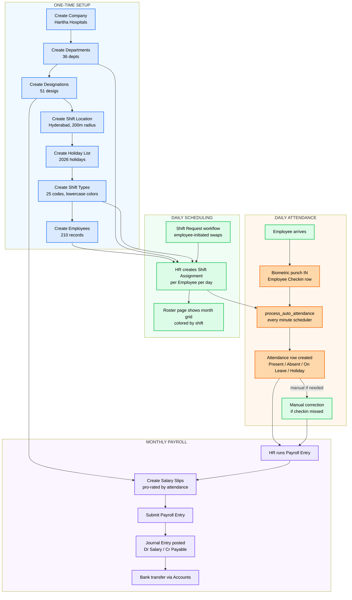
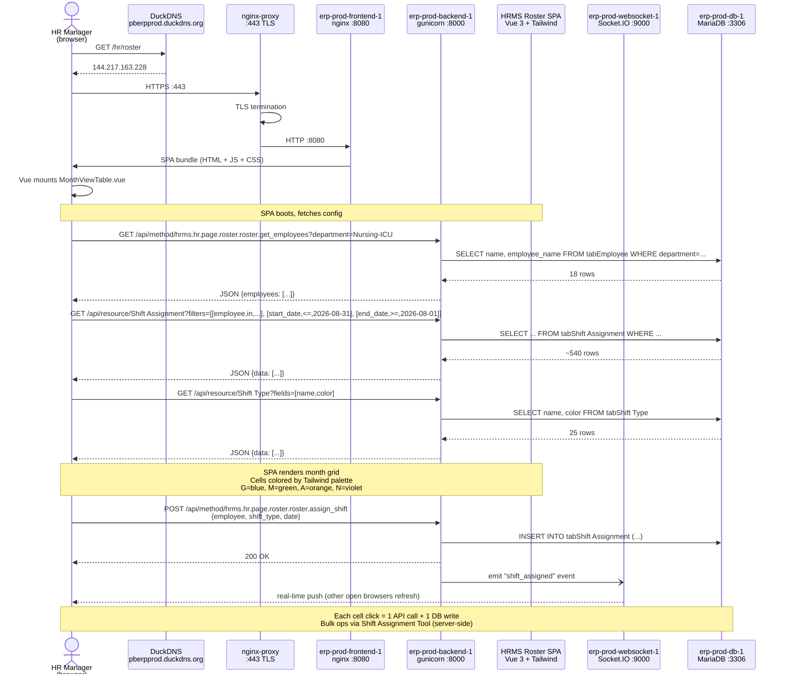
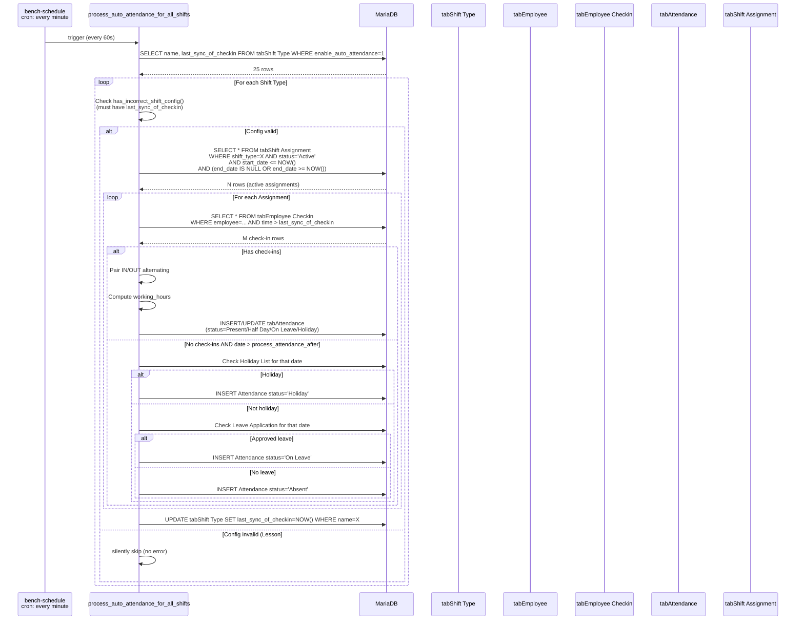
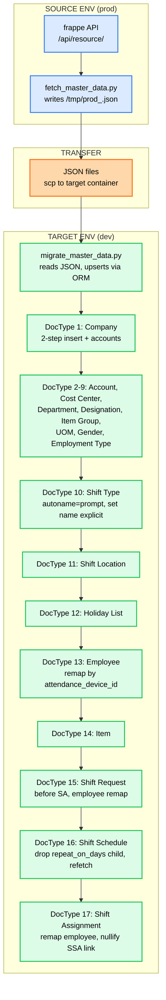
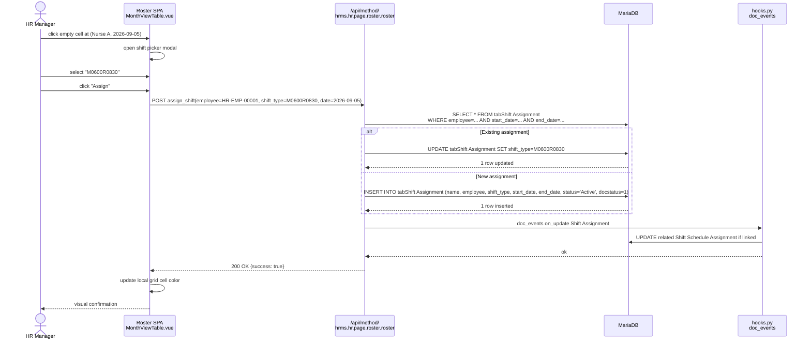

# 02.2 — Process Diagrams

> **Audience:** Anyone who needs a visual mental model of the shift management flow.
> **Goal:** Mermaid flowcharts of the end-to-end shift lifecycle, daily ops cycle, and Roster SPA architecture.
> **Last updated:** 2026-08-29
> **Pre-req reading:** [02.1 Shift Management Workflow](02.1-shift-management-workflow.md), [01.2 Schema Diagram](../01-schema/01.2-schema-diagram.md)

---

## How to render

- **GitHub:** all `.md` in this repo render Mermaid automatically in the file viewer. Just open the doc on github.com.
- **VS Code:** install the "Markdown Preview Mermaid Support" extension.
- **Offline:** install `mermaid-cli` (`npm install -g @mermaid-js/mermaid-cli`) and run `mmdc -i diagram.mmd -o diagram.png`.
- **Confluence / Notion:** paste the `mermaid` code block; both render natively as of 2024.

All diagrams below use Mermaid syntax. Color classes reference the same Tailwind palette used in the Shift Type color field (per [02.1 §Color coding](02.1-shift-management-workflow.md#color-coding-roster-spa--tailwind-palette)).

---

## 1. End-to-end shift lifecycle

From Employee onboarding to monthly payroll. One big picture.



**Key paths:**
- **Setup (blue)** happens once at deployment. Order matters: Company → Dept → Designation → Shift Location → Holiday List → Shift Types → Employees.
- **Scheduling (green)** happens daily. HR assigns who works which shift on which day.
- **Attendance (orange)** happens automatically every minute via scheduler, with manual override for missed check-ins.
- **Payroll (violet)** happens monthly. End-to-end flow from attendance to bank file.

---

## 2. Daily ops cycle

The 24-hour heartbeat of shift management. What runs when, who does what.

```mermaid
flowchart LR
    classDef cron fill:#dbeafe,stroke:#3b82f6,stroke-width:2px,color:#000
    classDef user fill:#dcfce7,stroke:#22c55e,stroke-width:2px,color:#000
    classDef data fill:#fed7aa,stroke:#f97316,stroke-width:2px,color:#000
    classDef sys fill:#ede9fe,stroke:#8b5cf6,stroke-width:2px,color:#000

    subgraph Morning["MORNING 06:00 – 10:00"]
        M1[Morning shift employees arrive]:::user
        M2[Biometric punches IN<br/>Employee Checkin created]:::data
        M3[process_auto_attendance<br/>marks Previous-day Absent if no checkin]:::cron
    end

    subgraph Midday["MIDDAY 12:00 – 14:00"]
        MD1[Manager checks Roster<br/>for today's coverage]:::user
        MD2[Identifies gaps<br/>missed check-ins]:::user
    end

    subgraph Afternoon["AFTERNOON 14:00 – 18:00"]
        A1[Afternoon shift starts]:::user
        A2[Biometric punches IN for A-shift]:::data
        A3[Process leave requests<br/>approve / reject]:::user
    end

    subgraph Evening["EVENING 18:00 – 22:00"]
        E1[Morning shift OUT<br/>Last check-out of day]:::data
        E2[Shift Assignment for next day<br/>reviewed by HR]:::user
    end

    subgraph Night["NIGHT 22:00 – 06:00"]
        N1[Night shift employees on duty]:::user
        N2[Security rounds<br/>manual check-ins]:::user
        N3[Midnight: cron rolls date]:::cron
    end

    M1 --> M2 --> M3
    MD1 --> MD2
    M3 --> MD1
    MD2 --> A3
    A1 --> A2 --> A3
    A3 --> E1
    E1 --> E2
    E2 --> N1
    N1 --> N2 --> N3
    N3 -.-> M1
```



**Cadence:**
- **Per-minute:** `process_auto_attendance` cron (continuous)
- **Per-day:** Manager checks Roster, reviews leave, plans next-day assignments
- **Per-shift:** IN punches at shift start, OUT punches at shift end
- **Per-month:** Payroll Entry on the 1st of next month (HR-driven, not shown here)

---

## 3. Roster SPA architecture

What happens when an HR manager opens `/hr/roster` in their browser. Request flow through the stack.



**Tailwind color mapping at the SPA layer:**

```javascript
// apps/hrms/roster/src/components/MonthViewTable.vue (simplified)
const colors = {
  blue:    '#3b82f6',  // G — General
  green:   '#22c55e',  // M — Morning
  orange:  '#f97316',  // A — Afternoon
  violet:  '#8b5cf6',  // N — Night
}

// Each cell:
<td :style="{ backgroundColor: colors[shiftType.color] }">
  {{ shiftType.name }}  <!-- e.g., "M0600R0830" -->
</td>
```

**Critical:** color keys MUST be lowercase Tailwind names. If a Shift Type has `color='Blue'` (capitalized), the lookup `colors['Blue']` returns `undefined` and the SPA crashes with "Cannot read properties of undefined (reading '300')" (Lesson #157). The `Shift Type-color-options` Property Setter in our `haritha_hospital` fixtures prevents this by restricting the dropdown to lowercase values.

---

## 4. Auto Attendance data flow

The minute-by-minute cron job that turns biometric punches into Attendance rows.



**Why `last_sync_of_checkin` is critical:** if NULL, the function `has_incorrect_shift_config()` returns True and the shift is silently skipped. Symptom is "scheduler runs every minute but marks zero attendance". Always set this to a future timestamp on Shift Type creation (Lesson #42).

---

## 5. Data migration flow

When we promote code from dev to prod, or seed a new env with prod's master data.



**Idempotency:** each step uses `frappe.db.exists()` → `.save()` or `.insert()` (Lesson #157 pattern). Re-running the script is safe.

**Gotchas (per Lesson #157):**
1. `get_doc()` needs `doctype` key
2. Company default accounts = 2-step (insert → set_value)
3. Account root nodes = skip
4. Shift Type autoname='prompt' = explicit name
5. Department root = skip
6. Employee missing lookup data = migrate lookup first
7. Employee ID remap = lookup by `attendance_device_id`
8. Child tables stripped = explicit fetch
9. HRMS validate_approver = Department Approver must exist
10. autoname='field.######' = Series pre-bump

See [`/scripts/migrate_master_data.py`](../../../scripts/migrate_master_data.py) for the full implementation.

---

## 6. Roster cell click → Shift Assignment flow

What happens when the manager drags / clicks a cell in the Roster SPA to assign a shift.



**Note:** in HRMS standard, the Roster cell click triggers the `hrms.hr.page.roster.roster` API. For bulk operations (assigning a whole department a shift for a date range), use the **Shift Assignment Tool** (server-side) instead — it's much faster for >50 assignments.

---

## Conventions

All diagrams in this doc follow these style rules:

| Element | Style |
|---|---|
| Setup nodes | Blue fill (`#dbeafe`) — happens once |
| User-action nodes | Green fill (`#dcfce7`) — human-driven |
| Data/system nodes | Orange fill (`#fed7aa`) — DB / scheduler / API |
| Money/payroll nodes | Violet fill (`#ede9fe`) — financial impact |
| Subgraph | Light tint background |
| Arrows | Solid black for direct flow, dashed grey for time-based |

---

## Related docs

| Doc | Purpose |
|---|---|
| [02.1 Shift Management Workflow](02.1-shift-management-workflow.md) | Prose explanation of the same flows |
| [01.1 Schema Reference](../01-schema/01.1-schema-reference.md) | Schema details for every node in these diagrams |
| [01.2 Schema Diagram](../01-schema/01.2-schema-diagram.md) | Entity-relationship diagram |
| [00.2 Architecture Overview](../00-foundations/00.2-architecture-overview.md) | Container / network topology (referenced in §3) |

---

*End of 02.2.*
