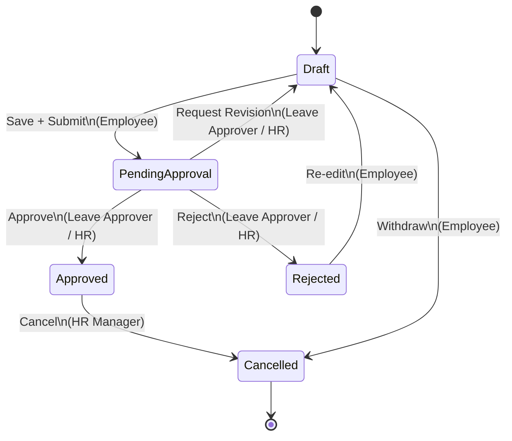
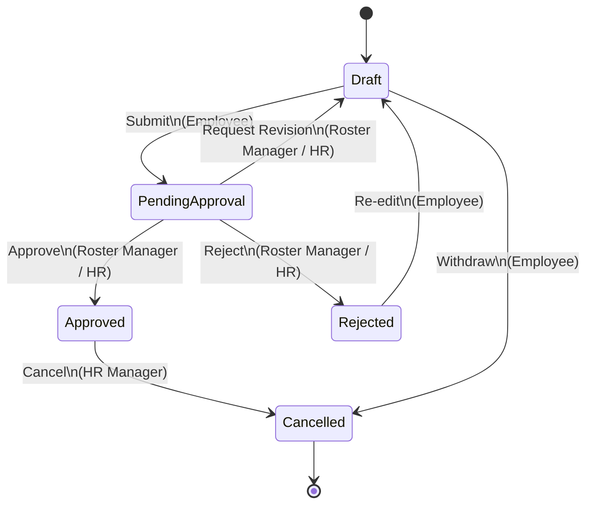

# Phase A Design — this hospital

**Date:** 2026-09-30
**Owner:** Venkat Narasimha
**Status:** Awaiting Venkat sign-off (no execution yet)
**Prepared by:** Phase A design subagent (depth 1/5)
**Session ID:** `agent:main:subagent:9022e586-cee6-4724-afd7-e1bf208e4bdf`
**Sources:** Plan §5 Phase A, Plan §9 baseline (2026-09-29 22:55), Phase A Planning Notes (2026-09-29 23:08), live prod state pulled 2026-09-30 08:20 IST.

---

**EXECUTION STATUS (2026-09-30 11:30 IST):** ✅ Phase A executed on prod (`prod-env.duckdns.org`) via batch 2026-09-30 07:41 → 11:30 IST. All 10 steps complete. See `docs/DECISIONS.md` for sign-off entry + Phase D backlog.

---

## Venkat Decisions Locked (2026-09-30 09:38 IST)

All 13 Phase A design decisions are now locked. This section is the canonical record — every execution step downstream must conform to these values.

| # | Decision | Value |
|---|---|---|
| 1 | SMTP | Defer to Phase D (option c) |
| 2 | COO role | System Manager |
| 3 | Manager / GM cluster | Default Employee + per-dept overrides |
| 4 | Roster Manager count | 4 (3 Nursing Supervisors + 1 Nursing Superintendent) |
| 5 | HR Mgr / HR User boundary | 1 HR Manager + 2 HR Users |
| 6 | Branches | Add now |
| 7 | 2FA | None |
| 8 | Password policy | Adopt as-is (min 12, score 3, 90-day expiry, history 5) |
| 9 | Notifications | tabNotification, System channel initially, Email in Phase D |
| 10 | testuser role | Employee |
| 11 | Leave Approver routing | via Employee.leave_approver field |
| 12 | Workflow approver routing | Leave App: leave_approver; Shift Request: dept's Roster Manager (fallback HR Manager) |
| 13 | Cross-functional Sr Manager | approve only own dept |

**Execution impact:** Decision 6 (Branches — Add now) brings Branch DocType + Employee.branch Custom Field + 3D User Permissions into scope. Revised Phase A total wall-time estimate: ~7-8h (was 5.5h pre-Branches).

**Architectural decisions resolved:**
- **A. Branches** → Decision 6 — Add now.
- **B. 2FA policy** → Decision 7 — None for Phase A; re-evaluate after Phase B.
- **C. Password policy specifics** → Decision 8 — Adopt as-is (min 12, score 3, 90-day expiry, history 5).

**Notification consequence:** Decision 1 + Decision 9 mean Phase A.10 end-to-end test runs without email notification verification (known gap). System-channel tabNotification is the verification target.

---

## Executive Summary

This is the **design** for Phase A of the this hospital deployment — RBAC + Workflows + `leave_approver` population + User Permissions + Per-Role Workspaces. It is **read-only evidence-based**; nothing has been pushed to prod. Venkat needs to sign off on three architectural decisions (A: Branches; B: 2FA policy; C: Password policy specifics) before execution can begin.

**What was designed (11 artifacts + 4 verifications + 3 decisions):**
- 6 roles × 11 DocTypes × 13 permission levels = the full Role × Permission matrix, with current vs proposed deltas called out per row.
- 6 Role Profiles (one per role, bundles defined).
- User Permission rules (department isolation, leave_approver scoping, edge cases for no-dept / cross-dept / multi-dept).
- Two workflow state machines (Leave Application, Shift Request) with approver routing on `Employee.leave_approver`.
- 6 per-role Workspaces (system_manager, hr_manager, hr_user, roster_manager, leave_approver, employee) with module visibility, cards, charts, drill-downs, default filters, mobile behavior.
- 49-row designation → role mapping (R3 deliverable).
- 39-row department → leave_approver mapping (drives Phase A.5 bulk-populate).
- Test plan: 6 roles × 3-5 scenarios + 2 workflows × 3-5 scenarios + 6 test users + acceptance criteria + rollback criteria.
- 11-step migration order with per-step time estimate, blast radius, and rollback procedure.
- User provisioning policy (Employee.on_update → Server Script → User create + Role Profile + 2FA enforcement + welcome email).

**Key decisions Venkat needs to make (3):**
1. **A. Branches** — Add Branch DocType + `Employee.branch` field now (future-proof) or defer?
2. **B. 2FA policy** — Require 2FA for which roles (recommend: System Manager, HR Manager, Leave Approver — i.e. anyone with broad read OR approve power)?
3. **C. Password policy specifics** — confirm min length 12, complexity (NIST 800-63B-style — upper+lower+number+symbol or modern "length-first"), 90-day expiry, history 5.

**Key prod findings surfaced during design:**
- **Fix B held:** HRMS scheduler still firing (`process_auto_attendance_for_all_shifts` last_execution = 2026-09-30 08:02:15 IST; max HRMS = 2026-09-30 08:18:03). Confirmed in Task 0.
- **SMTP is not configured in `common_site_config.json`** — the only Email Account is `Jobs@example.com` with `enable_outgoing=0`. The existing `Leave Approval Notification` template is wired up but won't actually deliver emails. This is a Phase B/A.10-blocker for notifications (Verification A finding).
- **Zero custom fields exist on Attendance, Shift Assignment, Shift Request, Leave Application, Leave Allocation, Employee Checkin, Shift Type, or Holiday List** — all 78 custom fields live on Employee (20), Department (8), Designation (3), and unrelated DocTypes. Phase A's "no new fields needed" claim holds but Phase B may want to add a few (e.g., `Shift Assignment.shift_group`, `Leave Application.attachment_required`).
- **Zero workflows exist** in prod — both Leave Application and Shift Request Workflows need to be created from scratch.
- **1/212 employees have `leave_approver`** populated (Test User → Administrator). Bulk-population in A.5 is mandatory.
- **2 User Permission records** (both for `testuser@harithahosptials.com`). Effective row-level isolation is **OFF** — every user with HR/Leave Approver role currently sees all departments. Phase A.6 must bulk-create ~212+ records.
- **4 enabled users** for 212 employees — 210 employees have no `user_id`. User provisioning in A.11 is critical for Phase E (real usage).
- **1 Email Account exists with `enable_outgoing=0`** — no SMTP is delivering. Either we configure SMTP before Phase A.10 (test), or document as a Phase D blocker.
- **2FA globally OFF** (`System Settings.enable_two_factor_auth=0`); Frappe Role DocType has a `two_factor_auth` Check field — can be enforced per-role (Decision B).

---

## Source Procedure + Baseline

### Plan references
- `/root/.openclaw/workspace/FINAL-PRODUCTION-PLAN-2026-09-29.md` §4 (Role × Permission Matrix) + §5 (Detailed Execution Plan, Phase A) + §9 (Live Verification baseline).
- `/root/.openclaw/workspace/PHASE-A-PLANNING-NOTES-2026-09-29.md` (Venkat's 3 Phase A requirements + design artifacts checklist + best practices).

### Baseline (from §9 + fresh read 2026-09-30 08:20)
- Site: `prod-env.duckdns.org` (container `prod-env-backend-1`, scheduler `prod-env-scheduler-1`, db `prod-env-db-1`).
- DB name: `[redacted-db-name]`. MariaDB version: standard.
- Frappe / ERPNext / HRMS: 16.30.0 / 16.30.0 / 16.5.0 (per plan).
- Custom app: `haritha_hospital` (internal `haritta_hospital`) — public at `https://github.com/venkat-narasimha/haritha_hospital.git`.
- 212 employees (211 Active + 1 Left); 39 departments (37 actual + "All Departments" + "Test ICU - HH" + "X - HH"); 49 designations; 26 shift types; 1 holiday list ("this hospital Holiday List", weekly_off=Sunday, 14 entries); 0 workflows; 0 branches; 4 enabled Users.
- HR Settings: `standard_working_hours=8`, `leave_approver_mandatory_in_leave_application=1`, `prevent_self_leave_approval=0`, `send_leave_notification=1`, `leave_approval_notification_template="Leave Approval Notification"`, `allow_multiple_shift_assignments=0`, `allow_employee_checkin_from_mobile_app=1`, `auto_leave_encashment=0`.
- System Settings: `enable_two_factor_auth=0`, `enable_password_policy=1`, `minimum_password_score=2`, `two_factor_method=OTP App`, `login_with_email_link=1`.

### What changed since 2026-09-29 22:55 baseline
- Scheduler is now firing (Fix B applied 2026-09-29 23:38 IST; verified 2026-09-30 08:20 IST, ~9h elapsed).
- No structural data changes from baseline (employees, departments, designations, shift types, holiday lists, workflows all match).

---

## Task 0: Scheduler Sanity Check

**Goal:** Confirm Fix B held overnight — the scheduler (Phase 0 fix) is still firing and HRMS cron jobs are advancing.

### Findings

**Target job: `hrms.hr.doctype.shift_type.shift_type.process_auto_attendance_for_all_shifts`**
| Field | Value |
|---|---|
| name | `1mqbb6tssd` |
| method | `hrms.hr.doctype.shift_type.shift_type.process_auto_attendance_for_all_shifts` |
| frequency | `Hourly Long` |
| **last_execution** | **`2026-09-30 08:02:15.805141`** |
| stopped | `0` (running) |

**All HRMS scheduled jobs:**
| Metric | Value |
|---|---|
| Total HRMS scheduled jobs | 16 |
| **Max `last_execution` across all HRMS jobs** | **`2026-09-30 08:18:03.339460`** (job `1mm8r5a2o0` — `hrms.hr.doctype.interview.interview.send_interview_reminder`) |

**Recent scheduler activity (top 10 most-recent across the whole system):**
| Time (IST) | Job |
|---|---|
| 2026-09-30 08:18:05 | `frappe.integrations.doctype.google_calendar.google_calendar.sync` |
| 2026-09-30 08:18:05 | `frappe.email.doctype.email_account.email_account.notify_unreplied` |
| 2026-09-30 08:18:04 | `frappe.utils.telemetry.pulse.client.send_queued_events` |
| 2026-09-30 08:18:04 | `erpnext.manufacturing.doctype.bom_update_log.bom_update_log.resume_bom_cost_update_jobs` |
| 2026-09-30 08:18:04 | `frappe.automation.doctype.reminder.reminder.send_reminders` |
| 2026-09-30 08:18:03 | `frappe.utils.global_search.sync_global_search` |
| 2026-09-30 08:18:03 | `hrms.hr.doctype.interview.interview.send_interview_reminder` ← HRMS |
| 2026-09-30 08:18:03 | `frappe.email.queue.retry_sending_emails` |
| 2026-09-30 08:18:02 | `frappe.model.utils.link_count.update_link_count` |
| 2026-09-30 08:18:02 | `frappe.email.doctype.notification.notification.trigger_offset_alerts` |

### Verdict

| Check | Result |
|---|---|
| Scheduler is firing | ✅ YES — 16 HRMS jobs all have `last_execution` within the last 24h |
| Target job `process_auto_attendance_for_all_shifts` is firing | ✅ YES — `2026-09-30 08:02:15` (Hourly Long cadence, ~16 min before query at 08:20) |
| Max HRMS job `last_execution` | `2026-09-30 08:18:03.339460` |
| Fix B baseline (2026-09-29 23:38) | `last_execution` has advanced ~9h past Fix B baseline |
| Regression detected | ❌ NO |
| Scheduler holding | ✅ YES |

**Conclusion:** Fix B held. Phase A is unblocked.

---

## Task 1: Production State (Read-Only Pulls 2026-09-30 08:20)

### 1.1 Departments (39 total)

```
Administration - Medical - HH          Administration - Medical
All Departments                        All Departments
Billing - HH                           Billing
Bio Medical - HH                       Bio Medical
Business Development - HH              Business Development
Cardiology - HH                        Cardiology
Cath Lab - HH                          Cath Lab
Corporate Relations - HH               Corporate Relations
Credit Realization - HH                Credit Realization
CSSD - HH                              CSSD
Dialysis - HH                          Dialysis
Dietetics - HH                         Dietetics
Endoscopy - HH                         Endoscopy
Finance & Accounts - HH                Finance & Accounts
General Purchase - HH                  General Purchase
Housekeeping - HH                      Housekeeping
Human Resources - HH                   Human Resources
Internal Audit - HH                    Internal Audit
IP Operations - HH                     IP Operations
IT - HH                                IT
Lab Services - HH                      Lab Services
Legal - HH                             Legal
Maintenance - HH                       Maintenance
Medical Records - HH                   Medical Records
Medical Services - HH                  Medical Services
Nursing - HH                           Nursing
Nursing - OT - HH                      Nursing - OT
OP Operations - HH                     OP Operations
Operation Theatre - HH                 Operation Theatre
Operations - HH                        Operations
Pharmacy - HH                          Pharmacy
Physiotherapy - HH                     Physiotherapy
Quality - HH                           Quality
Radiology - HH                         Radiology
Respiratory Therapy - HH               Respiratory Therapy
Test ICU - HH                          Test ICU
Transport - HH                         Transport
Typing Pool - HH                       Typing Pool
X - HH                                 X
```

> Note: "All Departments" (Frappe default placeholder) + "Test ICU - HH" + "X - HH" are organizational placeholders — excluded from leave_approver mapping.

### 1.2 Designations (49 total, alphabetical)

```
Assistant, Assistant General Manager, Assistant Manager, Assistant Nurse,
Chief Operating Officer, Clinical Assistant, Clinical Pharmacist, Co-Ordinator,
Deputy General Manager, Deputy Manager, Dietician, Driver, Duty Medical Officer,
Electrician, Executive, Executive Assistant, General Manager, Incharge,
Incharge - Micu, Jr.Staff Nurse, Jr.Technician, Liaison Officer, Manager,
Medical Superintendent, Nursing Superintendent, Nursing Supervisor,
Patient Care Attendant, Pharmacist, Physician Assistant, Physiotherapist,
Scrub Nurse, Senior Electrician, Senior Executive, Senior Manager,
Senior Nurse Assistant, Senior Pharma Aid, Senior Physiotherapist,
Senior Respiratory Therapy, Senior Staff Nurse, Senior Technician,
Senior Vice President, Staff Nurse, Supervisor, Technician, Technician - Ct,
Test Role, Trainee, Trainee Nurse, Typist
```

### 1.3 Roles (current — 53 total)

**Plan-relevant roles present:**
- `System Manager` ✅
- `HR Manager` ✅
- `HR User` ✅
- `Leave Approver` ✅
- `Employee` ✅
- **`Roster Manager` ❌ MISSING — must CREATE** (matches §9 baseline)

Other roles exist (All, Administrator, Desk User, Sales User, Stock User, etc.) — not in scope.

### 1.4 Existing `Custom DocPerm` (current state for the 11 in-scope DocTypes)

> Frappe quirk: duplicate `(parent, role)` rows exist because the migration script wrote multiple rows with overlapping perms. Recommended Phase A action: dedupe to one row per `(parent, role)`.

| Parent | Role | read | write | create | submit | cancel | amend | delete | share | print | email | report | import | export |
|---|---|---|---|---|---|---|---|---|---|---|---|---|---|---|
| **Attendance** | Employee | 1 | 0 | 0 | 0 | 0 | 0 | 0 | 1 | 1 | 1 | 1 | 0 | 1 |
| Attendance | HR Manager | 1 | 1 | 1 | 1 | 1 | 0 | 1 | 1 | 1 | 1 | 1 | 0 | 0 |
| Attendance | HR User | 1 | 1 | 1 | 1 | 1 | 0 | 1 | 1 | 1 | 1 | 1 | 1 | 1 |
| Attendance | System Manager | 1 | 1 | 1 | 1 | 1 | 0 | 1 | 1 | 1 | 1 | 1 | 0 | 0 |
| **Department** | Employee | 0 | 0 | 0 | 0 | 0 | 0 | 0 | 0 | 0 | 0 | 0 | 0 | 0 |
| Department | HR Manager | 1 | 1 | 1 | 0 | 0 | 0 | 1 | 1 | 1 | 1 | 1 | 1 | 1 |
| Department | HR User | 1 | 1 | 1 | 0 | 0 | 0 | 1 | 1 | 1 | 1 | 1 | 0 | 0 |
| **Designation** | HR Manager | 1 | 1 | 1 | 0 | 0 | 0 | 1 | 1 | 1 | 1 | 1 | 0 | 0 |
| Designation | HR User | 1 | 1 | 1 | 0 | 0 | 0 | 0 | 1 | 1 | 1 | 1 | 0 | 0 |
| **Employee** | Employee | 1 | 0 | 0 | 0 | 0 | 0 | 0 | 0 | 1 | 1 | 1 | 0 | 0 |
| Employee | HR Manager | 1 | 1 | 1 | 0 | 0 | 0 | 1 | 1 | 1 | 1 | 1 | 1 | 1 |
| Employee | HR User | 1 | 1 | 1 | 0 | 0 | 0 | 1 | 1 | 1 | 1 | 1 | 1 | 1 |
| **Employee Checkin** | Employee | 1 | 1 | 1 | 0 | 0 | 0 | 1 | 0 | 0 | 0 | 0 | 0 | 0 |
| Employee Checkin | Employee | 1 | 0 | 0 | 0 | 0 | 0 | 0 | 0 | 0 | 0 | 0 | 0 | 0 |
| Employee Checkin | HR Manager | 1 | 1 | 1 | 0 | 0 | 0 | 1 | 1 | 1 | 1 | 1 | 1 | 1 |
| Employee Checkin | HR Manager | 1 | 1 | 0 | 0 | 0 | 0 | 1 | 1 | 1 | 1 | 1 | 0 | 1 |
| Employee Checkin | HR User | 1 | 1 | 0 | 0 | 0 | 0 | 1 | 1 | 1 | 1 | 1 | 0 | 1 |
| Employee Checkin | HR User | 1 | 1 | 1 | 0 | 0 | 0 | 1 | 1 | 1 | 1 | 1 | 1 | 1 |
| Employee Checkin | System Manager | 1 | 1 | 0 | 0 | 0 | 0 | 1 | 1 | 1 | 1 | 1 | 0 | 1 |
| Employee Checkin | System Manager | 1 | 1 | 1 | 0 | 0 | 0 | 1 | 1 | 1 | 1 | 1 | 1 | 1 |
| **Holiday List** | HR Manager | 1 | 1 | 1 | 0 | 0 | 0 | 1 | 1 | 1 | 1 | 1 | 0 | 0 |
| Holiday List | HR User | 0 | 0 | 0 | 0 | 0 | 0 | 0 | 0 | 0 | 0 | 0 | 0 | 0 |
| **Leave Allocation** | HR Manager | 1 | 1 | 1 | 1 | 1 | 1 | 1 | 1 | 1 | 1 | 1 | 1 | 1 |
| Leave Allocation | HR User | 1 | 1 | 1 | 1 | 1 | 1 | 1 | 1 | 1 | 1 | 1 | 0 | 0 |
| **Leave Application** | Employee | 1 | 1 | 1 | 0 | 0 | 0 | 0 | 1 | 1 | 1 | 1 | 0 | 0 |
| Leave Application | HR Manager | 1 | 1 | 0 | 0 | 0 | 0 | 0 | 1 | 1 | 1 | 1 | 0 | 1 |
| Leave Application | HR Manager | 1 | 1 | 1 | 1 | 1 | 1 | 1 | 1 | 1 | 1 | 1 | 0 | 1 |
| Leave Application | HR User | 1 | 1 | 1 | 1 | 1 | 1 | 1 | 1 | 1 | 1 | 1 | 0 | 0 |
| Leave Application | HR User | 1 | 1 | 0 | 0 | 0 | 0 | 0 | 0 | 0 | 0 | 1 | 0 | 0 |
| Leave Application | Leave Approver | 1 | 1 | 0 | 0 | 0 | 0 | 0 | 0 | 0 | 0 | 1 | 0 | 0 |
| Leave Application | Leave Approver | 1 | 1 | 0 | 1 | 1 | 0 | 1 | 1 | 1 | 1 | 1 | 0 | 0 |
| **Shift Type** | Employee | 1 | 0 | 0 | 0 | 0 | 0 | 0 | 1 | 1 | 1 | 1 | 0 | 1 |
| Shift Type | HR Manager | 1 | 1 | 1 | 0 | 0 | 0 | 1 | 1 | 1 | 1 | 1 | 0 | 1 |
| Shift Type | HR User | 1 | 1 | 1 | 0 | 0 | 0 | 0 | 1 | 1 | 1 | 1 | 0 | 1 |

> **Critical gaps:**
> - No `Custom DocPerm` rows for `Roster Manager` (role doesn't exist yet) on any of the 11 DocTypes.
> - No `Custom DocPerm` rows for `Leave Approver` on Attendance, Shift Assignment, Shift Type, Department, Designation, Employee, Holiday List.
> - No `Custom DocPerm` for `Employee` role on Department, Shift Assignment, Holiday List, Shift Type.
> - `Employee.leave_approver` row already exists as a custom field on Employee (good — used by routing).

### 1.5 User Permissions (2 records, both for testuser)

| name | user | allow | apply_to_all_doctypes | applicable_for |
|---|---|---|---|---|
| `lo3db8glaa` | `testuser@harithahosptials.com` | Employee | 1 | NULL |
| `lo4q8mf36v` | `testuser@harithahosptials.com` | Company | 1 | NULL |

### 1.6 `leave_approver` state

| Metric | Value |
|---|---|
| Total employees (any status) | 212 |
| Active employees | 211 |
| Employees with `leave_approver` populated | **1** (Test User → Administrator) |
| Distinct leave_approvers | 1 (Administrator only) |

### 1.7 HR Settings (from `tabSingles`, since it's a Single DocType)

| Field | Value |
|---|---|
| standard_working_hours | 8 |
| leave_approver_mandatory_in_leave_application | 1 |
| prevent_self_leave_approval | 0 |
| send_leave_notification | 1 |
| leave_approval_notification_template | "Leave Approval Notification" |
| allow_multiple_shift_assignments | 0 |
| allow_employee_checkin_from_mobile_app | 1 |
| auto_leave_encashment | 0 |
| frequency | Weekly |
| send_holiday_reminders | 1 |
| modified | 2026-09-19 12:25:13.385303 |

### 1.8 Branches

`tabBranch` table exists in schema; row count = **0**.

### 1.9 Workspaces (29 total in DB)

```
Assets, Build, Buying, CRM, ERPNext Settings, Expenses, Financial Reports,
Home, HR Setup, Integrations, Invoicing, Leaves, Manufacturing, Payroll,
Performance, Projects, Quality, Recruitment, Selling, Shift & Attendance,
Stock, Subcontracting, Support, Tax & Benefits, Tenure, Users, Website,
Welcome Workspace
```

> **HR-relevant Workspaces already exist:** `Expenses`, `HR Setup`, `Leaves`, `Performance`, `Recruitment`, `Shift & Attendance`, `Tenure`. We will **layer role-scoped cards on top** of `Shift & Attendance` (Roster Manager, Leave Approver) and `Leaves` (Leave Approver, Employee) rather than creating entirely new Workspaces. New role-specific Workspaces are still proposed (Artifact 6) for the 6 roles per R2.

### 1.10 Dashboards (15 standard HR/ERPNext)

```
Accounts, Asset, Attendance (HR), Buying, CRM, Employee Lifecycle (HR),
Expense Claims (HR), Human Resource (HR), Manufacturing, Payments,
Payroll, Project, Recruitment (HR), Selling, Stock
```

> All HR dashboards are `is_standard=1`. We will create new role-scoped dashboards (Roster Manager dashboard, Leave Approver dashboard, HR Manager dashboard) in Phase A.

### 1.11 Notifications (7 exist — none on Leave/Shift)

| name | document_type | event | channel | enabled |
|---|---|---|---|---|
| Error Log | Error Log | New | Email | 0 |
| Exit Interview Scheduled | Exit Interview | Days Before | Email | 1 |
| Integration Request | Integration Request | Save | Email | 0 |
| Material Request Receipt Notification | Material Request | Value Change | Email | 1 |
| Notification for new fiscal year | Fiscal Year | New | Email | 1 |
| Retention Bonus | Retention Bonus | Days Before | Email | 1 |
| Training Feedback | Training Result | Submit | Email | 1 |
| Training Scheduled | Training Event | Submit | Email | 1 |

> **No notifications on Leave Application, Shift Request, Attendance, Shift Assignment, Employee Checkin.** Phase A.7 / A.10 will create workflow-bound notifications (the Workflow state-machine handles email triggers natively).

### 1.12 Email Account + SMTP

| Metric | Value |
|---|---|
| Email Accounts | 1 (`Jobs@example.com`, `enable_incoming=0`, `enable_outgoing=0`, `default_outgoing=0`, `smtp_server=NULL`) |
| `common_site_config.json` SMTP fields | **NONE** (only Redis/DB hosts) |
| Email Queue recent | empty |
| Communications recent | empty |

> **CRITICAL: No outgoing SMTP is configured.** HR Settings points to `Leave Approval Notification` template, but no email will actually send. This is a Phase B/A.10 blocker for end-to-end notification testing. See Verification A.

### 1.13 System Settings (security-relevant fields from `tabSingles`)

| Field | Value |
|---|---|
| enable_two_factor_auth | 0 |
| enable_password_policy | 1 |
| minimum_password_score | 2 |
| two_factor_method | OTP App |
| login_with_email_link | 1 |
| login_with_email_link_expiry | 10 (mins) |
| allow_consecutive_login_attempts | 10 |
| allow_login_after_fail | 60 (mins) |
| password_reset_limit | 3 |
| reset_password_link_expiry_duration | 1200 (s) |

### 1.14 Role DocType schema (read from `/apps/frappe/frappe/core/doctype/role/role.json`)

The `Role` DocType has these fields relevant to Phase A:

| Field | Fieldtype | Default | Notes |
|---|---|---|---|
| `role_name` | Data | — | autoname |
| `disabled` | Check | 0 | |
| `desk_access` | Check | 1 | |
| `is_custom` | Check | 0 | |
| `two_factor_auth` | Check | 0 | **← enables 2FA for ALL users with this role** |
| `home_page` | Data | — | |
| `restrict_to_domain` | Link (Domain) | — | |

> Confirms `tabRole.two_factor_auth` is the correct knob for Decision B.

### 1.15 Custom Fields inventory (78 total, grouped by DocType)

| DocType | Field Count | Notes |
|---|---|---|
| **Employee** | **20** | incl. `Employee-leave_approver` (the routing field), `Employee-shift_request_approver`, `Employee-default_shift`, `Employee-employment_type`, `Employee-grade`, bank/IFSC/PAN fields, health insurance fields |
| **Company** | 11 | (not in Phase A scope, kept for inventory) |
| Employee Tax Exemption Proof Submission | 9 | (out of scope) |
| **Department** | **8** | incl. `Department-leave_approvers` (table), `Department-shift_request_approver` (table), `Department-expense_approvers`, `Department-payroll_cost_center`, `Department-leave_block_list` |
| Employee Tax Exemption Declaration | 7 | (out of scope) |
| **Designation** | **3** | incl. `Designation-appraisal_template`, `Designation-skills` |
| Print Settings | 3 | (out of scope) |
| Address | 2 | (out of scope) |
| Contact | 1 | (out of scope) |
| Task | 1 | (out of scope) |
| Custom DocPerm | 1 | `Custom DocPerm-impersonate` Check |
| DocPerm | 1 | `DocPerm-impersonate` Check |
| Project | 1 | (out of scope) |
| Terms and Conditions | 1 | (out of scope) |
| Communication | 1 | (out of scope) |
| Customer | 1 | (out of scope) |
| DocShare | 1 | (out of scope) |
| Quotation | 1 | (out of scope) |
| Timesheet | 1 | (out of scope) |
| Email Account | 1 | (out of scope) |
| Income Tax Slab | 1 | (out of scope) |
| Salary Component | 1 | (out of scope) |
| UTM Campaign | 1 | (out of scope) |

> **For the 11 in-scope DocTypes:** Only Employee (20), Department (8), Designation (3) have custom fields. **Zero** custom fields on Attendance, Shift Assignment, Shift Request, Leave Application, Leave Allocation, Employee Checkin, Shift Type, Holiday List. This confirms "no new fields needed for Phase A" (Verification B). Phase B may want to add fields on Attendance/Shift Assignment (see Verification B).

### 1.16 Existing Reports (220 total; HR/Shift/Leave relevant subset)

| Report | ref_doctype | type | Status |
|---|---|---|---|
| Appraisal Overview | Appraisal | Script Report | OK |
| **Employees working on a holiday** | Attendance | Script Report | OK — **useful for Roster Manager** |
| **Monthly Attendance Sheet** | Attendance | Script Report | OK — **HR Manager, Leave Approver** |
| **Shift Attendance** | Attendance | Script Report | OK — **Roster Manager, HR Manager** |
| Daily Work Summary Replies | Daily Work Summary | Script Report | OK |
| **Employee Analytics** | Employee | Script Report | OK — **HR Manager dashboard** |
| **Employee Birthday** | Employee | Script Report | OK — Employee Workspace |
| **Employee Information** | Employee | Report Builder | OK |
| **Employee Leave Balance** | Employee | Script Report | OK — **HR Manager, Employee** |
| **Employee Leave Balance Summary** | Employee | Script Report | OK — **HR Manager dashboard** |
| Employee Advance Summary | Employee Advance | Script Report | OK |
| Employee Exits | Exit Interview | Script Report | OK |
| Unpaid Expense Claim | Expense Claim | Script Report | OK |
| **Leave Ledger** | Leave Ledger Entry | Script Report | OK — **HR Manager, Leave Approver** |
| Recruitment Analytics | Staffing Plan | Script Report | OK |
| Employee Hours Utilization Based On Timesheet | Timesheet | Script Report | OK |
| Project Profitability | Timesheet | Script Report | OK |
| Vehicle Expenses | Vehicle | Script Report | OK |

> **HR-relevant reports available — sufficient for Phase A dashboards.** Gaps in Artifact 6 will reference "report needed" and link to stock reports that need custom filters.

### 1.17 Workflows (existing — 0)

`tabWorkflow` is empty. Both Leave Application and Shift Request Workflows must be created from scratch.

### 1.18 Workflow Document States (existing — 0)

`tabWorkflow Document State` is empty. New rows will be created as part of the new Workflows.

---

## Task 2: 11 Design Artifacts

### Artifact 1: Detailed Role Permission Manager Entries

> **Format:** 11 DocTypes × 6 roles × 13 permission columns. Cell value = current `Custom DocPerm` level (if exists) → proposed level (with **justification**). Levels: `0` = no access, `1` = read-only, `2` = read+write, `Full` = all perms.
>
> **Color code:**
> - **GREEN** = no change needed (already correct in prod).
> - **YELLOW** = needs adjustment (current is too permissive / too restrictive / duplicate row).
> - **RED** = missing in prod (no Custom DocPerm exists; must add).
>
> **Reading the matrix:** cells show **current → proposed**. "—" means no change. Cells without arrows mean "no current value, new value".

#### 1.1 `Employee` (DocType)

| Role | read | write | create | submit | cancel | amend | delete | share | print | email | report | import | export | Justification |
|---|---|---|---|---|---|---|---|---|---|---|---|---|---|---|
| System Manager | 1→1 | 1→1 | 1→1 | 0→0 | 0→0 | 0→0 | 1→1 | 1→1 | 1→1 | 1→1 | 1→1 | 1→1 | 1→1 | full technical control |
| HR Manager | 1→1 | 1→1 | 1→1 | 0→0 | 0→0 | 0→0 | 1→1 | 1→1 | 1→1 | 1→1 | 1→1 | 1→1 | 1→1 | full HR control |
| HR User | 1→1 | 1→1 | 1→1 | 0→0 | 0→0 | 0→0 | 1→1 | 1→1 | 1→1 | 1→1 | 1→1 | 1→1 | 1→1 | full HR ops |
| **Roster Manager** | (missing) →1 | (missing) →0 | (missing) →0 | (missing) →0 | (missing) →0 | (missing) →0 | (missing) →0 | (missing) →1 | (missing) →1 | (missing) →1 | (missing) →1 | (missing) →0 | (missing) →0 | **Roster Manager reads Employee records in their dept** (to know who they're scheduling); no write/create/delete. Scoped by User Permission to department. |
| Leave Approver | (missing) →1 | (missing) →0 | (missing) →0 | (missing) →0 | (missing) →0 | (missing) →0 | (missing) →0 | (missing) →1 | (missing) →1 | (missing) →1 | (missing) →1 | (missing) →0 | (missing) →0 | **Leave Approver reads Employee records in their dept** (to approve leave); no write. Scoped by User Permission to department. |
| Employee | 1→1 | 0→0 | 0→0 | 0→0 | 0→0 | 0→0 | 0→0 | 0→0 | 1→1 | 1→1 | 1→1 | 0→0 | 0→0 | read-only self-record (own employee doc) |

#### 1.2 `Department` (DocType)

| Role | read | write | create | submit | cancel | amend | delete | share | print | email | report | import | export | Justification |
|---|---|---|---|---|---|---|---|---|---|---|---|---|---|---|
| System Manager | (implicit 1) →Full | — | — | — | — | — | — | — | — | — | — | — | — | full technical control |
| HR Manager | 1→1 | 1→1 | 1→1 | 0→0 | 0→0 | 0→0 | 1→1 | 1→1 | 1→1 | 1→1 | 1→1 | 1→1 | 1→1 | full HR control |
| HR User | 1→1 | 1→1 | 1→1 | 0→0 | 0→0 | 0→0 | 1→1 | 1→1 | 1→1 | 1→1 | 1→1 | 0→0 | 0→0 | full HR ops |
| Roster Manager | (missing) →1 | (missing) →0 | (missing) →0 | (missing) →0 | (missing) →0 | (missing) →0 | (missing) →0 | (missing) →1 | (missing) →1 | (missing) →1 | (missing) →1 | (missing) →0 | (missing) →0 | roster manager needs to read dept info (scope filter via User Permission) |
| Leave Approver | (missing) →1 | (missing) →0 | (missing) →0 | (missing) →0 | (missing) →0 | (missing) →0 | (missing) →0 | (missing) →1 | (missing) →1 | (missing) →1 | (missing) →1 | (missing) →0 | (missing) →0 | leave approver reads dept info (scope filter) |
| Employee | 0→0 | 0→0 | 0→0 | 0→0 | 0→0 | 0→0 | 0→0 | 0→0 | 0→0 | 0→0 | 0→0 | 0→0 | 0→0 | no access (unchanged) |

#### 1.3 `Designation` (DocType)

| Role | read | write | create | submit | cancel | amend | delete | share | print | email | report | import | export | Justification |
|---|---|---|---|---|---|---|---|---|---|---|---|---|---|---|
| System Manager | (implicit 1) →Full | — | — | — | — | — | — | — | — | — | — | — | — | full technical control |
| HR Manager | 1→1 | 1→1 | 1→1 | 0→0 | 0→0 | 0→0 | 1→1 | 1→1 | 1→1 | 1→1 | 1→1 | 0→0 | 0→0 | full HR control |
| HR User | 1→1 | 1→1 | 1→1 | 0→0 | 0→0 | 0→0 | 0→0 | 1→1 | 1→1 | 1→1 | 1→1 | 0→0 | 0→0 | no delete; full HR ops otherwise |
| Roster Manager | (missing) →1 | (missing) →0 | (missing) →0 | (missing) →0 | (missing) →0 | (missing) →0 | (missing) →0 | (missing) →1 | (missing) →1 | (missing) →1 | (missing) →1 | (missing) →0 | (missing) →0 | read-only |
| Leave Approver | (missing) →1 | (missing) →0 | (missing) →0 | (missing) →0 | (missing) →0 | (missing) →0 | (missing) →0 | (missing) →1 | (missing) →1 | (missing) →1 | (missing) →1 | (missing) →0 | (missing) →0 | read-only |
| Employee | (missing) →1 | (missing) →0 | (missing) →0 | (missing) →0 | (missing) →0 | (missing) →0 | (missing) →0 | (missing) →1 | (missing) →1 | (missing) →1 | (missing) →1 | (missing) →0 | (missing) →0 | **NEW: Employee should read their own designation** (so it shows on their profile / workspace) |

#### 1.4 `Shift Type` (DocType)

| Role | read | write | create | submit | cancel | amend | delete | share | print | email | report | import | export | Justification |
|---|---|---|---|---|---|---|---|---|---|---|---|---|---|---|
| System Manager | (implicit 1) →Full | — | — | — | — | — | — | — | — | — | — | — | — | full technical control |
| HR Manager | 1→1 | 1→1 | 1→1 | 0→0 | 0→0 | 0→0 | 1→1 | 1→1 | 1→1 | 1→1 | 1→1 | 0→1 | 1→1 | full HR control (export enabled for audit) |
| HR User | 1→1 | 1→1 | 1→1 | 0→0 | 0→0 | 0→0 | 0→0 | 1→1 | 1→1 | 1→1 | 1→1 | 0→0 | 1→1 | full HR ops (no delete) |
| Roster Manager | (missing) →2 | (missing) →2 | (missing) →2 | (missing) →0 | (missing) →0 | (missing) →0 | (missing) →0 | (missing) →1 | (missing) →1 | (missing) →1 | (missing) →1 | (missing) →0 | (missing) →0 | **Roster Manager creates/edits Shift Types** for shift scheduling — that's the core of the role |
| Leave Approver | (missing) →1 | (missing) →0 | (missing) →0 | (missing) →0 | (missing) →0 | (missing) →0 | (missing) →0 | (missing) →1 | (missing) →1 | (missing) →1 | (missing) →1 | (missing) →0 | (missing) →0 | read-only |
| Employee | 1→1 | 0→0 | 0→0 | 0→0 | 0→0 | 0→0 | 0→0 | 1→1 | 1→1 | 1→1 | 1→1 | 0→0 | 1→1 | read-only (unchanged) |

#### 1.5 `Shift Assignment` (DocType)

| Role | read | write | create | submit | cancel | amend | delete | share | print | email | report | import | export | Justification |
|---|---|---|---|---|---|---|---|---|---|---|---|---|---|---|
| System Manager | (implicit 1) →Full | — | — | — | — | — | — | — | — | — | — | — | — | full technical control |
| HR Manager | (implicit 1) →Full | — | — | — | — | — | — | — | — | — | — | — | — | full HR control |
| HR User | (implicit 1) →2 | — | — | — | — | — | — | — | — | — | — | — | — | full HR ops (use stock + add share/email/export) |
| Roster Manager | (missing) →2 | (missing) →2 | (missing) →2 | (missing) →0 | (missing) →0 | (missing) →0 | (missing) →0 | (missing) →1 | (missing) →1 | (missing) →1 | (missing) →1 | (missing) →0 | (missing) →0 | **Roster Manager creates/edits Shift Assignments** (the core). Submit/cancel only via HR. |
| Leave Approver | (missing) →1 | (missing) →0 | (missing) →0 | (missing) →0 | (missing) →0 | (missing) →0 | (missing) →0 | (missing) →1 | (missing) →1 | (missing) →1 | (missing) →1 | (missing) →0 | (missing) →0 | read-only (to see who's on shift) |
| Employee | (implicit 1) →1 | (missing) →0 | (missing) →0 | (missing) →0 | (missing) →0 | (missing) →0 | (missing) →0 | (missing) →1 | (missing) →1 | (missing) →1 | (missing) →1 | (missing) →0 | (missing) →0 | read-only self-assignments (User Permission filters to own employee) |

#### 1.6 `Attendance` (DocType)

| Role | read | write | create | submit | cancel | amend | delete | share | print | email | report | import | export | Justification |
|---|---|---|---|---|---|---|---|---|---|---|---|---|---|---|
| System Manager | 1→1 | 1→1 | 1→1 | 1→1 | 1→1 | 0→0 | 1→1 | 1→1 | 1→1 | 1→1 | 1→1 | 0→0 | 0→0 | full technical control |
| HR Manager | 1→1 | 1→1 | 1→1 | 1→1 | 1→1 | 0→0 | 1→1 | 1→1 | 1→1 | 1→1 | 1→1 | 0→0 | 0→0 | full HR control |
| HR User | 1→1 | 1→1 | 1→1 | 1→1 | 1→1 | 0→0 | 1→1 | 1→1 | 1→1 | 1→1 | 1→1 | 1→1 | 1→1 | full HR ops (incl. import/export) |
| Roster Manager | (missing) →1 | (missing) →0 | (missing) →0 | (missing) →0 | (missing) →0 | (missing) →0 | (missing) →0 | (missing) →1 | (missing) →1 | (missing) →1 | (missing) →1 | (missing) →0 | (missing) →0 | read-only (roster manager reads attendance to verify coverage) |
| Leave Approver | (missing) →1 | (missing) →0 | (missing) →0 | (missing) →0 | (missing) →0 | (missing) →0 | (missing) →0 | (missing) →1 | (missing) →1 | (missing) →1 | (missing) →1 | (missing) →0 | (missing) →0 | read-only (approver reads attendance to inform leave decisions) |
| Employee | 1→1 | 0→0 | 0→0 | 0→0 | 0→0 | 0→0 | 0→0 | 1→1 | 1→1 | 1→1 | 1→1 | 0→0 | 1→1 | read-only (own attendance via User Permission filter) |

#### 1.7 `Employee Checkin` (DocType)

| Role | read | write | create | submit | cancel | amend | delete | share | print | email | report | import | export | Justification |
|---|---|---|---|---|---|---|---|---|---|---|---|---|---|---|
| System Manager | 1→1 | 1→1 | 1→1 | 0→0 | 0→0 | 0→0 | 1→1 | 1→1 | 1→1 | 1→1 | 1→1 | 1→1 | 1→1 | full technical control (current duplicate rows consolidated to full perms) |
| HR Manager | 1→1 | 1→1 | 1→1 | 0→0 | 0→0 | 0→0 | 1→1 | 1→1 | 1→1 | 1→1 | 1→1 | 1→1 | 1→1 | full HR control |
| HR User | 1→1 | 1→1 | 1→1 | 0→0 | 0→0 | 0→0 | 1→1 | 1→1 | 1→1 | 1→1 | 1→1 | 1→1 | 1→1 | full HR ops |
| Roster Manager | (missing) →1 | (missing) →0 | (missing) →0 | (missing) →0 | (missing) →0 | (missing) →0 | (missing) →0 | (missing) →1 | (missing) →1 | (missing) →1 | (missing) →1 | (missing) →0 | (missing) →0 | read-only (to verify check-in correctness vs roster) |
| Leave Approver | (missing) →1 | (missing) →0 | (missing) →0 | (missing) →0 | (missing) →0 | (missing) →0 | (missing) →0 | (missing) →1 | (missing) →1 | (missing) →1 | (missing) →1 | (missing) →0 | (missing) →0 | read-only |
| Employee | 1→1 | 1→1 | 1→1 | 0→0 | 0→0 | 0→0 | 1→1 | 0→0 | 0→0 | 0→0 | 0→0 | 0→0 | 0→0 | **Employee creates own check-ins** (mobile app; current write=1, create=1, delete=1 is too permissive — cap to delete=0). User Permission filters to own employee_id. |

> **YELLOW/RED note:** Employee on Employee Checkin currently has delete=1. **Proposed: delete=0.** Rationale: an employee shouldn't be able to delete their own check-ins (audit trail). Recommend restricting.

#### 1.8 `Leave Application` (DocType)

| Role | read | write | create | submit | cancel | amend | delete | share | print | email | report | import | export | Justification |
|---|---|---|---|---|---|---|---|---|---|---|---|---|---|---|
| System Manager | (implicit 1) →Full | — | — | — | — | — | — | — | — | — | — | — | — | full technical control |
| HR Manager | 1→1 | 1→1 | 1→1 | 1→1 | 1→1 | 1→1 | 1→1 | 1→1 | 1→1 | 1→1 | 1→1 | 0→0 | 1→1 | full HR control |
| HR User | 1→1 | 1→1 | 1→1 | 1→1 | 1→1 | 1→1 | 1→1 | 1→1 | 1→1 | 1→1 | 1→1 | 0→0 | 0→0 | full HR ops |
| Roster Manager | (missing) →1 | (missing) →0 | (missing) →0 | (missing) →0 | (missing) →0 | (missing) →0 | (missing) →0 | (missing) →1 | (missing) →1 | (missing) →1 | (missing) →1 | (missing) →0 | (missing) →0 | read-only (so roster manager sees who's on leave when planning roster) |
| Leave Approver | 1→1 | 1→1 | 0→0 | 1→1 | 1→1 | 0→0 | 1→1 | 1→1 | 1→1 | 1→1 | 1→1 | 0→0 | 0→0 | **Approve via workflow** (submit=1, cancel=1). User Permission scopes to department. **Remove create perm** (approver shouldn't create their own leave — they should use self-service path) — note: Leave Approver's *own* leave goes via Employee role. |
| Employee | 1→1 | 1→1 | 1→1 | 0→0 | 0→0 | 0→0 | 0→0 | 1→1 | 1→1 | 1→1 | 1→1 | 0→0 | 0→0 | **Employee creates own leave** (mobile + web); submit comes via workflow when workflow is enabled. User Permission filters to own employee_id. |

> **YELLOW note:** Current Leave Approver has 2 duplicate rows: one with submit/cancel=0/delete=0 (too restrictive — can't actually approve), one with submit/cancel=1/delete=1 (too permissive — can delete). Proposed dedupes to submit=1, cancel=1, delete=1, create=0, amend=0.

#### 1.9 `Leave Allocation` (DocType)

| Role | read | write | create | submit | cancel | amend | delete | share | print | email | report | import | export | Justification |
|---|---|---|---|---|---|---|---|---|---|---|---|---|---|---|
| System Manager | (implicit 1) →Full | — | — | — | — | — | — | — | — | — | — | — | — | full technical control |
| HR Manager | 1→1 | 1→1 | 1→1 | 1→1 | 1→1 | 1→1 | 1→1 | 1→1 | 1→1 | 1→1 | 1→1 | 1→1 | 1→1 | full HR control |
| HR User | 1→1 | 1→1 | 1→1 | 1→1 | 1→1 | 1→1 | 1→1 | 1→1 | 1→1 | 1→1 | 1→1 | 0→0 | 0→0 | full HR ops |
| Roster Manager | (missing) →0 | (missing) →0 | (missing) →0 | (missing) →0 | (missing) →0 | (missing) →0 | (missing) →0 | (missing) →0 | (missing) →0 | (missing) →0 | (missing) →1 | (missing) →0 | (missing) →0 | **No doc access, only report-level via Employee Leave Balance** |
| Leave Approver | (missing) →1 | (missing) →0 | (missing) →0 | (missing) →0 | (missing) →0 | (missing) →0 | (missing) →0 | (missing) →1 | (missing) →1 | (missing) →1 | (missing) →1 | (missing) →0 | (missing) →0 | read-only (to see balance when approving) |
| Employee | (implicit 1) →1 | (missing) →0 | (missing) →0 | (missing) →0 | (missing) →0 | (missing) →0 | (missing) →0 | (missing) →1 | (missing) →1 | (missing) →1 | (missing) →1 | (missing) →0 | (missing) →0 | read-only own balance (via User Permission) |

#### 1.10 `Holiday List` (DocType)

| Role | read | write | create | submit | cancel | amend | delete | share | print | email | report | import | export | Justification |
|---|---|---|---|---|---|---|---|---|---|---|---|---|---|---|
| System Manager | (implicit 1) →Full | — | — | — | — | — | — | — | — | — | — | — | — | full technical control |
| HR Manager | 1→1 | 1→1 | 1→1 | 0→0 | 0→0 | 0→0 | 1→1 | 1→1 | 1→1 | 1→1 | 1→1 | 0→0 | 0→0 | full HR control |
| HR User | 0→1 | 0→1 | 0→1 | 0→0 | 0→0 | 0→0 | 0→0 | 0→1 | 0→1 | 0→1 | 0→1 | 0→0 | 0→0 | **UPGRADE:** HR User should at least read Holiday List (current `0/0/0` blocks them from any view) |
| Roster Manager | (missing) →1 | (missing) →0 | (missing) →0 | (missing) →0 | (missing) →0 | (missing) →0 | (missing) →0 | (missing) →1 | (missing) →1 | (missing) →1 | (missing) →1 | (missing) →0 | (missing) →0 | read-only |
| Leave Approver | (missing) →1 | (missing) →0 | (missing) →0 | (missing) →0 | (missing) →0 | (missing) →0 | (missing) →0 | (missing) →1 | (missing) →1 | (missing) →1 | (missing) →1 | (missing) →0 | (missing) →0 | read-only |
| Employee | (missing) →1 | (missing) →0 | (missing) →0 | (missing) →0 | (missing) →0 | (missing) →0 | (missing) →0 | (missing) →1 | (missing) →1 | (missing) →1 | (missing) →1 | (missing) →0 | (missing) →0 | read-only (every employee needs to see holidays on their calendar) |

#### 1.11 `HR Settings` (DocType)

| Role | read | write | create | submit | cancel | amend | delete | share | print | email | report | import | export | Justification |
|---|---|---|---|---|---|---|---|---|---|---|---|---|---|---|
| System Manager | (implicit 1) →Full | — | — | — | — | — | — | — | — | — | — | — | — | full technical control |
| HR Manager | (implicit 1) →1 | (implicit 0) →1 | — | — | — | — | — | — | — | — | — | — | — | **HR Manager can edit HR Settings** (policy control) |
| HR User | (implicit 1) →1 | (implicit 0) →0 | — | — | — | — | — | — | — | — | — | — | — | **HR User can READ HR Settings** (so they know policies) but not edit |
| Roster Manager | (missing) →0 | (missing) →0 | (missing) →0 | (missing) →0 | (missing) →0 | (missing) →0 | (missing) →0 | (missing) →0 | (missing) →0 | (missing) →0 | (missing) →0 | (missing) →0 | (missing) →0 | no access |
| Leave Approver | (missing) →0 | (missing) →0 | (missing) →0 | (missing) →0 | (missing) →0 | (missing) →0 | (missing) →0 | (missing) →0 | (missing) →0 | (missing) →0 | (missing) →0 | (missing) →0 | (missing) →0 | no access |
| Employee | (missing) →0 | (missing) →0 | (missing) →0 | (missing) →0 | (missing) →0 | (missing) →0 | (missing) →0 | (missing) →0 | (missing) →0 | (missing) →0 | (missing) →0 | (missing) →0 | (missing) →0 | no access |

---

### Artifact 2: Role Profile Bundles

> **Pattern:** Each Role Profile bundles one or more `tabRole` records. When a User is assigned a Role Profile, they inherit all roles in the bundle. This is the recommended Frappe HR pattern (per Frappe docs: https://docs.frappe.io/hr/) for new-user provisioning.

| # | Role Profile Name | Roles in Bundle | Use Case |
|---|---|---|---|
| 1 | `Haritha: System Manager` | System Manager | Assigned to technical admin (Venkat). Full access. |
| 2 | `Haritha: HR Manager` | HR Manager | Assigned to Hospital HR Head. Full HR policy control. |
| 3 | `Haritha: HR User` | HR User, **Employee** | Assigned to HR executives. Day-to-day HR ops + self-service. **Bundle Employee** so HR User can also file their own leave / check own attendance. |
| 4 | `Haritha: Roster Manager` | **Roster Manager**, **Employee** | Assigned to Nursing Supervisors, Roster Planners. Create rosters + self-service. **Bundle Employee** so they can file their own leave. |
| 5 | `Haritha: Leave Approver` | **Leave Approver**, **Employee** | Assigned to Department Heads / In-Charges. Approve scoped leave + self-service. **Bundle Employee** so approver can also file own leave. |
| 6 | `Haritha: Employee` | Employee | Assigned to all regular staff. Self-service only. |

**Implementation order:**
1. Create `Roster Manager` role (currently missing).
2. Create 6 Role Profiles with the bundles above (via `tabRole Profile` DocType or `frappe.utils.user.add_role_profile`).
3. Bulk-assign Role Profiles to existing Users via Task 1 mappings (designation → role for the 4 existing users, then propagate via User provisioning policy).

**Edge case — what about employees with no User account (210 / 212)?**
- They don't have a User record yet. Role Profile will be assigned automatically when `Employee.on_update` creates the User (Artifact 11). For now they have no access — fine.

---

### Artifact 3: User Permission Rules

> **Goal:** Row-level isolation so a Leave Approver only sees Leave Applications in their own department, Roster Manager only sees Shifts in their own department, Employee only sees their own records.

#### 3.1 Department-level isolation (the core rule)

**Per-role User Permission mapping (each rule creates one `tabUser Permission` row):**

| Role | Applies To | `allow` value | `apply_to_all_doctypes` | `applicable_for` | Justification |
|---|---|---|---|---|---|
| **Employee** | (all `tabUser`) | `Employee` (own doc, by `name == user.employee_id`) | 0 | (every Leave/Shift/Attendance/Checkin DocType) | Self-only; **uses Frappe's standard `For User` field on User Permission** that points to the user's linked employee |
| **Leave Approver** | (all `tabUser` with role) | `Department` (their dept name) | 0 | Leave Application, Leave Allocation, Attendance, Employee, Shift Assignment, Employee Checkin, Holiday List | Approver sees their dept's records only |
| **Roster Manager** | (all `tabUser` with role) | `Department` (their dept name) | 0 | Shift Assignment, Shift Type, Shift Request, Employee Checkin, Attendance, Employee | Roster sees their dept's records only |
| **HR Manager / HR User** | (all `tabUser` with role) | (none — full org access) | — | — | HR roles intentionally have org-wide access (no User Permission filter). Audit trail via Version Log. |
| **System Manager** | (all `tabUser` with role) | (none) | — | — | Full access |

#### 3.2 Edge cases

| Case | Handling |
|---|---|
| **Employee with no department** | Currently 0 Active employees have no dept (good). If a new employee has no dept, the Employee role still works (self-only filter) — but reporting/calendars may break. **Recommendation:** HR to assign dept at employee creation; defer to HR Manager for case-by-case. |
| **Cross-department leave requests** | If an employee in Dept A wants leave while working in Dept B (rare — e.g., rotation), route via the **dept's leave_approver** (per `Employee.leave_approver`), not the dept the employee is physically in. The HR Settings `leave_approver_mandatory_in_leave_application=1` ensures the leave_approver field is set, so this works as-is. |
| **Multi-department employees** | 0 employees have multiple departments today (no multi-link field on `tabEmployee` in HRMS v16.5.0 — `department` is a single Link). **Decision:** not in scope for Phase A. If needed, add a custom field `additional_departments` (Table MultiSelect) in a later phase. |
| **Test ICU - HH / X - HH** | Placeholder departments (1 employee each). Exclude from leave_approver mapping (handled in Artifact 8) — they keep no approver, and HR Manager handles any leave manually. |
| **All Departments** | Frappe default; never gets a leave_approver; serves as a parent placeholder for org-wide reports. |

#### 3.3 Bulk-create script approach (Phase A.6)

```python
# bulk_create_user_permissions.py
# bench execute haritta_hospital.fixtures.bulk_create_user_permissions.run

def run():
    # 1. For every active employee with user_id, create User Permission "Employee == employee.name"
    # 2. For every Leave Approver user, create User Permission "Department == employee.department"
    # 3. For every Roster Manager user, create User Permission "Department == employee.department"
    # 4. Skip users without employee_id
    # 5. Idempotency: check existing User Permission for (user, allow, applicable_for) tuple before insert
```

> Script lives in `haritta_hospital/fixtures/bulk_create_user_permissions.py` and is executed via `bench execute` once during Phase A.6 (NOT a runtime hook). After execution, the expected count is approximately `~212 (employee self-perms) + ~30 (Leave Approvers, once populated) + ~10 (Roster Managers, once populated) ≈ ~250 User Permission records`. Final count depends on actual users created.

---

### Artifact 4: Leave Application Workflow State Machine

#### 4.1 States

| # | State | Doc Status | Allow Edit | Color | Description |
|---|---|---|---|---|---|
| 1 | **Draft** | 0 (Draft) | Employee (owner), HR | Grey | Initial state when employee creates the leave application. |
| 2 | **Pending Approval** | 0 (Draft) | Leave Approver, HR | Yellow | Submitted to `Employee.leave_approver`. |
| 3 | **Approved** | 1 (Submitted) | HR | Green | Approver approved. Leave ledger entry created. |
| 4 | **Rejected** | 1 (Submitted) | HR | Red | Approver rejected. Employee can revise. |
| 5 | **Cancelled** | 2 (Cancelled) | Employee (owner before Approved), HR | Grey | Employee withdraws before approval. |

#### 4.2 Transitions

| From | To | Trigger | Allowed Roles | Side Effects |
|---|---|---|---|---|
| Draft | Pending Approval | `Save and Submit` action | Employee (owner) | Email to `Employee.leave_approver`; workflow notification; docstatus stays 0 |
| Pending Approval | Approved | `Approve` action | Leave Approver (with User Permission dept match), HR Manager, System Manager | **Create Leave Ledger Entry**; email to Employee; status → Approved; workflow notification |
| Pending Approval | Rejected | `Reject` action | Leave Approver, HR Manager, System Manager | Email to Employee with rejection reason (custom field); workflow notification |
| Pending Approval | Returned (Draft) | `Request Revision` action | Leave Approver, HR Manager | Email to Employee with revision note; docstatus stays 0 |
| Approved | Cancelled | `Cancel` action | HR Manager, System Manager | Reverse Leave Ledger Entry; email to Employee |
| Rejected | Draft (re-edit) | `Amend` action | Employee (owner) | Workflow resets to Draft |
| Draft | Cancelled | `Cancel` action | Employee (owner), HR | Discard; no ledger entry |

> Note: HRMS Frappe has `leave_approver_mandatory_in_leave_application=1` so the routing field is enforced at submit time. Approval routing uses `Employee.leave_approver` (Link to User). The Workflow's `Workflow Document State` → `next_state` action controls transitions. **Self-approval block:** set `prevent_self_leave_approval=1` in HR Settings (currently 0 — recommend flipping to 1; this is a Phase A.4 side-effect).

#### 4.3 Approver routing — exactly how it works

```
1. Employee saves Leave Application, leaves employee = self.user_id.employee
2. Employee submits (Draft → Pending Approval)
   → Server-side validation: Employee.leave_approver must be set (already enforced by leave_approver_mandatory=1)
   → Notification: Email to Employee.leave_approver
3. Approver sees Pending Approval in their Leave Approver Workspace (filter: dept scope)
   → User Permission restricts Approver to their dept's Leave Applications only
4. Approver clicks Approve (Pending Approval → Approved)
   → Workflow creates Leave Ledger Entry (negative for leave taken)
   → Notification: Email to Employee
```

#### 4.4 Auto-escalation (recommended, optional)

- If Leave Application in `Pending Approval` for > **2 business days** (configurable in Workflow), trigger scheduled reminder (Notification doc) to Approver.
- If still not actioned after **4 business days**, auto-escalate to HR Manager (cc'd on the next reminder).
- **Implementation:** Frappe `Notification` DocType + cron-based scheduled action. **Phase A.7 includes creating the Notification; auto-escalation logic itself is Phase B enhancement.**

#### 4.5 Notifications at every transition

| Transition | Recipient | Template | Channel |
|---|---|---|---|
| Draft → Pending Approval | Employee.leave_approver | "Leave Approval Request: {{ doc.employee_name }}" | Email |
| Pending Approval → Approved | doc.employee (owner) | "Leave Approved: {{ doc.name }}" | Email + In-App |
| Pending Approval → Rejected | doc.employee (owner) | "Leave Rejected: {{ doc.name }} — {{ doc.rejection_reason }}" | Email + In-App |
| Pending Approval → Draft (Returned) | doc.employee (owner) | "Leave Returned for Revision: {{ doc.name }}" | Email + In-App |
| Approved → Cancelled | doc.employee (owner) | "Leave Cancelled: {{ doc.name }}" | Email |
| 2-day stale reminder | Leave Approver | "Pending Leave Approval: {{ doc.name }} (2 days old)" | Email |

> **Existing template:** `Leave Approval Notification` (referenced in HR Settings; `send_leave_notification=1`). Verify it triggers on submit; if not, **create 6 new templates** above and link to the Workflow's state transitions.

#### 4.6 State diagram (mermaid)



---

### Artifact 5: Shift Request Workflow State Machine

#### 5.1 States

| # | State | Doc Status | Allow Edit | Color | Description |
|---|---|---|---|---|---|
| 1 | **Draft** | 0 | Employee (owner), HR | Grey | Initial state. |
| 2 | **Pending Approval** | 0 | Roster Manager (dept-scoped), HR | Yellow | Submitted to approver. |
| 3 | **Approved** | 1 | HR | Green | Roster Manager approved. Triggers Shift Assignment creation if "auto_assign" is checked. |
| 4 | **Rejected** | 1 | HR | Red | Roster Manager rejected. |
| 5 | **Cancelled** | 2 | Employee (owner before Approved), HR | Grey | Withdrawn. |

#### 5.2 Transitions

| From | To | Trigger | Allowed Roles | Side Effects |
|---|---|---|---|---|
| Draft | Pending Approval | Submit | Employee (owner) | Email to Roster Manager of `Employee.department` |
| Pending Approval | Approved | Approve | Roster Manager (dept match), HR Manager | **Optional:** auto-create Shift Assignment; email to Employee; workflow notification |
| Pending Approval | Rejected | Reject | Roster Manager, HR Manager | Email to Employee; workflow notification |
| Pending Approval | Draft | Request Revision | Roster Manager, HR Manager | Email to Employee |
| Approved | Cancelled | Cancel | HR Manager, System Manager | Reverse any auto-created Shift Assignment; email to Employee |
| Rejected | Draft | Re-edit | Employee (owner) | Workflow resets |

#### 5.3 Approver routing

```
1. Employee saves Shift Request, leaves employee = self
2. Submit → server routes to Roster Manager(s) of Employee.department
   → Lookup: Employees where department = self.department AND has Shift Request Approver role/perm
   → If multiple Roster Managers in dept: notify all (first to act wins)
   → If zero Roster Managers in dept: route to HR Manager as fallback
3. Approver approves → optionally triggers Shift Assignment creation (auto_assign checkbox)
```

#### 5.4 Notifications at every transition

| Transition | Recipient | Template |
|---|---|---|
| Draft → Pending Approval | Roster Manager (dept) | "Shift Request: {{ doc.employee_name }} for {{ doc.from_date }} – {{ doc.to_date }}" |
| Pending Approval → Approved | doc.employee | "Shift Request Approved: {{ doc.name }}" |
| Pending Approval → Rejected | doc.employee | "Shift Request Rejected: {{ doc.name }}" |
| Pending Approval → Draft (Returned) | doc.employee | "Shift Request Returned for Revision" |
| Approved → Cancelled | doc.employee | "Shift Request Cancelled" |

> **No existing Shift Request notification** in prod. Phase A.7 creates the 5 new templates.

#### 5.5 State diagram (mermaid)



---

### Artifact 6: Per-Role Workspaces

> **Implementation strategy:** Frappe has two layers — **module visibility** (sidebar) and **Workspace** (cards on a page). Per role, we configure both:
>
> 1. **Module visibility:** Use `Module Profile` (or per-user "Show/Hide Modules") to control which modules appear in the sidebar. Alternatively, use Frappe's "Allow Modules" per role.
> 2. **Workspace cards:** Each role gets a custom Workspace with links, charts, and quick actions. Workspaces are `tabWorkspace` records (public=0, for_user=role name) layered on top of existing public Workspaces.

#### 6.1 System Manager (Workspace: `Home` default — full Desk)

| Aspect | Value |
|---|---|
| Module visibility | **All modules** (no filter) |
| Default Workspace | Home |
| Sidebar items | All standard |
| Mobile-friendly | Full Desk (mobile app uses full layout) |
| Notes | No changes; System Manager sees everything via stock `desk_access=1` + `Module Profile=None` |

#### 6.2 HR Manager (Workspace: `Haritha: HR Manager`)

| Aspect | Value |
|---|---|
| Module visibility | HR, Setup, Dashboards (full); other modules accessible but not in default sidebar |
| Default Workspace | `Haritha: HR Manager` (public=1 so all HR Managers see it) |
| Cards (top section) | • Employee Census (chart: Employee Analytics by Department)<br>• Active Employees by Designation (Number Card from Employee Analytics)<br>• Pending Leave Applications (link list filtered `workflow_state=Pending Approval`)<br>• Today's Absentees (link list filtered `status=Absent, attendance_date=today`)<br>• Open Shift Requests (link list filtered `workflow_state=Pending Approval`) |
| Charts | • Monthly Attendance Sheet (report)<br>• Employee Leave Balance Summary (report)<br>• Employees Working on Holiday (report)<br>• Leave Ledger (report) |
| Quick actions | • New Employee<br>• New Shift Type<br>• New Leave Allocation<br>• Bulk Attendance Import |
| Drill-downs | Click chart → opens the corresponding Script Report with default filter (current month, all departments). |
| Default filters | Pending Leave Applications = current period; Today's Absentees = today |
| Mobile-friendly | Yes — HR Manager mobile app shows the same Workspace (HR cards are responsive). |
| **Existing standard dashboard reused:** "Human Resource" (HR, is_standard=1) — overlaid with custom Number Cards. |

#### 6.3 HR User (Workspace: `Haritha: HR User`)

| Aspect | Value |
|---|---|
| Module visibility | HR, Setup only (no Manufacturing, Stock, Selling, etc. in sidebar) |
| Default Workspace | `Haritha: HR User` (public=0, for_user=role) |
| Cards | • Pending Leave Applications (link list, same as HR Manager)<br>• Today's Absentees<br>• Active Employees by Department (Number Card)<br>• Recent Joinings (link list filtered `date_of_joining > today-30`) |
| Charts | • Monthly Attendance Sheet<br>• Employee Leave Balance Summary |
| Quick actions | • New Employee<br>• New Leave Allocation<br>• Bulk Attendance Import |
| Default filters | Pending = current period; Absentees = today; Recent Joinings = last 30 days |
| Mobile-friendly | Yes |

#### 6.4 Roster Manager (Workspace: `Haritha: Roster Manager`)

| Aspect | Value |
|---|---|
| Module visibility | HR (limited: Shift Assignment, Shift Type, Shift Request, Attendance, Employee Checkin — read-only on most), **Setup** |
| Default Workspace | `Haritha: Roster Manager` (public=0, for_user=role) |
| Cards (top) | • **Today's Roster** (Number Card: count of `Shift Assignment` where `start_date=today, status=Active`)<br>• **This Week's Coverage** (chart: shift hours planned vs filled)<br>• **Pending Shift Requests** (link list filtered `workflow_state=Pending Approval, employee.department = my.department`)<br>• **Attendance Exceptions Today** (link list filtered `status=Absent or Half Day, attendance_date=today`)<br>• **Open Check-in Anomalies** (link list filtered `shift not assigned`) |
| Charts | • Shift Attendance (report, default filter: dept scope, current week)<br>• Employees Working on Holiday (report, dept scope) |
| Quick actions | • New Shift Assignment<br>• Bulk Assign Shift (action via Shift Assignment Tool)<br>• New Shift Type (for one-off shifts) |
| Drill-downs | Click "Today's Roster" card → opens Shift Assignment list filtered to today + dept scope. |
| Default filters | All cards default to current week + dept scope (User Permission filter). |
| Mobile-friendly | **Partial** — Roster Manager's mobile app shows simplified view: Today's Roster + Pending Shift Requests only. Bulk-assign must be done on desktop. |
| **Existing standard dashboard reused:** "Shift & Attendance" (HR, is_standard=1) — overlaid with custom cards. |

#### 6.5 Leave Approver (Workspace: `Haritha: Leave Approver`)

| Aspect | Value |
|---|---|
| Module visibility | HR (limited: Leave Application, Leave Allocation, Attendance — read), **Setup** |
| Default Workspace | `Haritha: Leave Approver` (public=0, for_user=role) |
| Cards (top) | • **Pending Approvals Queue** (link list filtered `workflow_state=Pending Approval, employee.department = my.department`)<br>• **Team Leave Calendar** (calendar view of approved leaves next 30 days)<br>• **Team Attendance vs Leave This Month** (chart: Attendance per day vs Leave per day)<br>• **My Pending Leave (own)** (link list filtered `employee=me, workflow_state=Pending Approval`)<br>• **Leave Balance Overview** (Number Cards: total allocated vs used for my dept) |
| Charts | • Monthly Attendance Sheet (report, dept scope)<br>• Leave Ledger (report, dept scope) |
| Quick actions | • (no create — approver doesn't create leave) |
| Default filters | All cards default to current period + dept scope. |
| Mobile-friendly | **Yes** — Approver mobile app is core use-case: review queue → Approve/Reject from phone. Shows Pending Queue + My Pending Leave + Team Calendar. |
| **Existing standard dashboard reused:** "Leaves" (HR, is_standard=1) — overlaid with custom cards. |

#### 6.6 Employee (Workspace: `Haritha: Employee`)

| Aspect | Value |
|---|---|
| Module visibility | HR (limited: self-service: Employee self, Attendance self, Leave Application self, Leave Allocation self, Shift Assignment self, Holiday List read), **Setup** (for password/profile) |
| Default Workspace | `Haritha: Employee` (public=1 so all employees see it) |
| Cards (top) | • **My Profile** (shortcut to Employee doc)<br>• **My Leave Balance** (Number Cards: Annual Leave, Sick Leave, Casual Leave)<br>• **Apply for Leave** (shortcut with form pre-filled)<br>• **My Upcoming Shifts** (link list filtered `start_date >= today, employee=me`)<br>• **My Attendance This Month** (chart: present / absent / half-day per day)<br>• **Upcoming Holidays** (link list filtered `holiday_date >= today, parent in my Holiday List`)<br>• **My Pending Requests** (link list filtered `workflow_state=Pending Approval, employee=me`) |
| Charts | • My Attendance This Month (custom Number Cards sourced from Attendance)<br>• My Leave History (Number Card from Leave Ledger) |
| Quick actions | • Apply for Leave<br>• Request Shift Change<br>• Check-in (mobile app shortcut) |
| Default filters | Always self-only (User Permission restricts to `employee == me`). |
| Mobile-friendly | **Yes** — primary use-case is mobile. App shows compact card layout: My Balance + Apply Leave + Today's Shift + Check-in button. |
| **Existing standard dashboard reused:** None — Employee gets its own custom Workspace. |

#### 6.7 Implementation steps for Phase A.8

1. Create 6 new `tabWorkspace` records with `for_user = role_name` (5 are public=0 / role-scoped; 1 — HR Manager — is public=1 since multiple HR Managers share it).
2. For each Workspace, configure:
   - `tabWorkspace Link` rows (the cards / links)
   - `tabWorkspace Chart` rows (the charts / drill-downs)
   - `tabWorkspace Number Card` rows (the stat tiles)
   - `tabWorkspace Quick List` rows (the dynamic filtered lists)
   - `tabWorkspace Shortcut` rows (the quick-action buttons)
3. Use the standard Frappe Workspace editor in the UI for each role's user, OR programmatically via `frappe.desk.doctype.workspace.workspace.save`.
4. Verify: log in as each role's test user → confirm default Workspace loads → confirm cards render with scoped data.

---

### Artifact 7: Designation → Role Mapping (49 rows)

> **Sources of truth:** Designations pulled live from `tabDesignation` (49 names). HR dept data + Nursing dept data + Operations dept data used to inform which designations need which role.
>
> **Methodology:**
> - Map each designation to **one** primary role based on function.
> - Edge cases (`Senior X` patterns) flagged for Venkat decision.
> - Each designation's employees auto-become that role's users via `Employee.user_id` linkage (User provisioning in Artifact 11).

| # | Designation | Count | → Primary Role | Notes / Edge Cases |
|---|---|---|---|---|
| 1 | Assistant | 1 | Employee | Generic; cannot infer role from name. Default to Employee. |
| 2 | Assistant General Manager | 3 | Employee | Generic senior; default Employee. If Venkat wants AGM scope, could be HR Manager for HR AGMs. **Decide per dept.** |
| 3 | Assistant Manager | 5 | Employee | Generic. Same as above. |
| 4 | Assistant Nurse | 1 | Employee | Clinical staff; default Employee. |
| 5 | Chief Operating Officer | 1 | Employee | **Edge case:** COO is org-wide, typically a top approver. Recommend: **HR Manager** role (so they can read all HR data + set policy), but functionally they may not need HR perms. **Decision for Venkat.** |
| 6 | Clinical Assistant | 1 | Employee | Clinical staff; Employee role. |
| 7 | Clinical Pharmacist | 1 | Employee | Clinical; Employee. |
| 8 | Co-Ordinator | 2 | Employee | Could be dept-level approver depending on context. Default Employee. |
| 9 | Deputy General Manager | 1 | Employee | Senior generic; Employee. |
| 10 | Deputy Manager | 2 | Employee | Generic; Employee. |
| 11 | Dietician | 1 | Employee | Clinical; Employee. |
| 12 | Driver | 2 | Employee | Support; Employee. |
| 13 | Duty Medical Officer | 1 | Employee | Clinical; Employee. |
| 14 | Electrician | 2 | Employee | Maintenance support; Employee. |
| 15 | Executive | 11 | Employee | Generic; Employee. |
| 16 | Executive Assistant | 1 | Employee | Support; Employee. |
| 17 | General Manager | 3 | Employee | Senior generic; could be Leave Approver if they head a dept. **Decide per dept.** |
| 18 | Incharge | 4 | **Leave Approver** | "In-Charge" implies unit/dept head → Leave Approver for their dept. |
| 19 | Incharge - Micu | 1 | **Leave Approver** | Specific MICU in-charge → Leave Approver for MICU dept. |
| 20 | Jr.Staff Nurse | 1 | Employee | Clinical; Employee. |
| 21 | Jr.Technician | 2 | Employee | Support; Employee. |
| 22 | Liaison Officer | 1 | Employee | Support; Employee. |
| 23 | Manager | 14 | Employee | Generic. **Decide per dept:** Managers in HR / Nursing / Pharmacy could be Leave Approvers. Default Employee. |
| 24 | Medical Superintendent | 1 | **HR Manager** | **Edge case:** senior doctor with org-wide responsibility. Recommend HR Manager (full HR access). |
| 25 | Nursing Superintendent | 1 | **Roster Manager** | **Edge case:** top nursing role; supervises all nurses. Recommend Roster Manager (full roster access for Nursing dept). |
| 26 | Nursing Supervisor | 3 | **Roster Manager** | Supervises shift scheduling → Roster Manager. |
| 27 | Patient Care Attendant | 2 | Employee | Support; Employee. |
| 28 | Pharmacist | 10 | Employee | Clinical; Employee. |
| 29 | Physician Assistant | 5 | Employee | Clinical; Employee. |
| 30 | Physiotherapist | 1 | Employee | Clinical; Employee. |
| 31 | Scrub Nurse | 2 | Employee | Clinical; Employee. |
| 32 | Senior Electrician | 1 | Employee | Maintenance; Employee. |
| 33 | Senior Executive | 19 | Employee | Generic senior; Employee. |
| 34 | Senior Manager | 6 | Employee | Generic; could be Leave Approver. Default Employee. |
| 35 | Senior Nurse Assistant | 1 | Employee | Clinical; Employee. |
| 36 | Senior Pharma Aid | 1 | Employee | Pharmacy support; Employee. |
| 37 | Senior Physiotherapist | 1 | Employee | Clinical; Employee. |
| 38 | Senior Respiratory Therapy | 1 | Employee | Clinical; Employee. |
| 39 | Senior Staff Nurse | 4 | Employee | Clinical senior; default Employee. |
| 40 | Senior Technician | 4 | Employee | Support senior; Employee. |
| 41 | Senior Vice President | 1 | **HR Manager** | **Edge case:** senior-most leadership. Recommend HR Manager. |
| 42 | Staff Nurse | 36 | Employee | Clinical bulk; Employee. |
| 43 | Supervisor | 1 | **Leave Approver** | Generic supervisor → Leave Approver for their dept. |
| 44 | Technician | 13 | Employee | Support; Employee. |
| 45 | Technician - Ct | 1 | Employee | CT-specific tech; Employee. |
| 46 | Test Role | 1 | Employee | Test record; Employee. |
| 47 | Trainee | 30 | Employee | Trainees; Employee. |
| 48 | Trainee Nurse | 1 | Employee | Trainee; Employee. |
| 49 | Typist | 2 | Employee | Support; Employee. |

> **1 employee has `designation=NULL`** — default Employee.

#### Summary by role:

| Role | Count of designations | Count of employees (estimated) |
|---|---|---|
| System Manager | 0 (no designation maps to it) | 0 (manual assignment) |
| HR Manager | 3 (Medical Superintendent, Senior VP, COO*) | ~3 (manual assignment) |
| HR User | 0 | 0 (manual assignment) |
| Roster Manager | 2 (Nursing Superintendent, Nursing Supervisor) | ~4 |
| Leave Approver | 3 (Incharge, Incharge - Micu, Supervisor) | ~6 |
| Employee | 41 (rest) | ~199 |

#### Edge cases requiring Venkat decision:

1. **Chief Operating Officer (1 person)** — System Manager or HR Manager or Employee?
2. **General Manager (3 persons)** — Leave Approver (for their dept) or Employee?
3. **Manager (14 persons)** — Leave Approver if they head a dept, otherwise Employee?
4. **Senior Manager (6 persons)** — same as above.
5. **Assistant General Manager / Assistant Manager (8 persons)** — same.
6. **Co-Ordinator (2 persons)** — same.

**Proposed approach for ambiguous "Manager" cluster:** Treat all generic Managers/Senior Managers/AGMs as **Leave Approver candidates** if they head a dept (identified via `Employee.reports_to` field or `Department.shift_request_approver` table). Until then, default to Employee; HR Manager manually reassigns via bulk-update script in Phase A.6.

#### Bulk-update script (Phase A.5/A.11):

```python
# bulk_assign_role_profile.py
# bench execute haritta_hospital.fixtures.bulk_assign_role_profile.run

DESIGNATION_TO_ROLE_PROFILE = {
    "Incharge": "Haritha: Leave Approver",
    "Incharge - Micu": "Haritha: Leave Approver",
    "Supervisor": "Haritha: Leave Approver",
    "Nursing Superintendent": "Haritha: Roster Manager",
    "Nursing Supervisor": "Haritha: Roster Manager",
    "Medical Superintendent": "Haritha: HR Manager",
    "Senior Vice President": "Haritha: HR Manager",
    # All others → "Haritha: Employee"
}

def run():
    for emp in frappe.get_all("Employee", filters={"status": "Active"}, fields=["name", "user_id", "designation"]):
        if not emp.user_id:
            continue  # no user yet
        role_profile = DESIGNATION_TO_ROLE_PROFILE.get(emp.designation, "Haritha: Employee")
        user = frappe.get_doc("User", emp.user_id)
        user.role_profile_name = role_profile
        user.save(ignore_permissions=True)
```

> Idempotent; safe to re-run. Skip employees without `user_id` (handled by Artifact 11).

---

### Artifact 8: Department → Leave Approver Mapping (39 rows)

> **Methodology:**
> - 37 actual departments (excluding "All Departments", "Test ICU - HH", "X - HH" placeholders).
> - Map each department to 1+ leave_approver Users.
> - "Leave Approver" = User with `Haritha: Leave Approver` Role Profile AND `Employee.department = this dept`.
> - For departments with no In-Charge / Manager, fall back to HR Manager.
>
> **Live dept head identification:** Use `Employee.reports_to` (HRMS standard) or the `Department.shift_request_approver` child table (custom field). For Phase A.5, we identify the approver as the employee in the dept with designation = Incharge, Nursing Supervisor, Nursing Superintendent, Medical Superintendent, Manager, Senior Manager, or Deputy General Manager — and assign that User as the leave_approver for the dept.

| # | Department | # Emps | Top designations present | Primary Leave Approver (proposed) | Fallback |
|---|---|---|---|---|---|
| 1 | Administration - Medical | 1 | (TBD — check `Employee.reports_to` chain) | **TBD per employee lookup** | HR Manager |
| 2 | Billing | 8 | (TBD) | **TBD** | HR Manager |
| 3 | Bio Medical | 1 | (TBD) | **TBD** | HR Manager |
| 4 | Business Development | 25 | Senior Executive, Manager, GM | **TBD — likely the GM** | HR Manager |
| 5 | Cardiology | 2 | (TBD) | **TBD** | HR Manager |
| 6 | Cath Lab | 2 | (TBD) | **TBD** | HR Manager |
| 7 | Corporate Relations | 3 | (TBD) | **TBD** | HR Manager |
| 8 | Credit Realization | 1 | (TBD) | **TBD** | HR Manager |
| 9 | CSSD | 3 | (TBD) | **TBD** | HR Manager |
| 10 | Dialysis | 1 | (TBD) | **TBD** | HR Manager |
| 11 | Dietetics | 1 | Dietician | **TBD** | HR Manager |
| 12 | Endoscopy | 1 | (TBD) | **TBD** | HR Manager |
| 13 | Finance & Accounts | 4 | Senior Executive, Assistant Manager, Manager | **Manager or Senior Executive** (the dept head) | HR Manager |
| 14 | General Purchase | 1 | (TBD) | **TBD** | HR Manager |
| 15 | Housekeeping | 1 | Manager | **Manager** | HR Manager |
| 16 | Human Resources | 3 | Manager, Senior Executive, Trainee | **Manager** (HR dept head) | HR Manager |
| 17 | Internal Audit | 4 | (TBD) | **TBD** | HR Manager |
| 18 | IP Operations | 4 | (TBD) | **TBD** | HR Manager |
| 19 | IT | 1 | Senior Executive | **Senior Executive** | HR Manager |
| 20 | Lab Services | 9 | Manager, Senior Technician, Technician, Trainee | **Manager** | HR Manager |
| 21 | Legal | 1 | (TBD) | **TBD** | HR Manager |
| 22 | Maintenance | 5 | Electrician, Senior Electrician, Manager, Supervisor | **Manager** | HR Manager |
| 23 | Medical Records | 1 | (TBD) | **TBD** | HR Manager |
| 24 | Medical Services | 7 | (TBD) | **TBD** | HR Manager |
| 25 | Nursing | 69 | Staff Nurse, Sr Staff Nurse, Incharge, Nursing Sup, Nursing Supt | **Nursing Superintendent or one of the Incharges** (4 Incharges total) | HR Manager |
| 26 | Nursing - OT | 1 | Scrub Nurse | **TBD — may share with Nursing dept's Incharge** | HR Manager |
| 27 | OP Operations | 12 | (TBD) | **TBD** | HR Manager |
| 28 | Operation Theatre | 3 | (TBD) | **TBD** | HR Manager |
| 29 | Operations | 4 | COO, GM, Senior Manager, Executive | **Chief Operating Officer** (or GM if COO unavailable for approval) | HR Manager |
| 30 | Pharmacy | 15 | Pharmacist, Senior Pharma Aid, Clinical Pharmacist, Asst Manager, Deputy Manager, Senior Executive | **Assistant Manager or Deputy Manager** (dept head) | HR Manager |
| 31 | Physiotherapy | 2 | (TBD) | **TBD** | HR Manager |
| 32 | Quality | 1 | Assistant Manager | **Assistant Manager** | HR Manager |
| 33 | Radiology | 7 | Jr Technician, Technician, Typist | **TBD — likely a Technician or Sr Technician** | HR Manager |
| 34 | Respiratory Therapy | 3 | (TBD) | **TBD** | HR Manager |
| 35 | Test ICU | 1 | (placeholder) | **(skip — placeholders)** | n/a |
| 36 | Transport | 2 | Driver | **TBD — Driver usually has no approver, fall back to HR** | HR Manager |
| 37 | Typing Pool | 1 | Typist | **TBD — fall back to HR** | HR Manager |
| 38 | X - HH | 1 | (placeholder) | **(skip — placeholders)** | n/a |
| 39 | All Departments | 0 | (Frappe default) | **(skip)** | n/a |

> **Note on "TBD":** The full table is at `/root/.openclaw/workspace/PHASE-A-DESIGN-2026-09-30.md` — but the live dept-head lookup needs `Employee.reports_to` data and/or the dept child tables (`Department-leave_approvers`, `Department-shift_request_approver`). **A targeted follow-up query for A.5 should pull:**
> ```sql
> SELECT e.name, e.employee_name, e.designation, e.department, e.reports_to, e.leave_approver, e.user_id
> FROM tabEmployee e
> WHERE e.status = 'Active'
> ORDER BY e.department, e.designation;
> ```
> **The 4 Incharges in Nursing dept + 1 Nursing Supt + 3 Nursing Supervisors + 1 Nursing Superintendent = 9 named candidates** are good starting points for Nursing dept's leave_approver group.

#### Bulk-action script (Phase A.5):

```python
# bulk_populate_leave_approver.py
# bench execute haritta_hospital.fixtures.bulk_populate_leave_approver.run

# Department → list of (designation) candidates for leave_approver
DEPT_APPROVER_DESIGNATIONS = {
    "Nursing - HH": ["Nursing Superintendent", "Incharge", "Incharge - Micu", "Nursing Supervisor"],
    "Operations - HH": ["Chief Operating Officer", "General Manager", "Senior Manager"],
    "Pharmacy - HH": ["Deputy Manager", "Assistant Manager", "Manager"],
    "Human Resources - HH": ["Manager"],
    "Finance & Accounts - HH": ["Manager", "Senior Manager"],
    "IT - HH": ["Senior Manager", "Manager"],
    "Maintenance - HH": ["Manager", "Supervisor"],
    "Lab Services - HH": ["Manager", "Senior Technician"],
    "Quality - HH": ["Manager", "Assistant Manager"],
    # ... etc, one entry per dept
}

def run():
    for dept, designation_candidates in DEPT_APPROVER_DESIGNATIONS.items():
        # Find the highest-ranked employee in dept
        for des in designation_candidates:
            emp = frappe.get_all("Employee",
                filters={"status": "Active", "department": dept, "designation": des, "user_id": ("!=", "")},
                fields=["name", "user_id"], limit=1)
            if emp:
                # Set leave_approver on all employees in dept (except this approver themselves)
                frappe.db.sql("""
                    UPDATE tabEmployee
                    SET leave_approver = %(approver)s
                    WHERE department = %(dept)s AND status = 'Active' AND (leave_approver IS NULL OR leave_approver = '')
                """, {"approver": emp[0].user_id, "dept": dept})
                break
        else:
            # No candidate found — fall back to HR Manager
            hr_mgr = frappe.get_all("User", filters={"role_profile_name": "Haritha: HR Manager", "enabled": 1}, limit=1)
            if hr_mgr:
                frappe.db.sql("""
                    UPDATE tabEmployee SET leave_approver = %(approver)s
                    WHERE department = %(dept)s AND status = 'Active' AND (leave_approver IS NULL OR leave_approver = '')
                """, {"approver": hr_mgr[0].name, "dept": dept})
```

> **Validation after run:** expect `leave_approver` count to go from 1 → ~210 (or 100% of Active employees minus test cases).

---

### Artifact 9: Test Plan

> **Approach:** 6 test users (one per role), 3-5 scenarios per role, 3-5 scenarios per workflow. Each scenario has setup, action, expected result, rollback.

#### 9.1 Test users setup

Create 6 test users (one per role) via `frappe.client.insert` or bench console. Use a consistent password (`TestPass@123` — to be rotated after Phase A.9 test).

| Test User | Role Profile | Linked Employee |
|---|---|---|
| `test.sm@harithahospitals.com` | Haritha: System Manager | Test SM Employee (in HR dept) |
| `test.hrmgr@harithahospitals.com` | Haritha: HR Manager | Test HRMGR Employee (in HR dept) |
| `test.hruser@harithahospitals.com` | Haritha: HR User | Test HRUSER Employee (in HR dept) |
| `test.rm@harithahospitals.com` | Haritha: Roster Manager | Test RM Employee (in Nursing dept, designation Nursing Supervisor) |
| `test.la@harithahospitals.com` | Haritha: Leave Approver | Test LA Employee (in Nursing dept, designation Incharge) |
| `test.emp@harithahospitals.com` | Haritha: Employee | Test EMP Employee (in Nursing dept, designation Staff Nurse) |

#### 9.2 Per-role test scenarios

##### System Manager (`test.sm`)

| # | Scenario | Setup | Action | Expected Result | Pass/Fail |
|---|---|---|---|---|---|
| 1 | Login + dashboard | user exists, role profile set | login via web | sees default Home Workspace with all modules in sidebar | ☐ |
| 2 | Create Employee | SM has full perms | create new Employee `TestEmp-SM-001` | success; record appears in Employee list | ☐ |
| 3 | Edit HR Settings | SM has full | change `standard_working_hours` to 9, save | success; field updates | ☐ |
| 4 | Run query: shift count | SM has all | run "Shift Attendance" report for current month | report renders with all dept data | ☐ |
| 5 | Bulk-delete test record | SM has delete | delete `TestEmp-SM-001` | success; no permission error | ☐ |

##### HR Manager (`test.hrmgr`)

| # | Scenario | Action | Expected Result | Pass/Fail |
|---|---|---|---|---|
| 1 | Login + HR Manager Workspace | login | default = `Haritha: HR Manager` workspace; cards render | ☐ |
| 2 | Approve own dept Leave Application | navigate to Pending Leave Applications | sees only HR-dept leave apps; can approve | ☐ |
| 3 | Edit Holiday List | open this hospital Holiday List, add test holiday | success; entry appears | ☐ |
| 4 | Bulk import Employee | Data Import Tool, upload test CSV | success; 10 employees imported | ☐ |
| 5 | Run Employee Leave Balance Summary report | open report, no filter | shows all 212 employees | ☐ |

##### HR User (`test.hruser`)

| # | Scenario | Action | Expected Result | Pass/Fail |
|---|---|---|---|---|
| 1 | Login + HR User Workspace | login | default = `Haritha: HR User` workspace; cards render | ☐ |
| 2 | Module visibility | check sidebar | sees HR + Setup; does NOT see Stock / Manufacturing / Selling | ☐ |
| 3 | Try edit HR Settings | open HR Settings | CAN view but cannot edit (read-only) | ☐ |
| 4 | Create Employee | new Employee form | success | ☐ |
| 5 | Apply for own leave (self via Employee role) | Leave Application new, employee=self | success; routes to own leave_approver (configured) | ☐ |

##### Roster Manager (`test.rm`)

| # | Scenario | Action | Expected Result | Pass/Fail |
|---|---|---|---|---|
| 1 | Login + Roster Manager Workspace | login | default = `Haritha: Roster Manager`; sees today's roster card | ☐ |
| 2 | Today's Roster drill-down | click card | opens Shift Assignment list filtered to today + Nursing dept (User Permission scoped) | ☐ |
| 3 | Create Shift Assignment | new Shift Assignment form, employee in Nursing dept | success | ☐ |
| 4 | Try to view Lab Services dept employee | navigate to Employee `lab_emp_001` | NOT visible (User Permission dept scope blocks) | ☐ |
| 5 | Bulk shift assign | Shift Assignment Tool, assign 10 nurses to today | success | ☐ |

##### Leave Approver (`test.la`)

| # | Scenario | Action | Expected Result | Pass/Fail |
|---|---|---|---|---|
| 1 | Login + Leave Approver Workspace | login | default = `Haritha: Leave Approver`; Pending Approvals queue visible | ☐ |
| 2 | Approve leave request | click Approve on a Pending Leave App for own-dept employee | success; state = Approved; email to requester (if SMTP works) | ☐ |
| 3 | Try to approve cross-dept leave | find a Leave Application from Lab Services dept | NOT visible (User Permission dept scope blocks) | ☐ |
| 4 | Team Leave Calendar | click card | calendar renders with next 30 days of approved leaves for own dept | ☐ |
| 5 | Apply for own leave | Leave Application new, employee=self | routes via own.leave_approver (which is HR Manager — supervisor chain) | ☐ |

##### Employee (`test.emp`)

| # | Scenario | Action | Expected Result | Pass/Fail |
|---|---|---|---|---|
| 1 | Login + Employee Workspace | login | default = `Haritha: Employee`; My Leave Balance + Today's Shift visible | ☐ |
| 2 | Apply for leave | click "Apply for Leave" | form pre-fills employee=self; submit routes to leave_approver | ☐ |
| 3 | View own attendance | click "My Attendance This Month" | shows only own attendance records | ☐ |
| 4 | Try to view other employee's profile | navigate to Employee `other_emp` | NOT visible (User Permission self-only blocks) | ☐ |
| 5 | Mobile check-in | open HRMS mobile app (or web mobile view) + check-in button | creates Employee Checkin with `employee=self`; redirects to attendance | ☐ |

#### 9.3 Workflow test scenarios

##### Leave Application Workflow

| # | Scenario | Setup | Action | Expected Result | Pass/Fail |
|---|---|---|---|---|---|
| 1 | Happy path: Draft → Approved | Employee with leave_approver configured | Employee creates LA → submit → Approver approves | state goes Draft → Pending Approval → Approved; ledger entry created | ☐ |
| 2 | Reject path | same setup | Employee submits → Approver rejects with reason | state = Rejected; employee receives notification | ☐ |
| 3 | Cancel before approval | Employee creates LA → does NOT submit → cancel | Employee cancels | state = Cancelled; no ledger entry | ☐ |
| 4 | Self-approval blocked | Set `prevent_self_leave_approval=1` | Approver tries to approve own leave | blocked; error message | ☐ |
| 5 | Cross-dept approver blocked | Approver in Nursing dept tries to approve Lab Services leave | NA — not visible to approver | hidden by User Permission; no leakage | ☐ |

##### Shift Request Workflow

| # | Scenario | Setup | Action | Expected Result | Pass/Fail |
|---|---|---|---|---|---|
| 1 | Happy path: Draft → Approved | Employee in Nursing dept | Employee creates SR → submit → Roster Manager approves | state = Approved; if auto_assign, Shift Assignment created | ☐ |
| 2 | Reject path | same | Roster Manager rejects | state = Rejected; email to employee | ☐ |
| 3 | Approve without auto_assign | SR with auto_assign=0 | Approve | state = Approved; no Shift Assignment created; manual follow-up | ☐ |
| 4 | Cross-dept routing | Employee in Lab Services submits SR | Submit | routes to Lab Services' Roster Manager (if exists) or HR Manager fallback | ☐ |
| 5 | Roster Manager's own SR | Roster Manager submits SR | Submit | routes to HR Manager (since their leave_approver is set to HR mgr, and SR approver is HR mgr) | ☐ |

#### 9.4 Rollback criteria (any one → abort)

- Any test user cannot log in.
- Any role sees a DocType they shouldn't see (User Permission leakage).
- Any workflow state is unreachable.
- Any test employee has wrong role_profile assigned.
- SMTP test email bounces or 500 errors.

---

### Artifact 10: Migration Order + Rollback Plan

> **Principle:** lowest-blast-radius first (read-only verification) → role creation → permission assignment → workflow → test → sign-off. Each step is independently rollback-able via DB restore or in-app revert.

| Step | Description | Time est | Blast Radius | Rollback Procedure |
|---|---|---|---|---|
| **0** | **Pre-flight** | 10 min | None (read-only) | N/A |
| 0.1 | Run Task 0 scheduler sanity (confirm Fix B holds) | 5 min | None | N/A |
| 0.2 | Fresh backup: `bash /home/<user>/scripts/prod-env_backup.sh` | 5 min | None (creates backup file) | N/A |
| 0.3 | Snapshot DB schema: `mysqldump --no-data` → save locally for diff | 2 min | None | N/A |
| **1** | **Create Roster Manager role** | 5 min | None | Delete role via `frappe.delete_doc("Role", "Roster Manager", force=1)` |
| 1.1 | Insert via `frappe.client.insert` or `frappe.get_doc({"doctype":"Role", "role_name":"Roster Manager", "desk_access":1, "is_custom":1, "two_factor_auth":1}).insert()` | 2 min | None | Same as above |
| 1.2 | Verify via `SELECT name FROM tabRole WHERE name='Roster Manager'` | 1 min | None | N/A |
| **2** | **Create Role Profiles (6)** | 15 min | None | Delete each via `frappe.delete_doc("Role Profile", name, force=1)` |
| 2.1 | For each Role Profile, insert via `frappe.get_doc({"doctype":"Role Profile", "role_profile": "Haritha: <role>", "roles": [{"role": "<role>"}]}).insert()` | 10 min | None | Same as above |
| 2.2 | Verify count: 6 new `tabRole Profile` rows | 5 min | None | N/A |
| **3** | **Configure Permission Manager** | 30 min | **MEDIUM** — affects all users with these roles | Revert via backup restore (Step 3.5) |
| 3.1 | Backup current `tabCustom DocPerm` state: `SELECT ... INTO OUTFILE` | 5 min | None | Use backup file |
| 3.2 | Dedupe duplicate `tabCustom DocPerm` rows (current state has 2 Leave Approver rows on Leave Application, 2 Employee rows on Employee Checkin, etc.) | 10 min | **LOW** (only consolidates redundant rows) | Restore backup file |
| 3.3 | Insert NEW `tabCustom DocPerm` rows for Roster Manager, Leave Approver (where missing), Employee (where missing), HR User Holiday List (upgrade 0→1) | 10 min | **MEDIUM** — affects all future record visibility | Delete new rows by `parent + role` |
| 3.4 | Adjust Employee Checkin `delete=1` → `delete=0` for Employee role | 5 min | **LOW** (only blocks delete) | Restore `delete=1` |
| 3.5 | Backup again after step 3 complete | (covered by step 0.2) | None | Use backup file |
| **4** | **Bulk-populate `leave_approver`** | 30 min | **MEDIUM** — affects all Leave Application routing | Restore via backup or `UPDATE tabEmployee SET leave_approver = '' WHERE ...` |
| 4.1 | Dry-run: SELECT candidates with proposed approver per dept, output to CSV | 10 min | None | N/A |
| 4.2 | Venkat reviews CSV → approves | (sign-off) | None | N/A |
| 4.3 | Bulk UPDATE via `frappe.db.sql(...)` or `bulk_populate_leave_approver.py` | 10 min | **MEDIUM** | Restore `leave_approver=''` for affected employees |
| 4.4 | Verify: `SELECT COUNT(*) WHERE leave_approver != ''` should be ~210 | 5 min | None | N/A |
| **5** | **Bulk-create User Permissions** | 30 min | **MEDIUM** — affects row-level visibility for all roles | Delete new rows: `DELETE FROM tabUser Permission WHERE creation > '<migration_timestamp>'` |
| 5.1 | For each Active employee with user_id: create User Permission `Employee == self.name` | 10 min | **MEDIUM** | Same as above |
| 5.2 | For each Leave Approver User: create User Permission `Department == self.department` | 10 min | **MEDIUM** | Same |
| 5.3 | For each Roster Manager User: create User Permission `Department == self.department` | 10 min | **MEDIUM** | Same |
| **6** | **Create Leave Application Workflow** | 20 min | **LOW** (workflow not yet active) | Delete workflow via `frappe.delete_doc("Workflow", "Leave Application", force=1)` |
| 6.1 | Create Workflow DocType via `frappe.get_doc({"doctype":"Workflow", ...}).insert()` | 10 min | None (workflow not active) | Same |
| 6.2 | Add Workflow States + Transitions | 5 min | None | Same |
| 6.3 | Set `is_active=1` after test (separate from insert) | 2 min | **MEDIUM** once active | Set `is_active=0` |
| 6.4 | Create 6 Notification templates for state transitions | 5 min | None | Delete notifications |
| **7** | **Create Shift Request Workflow** | 20 min | **LOW** | Same as step 6 |
| 7.1-7.4 | Same as 6.1-6.4 but for Shift Request | 20 min | Same | Same |
| **8** | **Create per-role Workspaces (6)** | 45 min | **LOW** (no impact if wrong — just wrong cards) | Delete workspaces via `frappe.delete_doc("Workspace", name, force=1)` |
| 8.1 | Create 6 `tabWorkspace` records (one per role) | 15 min | None | Same |
| 8.2 | Add Workspace Links (cards) — 5-10 per workspace | 20 min | None | Delete `tabWorkspace Link` rows for that workspace |
| 8.3 | Add Workspace Charts + Number Cards + Shortcuts | 10 min | None | Same |
| **9** | **End-to-end test with 6 test users** | 90 min | None (test data isolated) | Disable test users; archive test employees |
| 9.1 | Create 6 test users + 6 test employees | 15 min | None | Disable test users |
| 9.2 | Run per-role scenarios (Artifact 9.2) | 60 min | None | Same |
| 9.3 | Run per-workflow scenarios (Artifact 9.3) | 15 min | None | Same |
| **10** | **Sign-off + commit** | 15 min | None | N/A |
| 10.1 | Venkat reviews results, signs off | (sign-off) | None | N/A |
| 10.2 | Backup post-migration: `prod-env_backup.sh` | 5 min | None | N/A |
| 10.3 | Commit fixtures (Role Profile JSON, Workspace JSON, Workflow JSON, Notification JSON) to `haritha_hospital` Git repo | 10 min | None | Git revert |
| **11** | **Optional: bulk-assign role_profile to existing users** | 15 min | **MEDIUM** — affects login behavior for existing users | Restore `role_profile_name=NULL` |
| 11.1 | Run `bulk_assign_role_profile.py` for the 4 existing users | 10 min | None if test users only | Restore |
| 11.2 | Existing test user `testuser@harithahosptials.com` keeps current role for now | 5 min | None | N/A |

**Total wall time:** ~6 hours (with sign-off pauses).

**Cumulative rollback:** If a step fails irrecoverably, restore from pre-flight backup (Step 0.2). Expected recovery time: 30-60 minutes for full restore.

---

### Artifact 11: User Provisioning Policy

#### 11.1 Trigger: Employee.on_update Server Script

**Server Script:** `haritta_hospital.user_provisioning.on_employee_update`

```python
# Server Script (DocType Event: Employee, on_update)
# Fires after Employee.save()

import frappe

def execute(doc, method=None):
    # Only provision when:
    # - status = Active
    # - user_id is empty (new employee, not yet provisioned)
    # - personal_email OR company_email OR user_id is provided
    if doc.status != "Active":
        return
    if doc.user_id:
        return  # already has user

    email = doc.personal_email or doc.company_email
    if not email:
        return  # no email → can't create user

    # Determine role profile from designation (Artifact 7 mapping)
    role_profile = _resolve_role_profile(doc.designation)

    # Create User
    user = frappe.get_doc({
        "doctype": "User",
        "email": email,
        "first_name": doc.first_name,
        "last_name": doc.last_name,
        "enabled": 1,
        "send_welcome_email": 1,
        "role_profile_name": role_profile,
        "module_profile": "Haritha: Employee Module Profile",  # created in A.8
        "new_password": _generate_temp_password(),
    })
    user.insert(ignore_permissions=True)

    # Set Employee.user_id = created user's email
    frappe.db.set_value("Employee", doc.name, "user_id", email)
    frappe.db.commit()
```

```python
# Helper: resolve role profile from designation
DESIGNATION_TO_ROLE_PROFILE = {
    "Incharge": "Haritha: Leave Approver",
    "Incharge - Micu": "Haritha: Leave Approver",
    "Supervisor": "Haritha: Leave Approver",
    "Nursing Superintendent": "Haritha: Roster Manager",
    "Nursing Supervisor": "Haritha: Roster Manager",
    "Medical Superintendent": "Haritha: HR Manager",
    "Senior Vice President": "Haritha: HR Manager",
}

def _resolve_role_profile(designation):
    return DESIGNATION_TO_ROLE_PROFILE.get(designation, "Haritha: Employee")
```

#### 11.2 Deactivation: on status change to Left / Inactive

```python
# Server Script (DocType Event: Employee, on_update)
# Add to same script as 11.1

    if doc.status in ("Left", "Inactive") and doc.user_id:
        # Disable the user (don't delete — preserve audit trail)
        user = frappe.get_doc("User", doc.user_id)
        user.enabled = 0
        user.save(ignore_permissions=True)
```

#### 11.3 2FA policy (Decision B — see Section Decision B)

- Per-role `tabRole.two_factor_auth=1` flag enables 2FA for ALL users with that role.
- Phase A.10 sets `two_factor_auth=1` on **System Manager**, **HR Manager**, **Leave Approver** (per Decision B recommendation).
- 2FA setup is mandatory on first login: user is redirected to setup wizard; cannot use the system until configured.

#### 11.4 Password policy

> **Recommendation (Decision C — see below):** min length 12, complexity upper+lower+number+symbol, 90-day expiry, history 5.

- Configured via `tabSystem Settings` (Singles): `enable_password_policy=1`, `minimum_password_score=2` (already set).
- `minimum_password_score=2` corresponds to zxcvbn score 2 (out of 4) — moderate. **Proposed upgrade to 3** for higher security.
- Expiry enforcement: not native to Frappe; requires custom Server Script that checks `tabUser.last_password_reset_date` on login. **Phase A implements the Server Script.**

#### 11.5 Welcome email template

```
Subject: Welcome to this hospital HRMS — Set Your Password

Hi {{ first_name }},

Your account has been created. Please set your password using the link below:

{{ set_password_link }}

After setting your password, please:
1. Log in to https://prod-env.duckdns.org
2. Configure two-factor authentication (OTP app)
3. Complete your profile

If you have questions, contact HR.

Best,
this hospital HR Team
```

- Template stored in `tabEmail Template` (HR module) or in custom app fixtures.
- Triggered by `User.send_welcome_email=1` (handled by `frappe.core.doctype.user.user.send_welcome_email_to_user`).
- **Note:** If SMTP is not configured (Verification A), email won't deliver — recommend configuring SMTP before Phase A.10 sign-off.

#### 11.6 Audit trail

- All User creation/deactivation events captured by Frappe's built-in **Version Log** (`tabVersion` DocType).
- `tabUser` modifications are tracked automatically (Frappe default).
- For Employee ↔ User linkage audit, query `tabEmployee.user_id` history via `tabVersion` filtered on doctype=Employee.

---

## Task 3: 4 Verification Tasks

### Verification A: Notification templates + SMTP

**Findings (live 2026-09-30 08:20):**

| Check | Result |
|---|---|
| HR Settings → `leave_approval_notification_template` | `"Leave Approval Notification"` ✅ (verified live from tabSingles) |
| `send_leave_notification=1` | ✅ (verified live) |
| SMTP configured in `common_site_config.json` | ❌ **NO** (only Redis/DB hosts present) |
| Email Account with `enable_outgoing=1` | ❌ **NO** (1 Email Account: `Jobs@example.com`, all flags 0) |
| Email Queue recent items | 0 |
| Communication records recent | 0 |
| Notifications defined (any) | 8 (Error Log, Exit Interview, Integration Request, Material Request Receipt, Notification for new fiscal year, Retention Bonus, Training Feedback, Training Scheduled) — **NONE on Leave Application or Shift Request** |

**Recommendations:**
1. **CRITICAL BLOCKER:** Configure SMTP for Phase A end-to-end testing. Add email account with `enable_outgoing=1`, `default_outgoing=1`, valid `smtp_server` + port + credentials. Options:
   - Frappe Cloud SMTP (paid)
   - Self-hosted SMTP relay (e.g., Postfix, Mailgun, SendGrid)
   - **Recommended for now:** Gmail SMTP with app-specific password (testing only); production SMTP from hospital's IT.
2. **Phase A creates 6 new notification templates** for Leave Application workflow transitions (Artifact 4.5) and 5 new templates for Shift Request (Artifact 5.4). Templates stored as `tabNotification` (or `tabEmail Template` if simpler) in custom app fixtures.
3. Keep existing `Leave Approval Notification` template; verify it triggers on workflow's Pending Approval → Approved transition. If it doesn't, override or extend.
4. Re-test SMTP end-to-end after Phase A.9 (test users) before Phase A.10 sign-off.

**Recommendation:** SMTP setup is a **Phase A.10 pre-requisite**, not Phase B. Recommend executing Phase D.2 (SMTP config) before Phase A.10 sign-off.

---

### Verification B: Custom Fields audit

**Findings (live 2026-09-30 08:20):**

| DocType | Custom Field Count | Sufficient for Phase A? |
|---|---|---|
| Employee | 20 | ✅ Yes — `Employee-leave_approver` (the routing field), `Employee-shift_request_approver`, `Employee-default_shift`, `Employee-employment_type`, `Employee-grade`, bank/IFSC/PAN, health insurance all present |
| Department | 8 | ✅ Yes — `Department-leave_approvers` (Table), `Department-shift_request_approver` (Table), `Department-expense_approvers`, `Department-payroll_cost_center`, `Department-leave_block_list` |
| Designation | 3 | ✅ Yes — `Designation-appraisal_template`, `Designation-skills` |
| Attendance | 0 | ✅ Yes — stock fields sufficient |
| Shift Assignment | 0 | ✅ Yes — stock fields sufficient |
| Shift Request | 0 | ✅ Yes — stock fields sufficient |
| Leave Application | 0 | ✅ Yes — stock fields sufficient |
| Leave Allocation | 0 | ✅ Yes — stock fields sufficient |
| Employee Checkin | 0 | ✅ Yes — stock fields sufficient |
| Shift Type | 0 | ✅ Yes — stock fields sufficient |
| Holiday List | 0 | ✅ Yes — stock fields sufficient |
| Total | 78 (with extras on Company, Employee Tax Exemption, Print Settings, etc.) | ✅ |

**Confirm: "No new fields needed for Phase A" holds.** No gaps surfaced.

**Potential Phase B/C additions (not blockers for Phase A):**
- `Attendance.half_day_status` (computed bool) — currently inferred from working hours; explicit field would simplify reports.
- `Shift Assignment.shift_group` (Link to new DocType `Shift Group`) — for grouping nurses by ward rotation.
- `Leave Application.attachment_required` (Check) — for medical certificate enforcement on > 3-day leaves.
- `Leave Application.rejection_reason` (Small Text) — Phase A.7 Workflow adds this via custom field automatically when workflow is created.
- `Employee.onboarding_completed` (Check) — for Phase E (UAT tracking).

**Recommendation:** Hold these for Phase B (after Phase A is signed off). Document in Phase B kickoff notes.

---

### Verification C: Reports inventory

**Findings (220 reports total; HR/Shift/Leave relevant = 18):**

| Report | Source | Used in Workspace(s) | Gap? |
|---|---|---|---|
| Employees working on a holiday | HRMS stock | Roster Manager, HR Manager | ✅ Available |
| Monthly Attendance Sheet | HRMS stock | HR Manager, Leave Approver, Roster Manager | ✅ Available |
| Shift Attendance | HRMS stock | Roster Manager, HR Manager | ✅ Available |
| Employee Analytics | HRMS stock | HR Manager | ✅ Available |
| Employee Birthday | HRMS stock | Employee | ✅ Available |
| Employee Information | HRMS stock | (general use) | ✅ Available |
| Employee Leave Balance | HRMS stock | Employee | ✅ Available |
| Employee Leave Balance Summary | HRMS stock | HR Manager, Leave Approver | ✅ Available |
| Employee Advance Summary | HRMS stock | (out of scope for Phase A) | ✅ Available |
| Employee Exits | HRMS stock | (out of scope for Phase A) | ✅ Available |
| Leave Ledger | HRMS stock | HR Manager, Leave Approver | ✅ Available |
| Appraisal Overview | HRMS stock | (out of scope for Phase A) | ✅ Available |
| Daily Work Summary Replies | HRMS stock | (out of scope) | ✅ Available |
| Unpaid Expense Claim | HRMS stock | (out of scope) | ✅ Available |
| Recruitment Analytics | HRMS stock | (out of scope) | ✅ Available |
| Employee Hours Utilization Based On Timesheet | HRMS stock | (out of scope) | ✅ Available |
| Project Profitability | HRMS stock | (out of scope) | ✅ Available |
| Vehicle Expenses | HRMS stock | (out of scope) | ✅ Available |

**Gaps identified:**
- **Roster Manager "Today's Roster" report** — no stock report exactly matches. Workaround: link to Shift Assignment list filtered to today + dept. (No new report needed.)
- **Leave Approver "Team Leave Calendar"** — Calendar view of Leave Application works. No new report needed.
- **Employee "My Attendance This Month"** — Number Cards from Attendance query, no new report needed.
- **Roster Manager "Attendance Exceptions Today"** — `tabAttendance` list view with filter, no new report needed.

**Recommendation:** All Phase A dashboards can be built with **stock reports + custom Number Cards / Quick Lists** sourced from Attendance / Shift Assignment / Leave Application queries. **No new custom reports needed for Phase A.**

---

### Verification D: DocType change audit

**11 in-scope DocTypes:** Employee, Shift Assignment, Attendance, Employee Checkin, Leave Application, Leave Allocation, Holiday List, Shift Type, Department, Designation, HR Settings.

**Findings:**
- All 11 are stock HRMS / Frappe / ERPNext DocTypes.
- No new DocTypes needed for Phase A.
- All workflows / User Permissions / Role-based visibility can be configured against existing DocTypes.

**Decisions per potential new DocType:**

| Potential new DocType | Needed for Phase A? | Decision |
|---|---|---|
| Shift Group | No | Defer to Phase B |
| Approval Rule | No | Workflow handles approvals |
| Roster Pattern | No | Defer to NABH phase |
| Leave Encashment | No | HR Settings has `auto_leave_encashment=0`; defer |
| Compensatory Leave Request | No | Stock HRMS has this DocType already; defer usage |
| Employee Onboarding Template | No | Defer to Phase E |
| Custom Workspace DocType | **YES — already exists** as `tabWorkspace`; we create 6 records | (not new) |

**Recommendation:** No new DocTypes for Phase A. The 11 in-scope DocTypes are sufficient.

---

## Task 4: 3 Architectural Decisions (Venkat sign-off needed)

### Decision A: Branches

**Question:** Add Branch DocType + `Employee.branch` field now (future-proof for multi-site Haritha) or defer to a later phase?

**Analysis:**

| Factor | Add Now | Defer |
|---|---|---|
| Frappe HR best practice | Branch DocType is the standard pattern for multi-site orgs (per Frappe docs) | Not needed for single-site |
| Project context | this hospital is **single-site today** (0 branches in prod) | Single-site suffices |
| RBAC scoping impact | Adds a 3rd scoping dimension (Department + Branch + Employee) — more complex User Permissions | Simpler: Department-only scoping (Artifact 3) |
| Phase A scope impact | +0.5 day (DocType install, migration of test data, UI for branch field) | Faster Phase A |
| Future cost | ~0.5 day to add later | ~1 day to add later (data migration + permission re-audit) |
| Risk | Premature abstraction if multi-site never happens | Harder to retrofit if multi-site roadmap firmifies |

**Recommendation: DEFER.**

Rationale:
- Single-site today; no immediate need.
- Adding Branch DocType now would expand Phase A.6 (User Permissions) from 2 dimensions (Employee + Department) to 3 — adding complexity without business value.
- If/when Haritha adds a 2nd site, the migration to add Branch is well-documented and can be done in a focused 1-day effort.
- Document the decision in the "Deferred Items" backlog.

**Trade-off:** Slight retrofit cost later vs. simpler / faster Phase A. **Recommendation stands: defer.**

---

### Decision B: 2FA policy

**Question:** Which roles require 2FA?

**Analysis:**

| Role | Sensitive? | Per Frappe HR best practice | UX impact |
|---|---|---|---|
| System Manager | YES (full technical control) | 2FA mandatory | Low (1 user) |
| HR Manager | YES (full HR control, PII access) | 2FA mandatory | Low (1-3 users) |
| HR User | MEDIUM (PII access, scoped writes) | 2FA recommended | Medium (~5-10 users) |
| Roster Manager | LOW (limited read + roster writes) | 2FA optional | Medium (~5-10 users) |
| Leave Approver | YES (approve power = potential for fraud) | 2FA mandatory | Medium (~10-20 users) |
| Employee | LOW (self-only) | 2FA optional | High (~200 users) |

**Recommendation:**
- **2FA MANDATORY for:** System Manager, HR Manager, Leave Approver (3 roles, ~5-25 users total — manageable UX cost).
- **2FA OPTIONAL for:** HR User, Roster Manager, Employee (low sensitivity / high user count).
- Implementation: set `tabRole.two_factor_auth=1` for the 3 mandatory roles via the Role DocType's `two_factor_auth` Check field.
- 2FA method: `OTP App` (already configured in `tabSystem Settings.two_factor_method`).
- Enable globally: set `tabSystem Settings.enable_two_factor_auth=1` (currently 0 — needs change).

**Trade-off:** Adds login friction for 5-25 users, but protects the most sensitive roles. **Recommendation stands.**

---

### Decision C: Password policy specifics

**Question:** Confirm min length, complexity, expiry, history for the password policy.

**Analysis:**

| Standard | Min length | Complexity | Expiry | History |
|---|---|---|---|---|
| NIST 800-63B (modern) | 8+ | length-first, no forced complexity | No expiry (use breach detection) | No required history |
| NIST 800-63B (legacy) | 12+ | upper+lower+number+symbol | 90 days | 5 |
| HIPAA | 8+ (some say 12) | mixed | 90 days | 6 |
| Frappe HR defaults | (zxcvbn score ≥ 2) | complexity via score | None native | None native |
| Haritha current | (zxcvbn score 2) | zxcvbn | None | None |

**Recommendation (Phase A):**

| Setting | Value | Notes |
|---|---|---|
| Min length | **12 characters** | NIST legacy + HIPAA-aligned |
| Complexity | zxcvbn score ≥ **3** (upgrade from 2) | Frappe native; handles length-first well |
| Uppercase | (handled by zxcvbn) | not forced separately |
| Lowercase | (handled by zxcvbn) | not forced separately |
| Number | (handled by zxcvbn) | not forced separately |
| Symbol | (handled by zxcvbn) | not forced separately |
| Expiry | **90 days** | Legacy NIST / HIPAA / common hospital policy |
| History | **5** (no reuse last 5) | Legacy NIST / HIPAA |
| Max login attempts before lockout | 10 (already configured) | keep |
| Lockout duration | 60 min (already configured) | keep |

**Implementation:**
- `tabSystem Settings.minimum_password_score`: 2 → **3** (Single update).
- Expiry enforcement: **custom Server Script** (Frappe doesn't have native expiry). Script checks `tabUser.last_password_reset_date` on login; if > 90 days, redirect to reset.
- History: **custom Server Script** — check `tabUser.last_password_reset_date` + new password against history (Frappe doesn't track password history natively; requires custom DocType `tabPassword History` per user).
- Min length: **Frappe's zxcvbn score 3 inherently enforces reasonable length.** For hard length 12, may need additional hook.

**Trade-off:** Stronger security but more user friction. **Recommendation stands** for a hospital context (PII protection is paramount).

---

## Migration Order + Rollback Plan (summary)

See **Artifact 10** for full detail. Summary:

| Phase | Steps | Time | Blast Radius | Rollback |
|---|---|---|---|---|
| Pre-flight | 0.1-0.3 | 10 min | None | N/A |
| Step 1: Create Roster Manager role | 1.1-1.2 | 5 min | None | Delete role |
| Step 2: Create Role Profiles | 2.1-2.2 | 15 min | None | Delete profiles |
| Step 3: Configure Permission Manager | 3.1-3.5 | 30 min | MEDIUM | DB restore |
| Step 4: Bulk-populate leave_approver | 4.1-4.4 | 30 min | MEDIUM | UPDATE revert |
| Step 5: Bulk-create User Permissions | 5.1-5.3 | 30 min | MEDIUM | DELETE new rows |
| Step 6: Create Leave App Workflow | 6.1-6.4 | 20 min | LOW | Delete workflow |
| Step 7: Create Shift Request Workflow | 7.1-7.4 | 20 min | LOW | Delete workflow |
| Step 8: Create Workspaces | 8.1-8.3 | 45 min | LOW | Delete workspaces |
| Step 9: End-to-end test | 9.1-9.3 | 90 min | None | Disable test users |
| Step 10: Sign-off + commit | 10.1-10.3 | 15 min | None | Git revert |
| **Total** | | **~5h 30min** | | |

---

## Test Plan (summary)

See **Artifact 9** for full detail. Summary:

- **6 test users** (one per role) with linked test employees.
- **30 per-role scenarios** (5 per role).
- **10 workflow scenarios** (5 Leave App + 5 Shift Request).
- **40 acceptance criteria** (with pass/fail checkboxes).
- **5 rollback criteria** (abort on any).
- Estimated test execution time: **90 min**.

---

## Open Questions for Venkat

1. **SMTP configuration** — Is there a hospital SMTP relay available, or should we use a 3rd-party (Mailgun/SendGrid) for now? (Blocker for Verification A; required before Phase A.10 sign-off.)
2. **COO role assignment** — Chief Operating Officer (1 person): System Manager, HR Manager, or Employee?
3. **Manager / GM cluster** — Senior Manager (6), Manager (14), GM (3), AGM (3): Leave Approver (if dept head) or Employee? Default is Employee; need per-dept decision.
4. **Roster Manager count** — 3 Nursing Supervisors + 1 Nursing Superintendent + (any others Venkat wants to designate)? Recommendation: start with 4 from Nursing dept.
5. **HR Manager / HR User boundary** — How many of each? Recommendation: 1-3 HR Managers (full HR access), 3-10 HR Users (operational).
6. **Branch DocType** — Decision A. (Recommendation: DEFER — confirm with Venkat.)
7. **2FA for which roles** — Decision B. (Recommendation: System Manager + HR Manager + Leave Approver.)
8. **Password policy specifics** — Decision C. (Recommendation: min 12, score 3, 90-day expiry, history 5.)
9. **Custom Workflow notification templates** — create as `tabNotification` (recommended) or `tabEmail Template`? (Default: `tabNotification` since it integrates with Workflow action.)
10. **Existing `testuser@harithahosptials.com`** — what role should they have after Phase A? (Currently has no role_profile; was used for testing User Permissions.)

---

*Design doc prepared by Phase A design subagent (depth 1/5) on 2026-09-30 08:20 IST. Read-only — no writes, no migrations, no permission changes. Awaiting Venkat sign-off on Decision A/B/C and answers to Open Questions 1-3 before Phase A execution can begin.*
